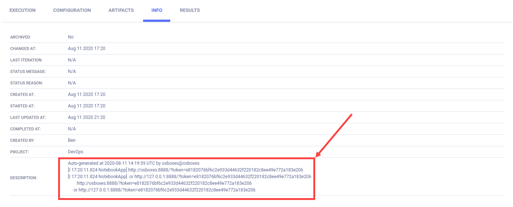
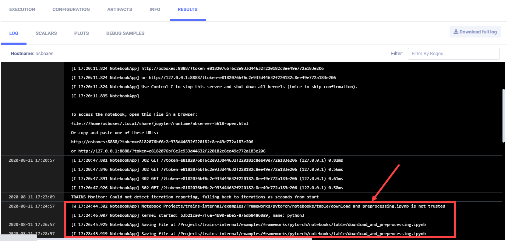

The [execute_jupyter_notebook_server.py](https://github.com/allegroai/clearml/blob/master/examples/services/jupyter-service/execute_jupyter_notebook_server.py)
example demonstrates executing a Jupyter Notebook server in **ClearML Agent** services mode. The example script creates 
an SSH server, and runs Jupyter Notebook as a subprocess. We integrate **ClearML** into the notebooks running on the Jupyter 
Notebook server by passing environment variables to the subprocess, which point to: 
* A **ClearML** configuration file
* A **ClearML Server** host configuration (web server, API server, and files server)
* **ClearML** API credentials. 
  
**ClearML** logs the server links and console output, including the notebooks run on the server, in the example script's 
Task. When the script runs, it creates an experiment named `Allocate Jupyter Notebook Instance`, which is associated with 
the `DevOps` project in the **ClearML Web UI**.

## Running the Jupyter Notebook server service

1. The example script must run at least once before it can execute as a **ClearML Agent** service, because the Task must 
   be stored in **ClearML Server** in order to be enqueued for a **ClearML Agent** to fetch and execute.

        python execute_jupyter_notebook_server.py

1. **ClearML Agent** must be running in services mode and listening to the `services` queue.

    For example:

        clearml-agent daemon --services-mode --detached --queue services --create-queue --cpu-only

1. Enqueue the Jupyter Notebook server Task.

    1. In the **ClearML Web (UI)**, Project page **>** **examples** project **>** right click the **Remote Jupyter NoteBook** 
       experiment.
    1. In the context menu, click **Enqueue** **>** select the **services** queue **>** **ENQUEUE**.

    The status changes to *Pending* and then to *Running*. Once it is running, the Jupyter Notebook server is ready to 
   run notebooks.

## Logging the Jupyter Notebook server

**ClearML** stores the Jupyter Notebook server links in the `Task.comment` property, which appears in the **ClearML Web UI**
**>** the experiment's **INFO** tab **>** **DESCRIPTION** section.

    task.comment += "\n" + "".join(
        line for line in new_lines if "http://" in line or "https://" in line
        )

It shows the server links are:

    [I 12:54:48.940 NotebookApp] http://osboxes:8889/?token=3be82d87e83268934dd086e3b136cc408d4bd12e23409f3a
    [I 12:54:48.940 NotebookApp]  or http://127.0.0.1:8889/?token=3be82d87e83268934dd086e3b136cc408d4bd12e23409f3a
            http://osboxes:8889/?token=3be82d87e83268934dd086e3b136cc408d4bd12e23409f3a
         or http://127.0.0.1:8889/?token=3be82d87e83268934dd086e3b136cc408d4bd12e23409f3a

The Jupyter Note Server console output appears in **RESULTS** **>** **CONSOLE**, including log entries for the notebooks run 
on the server.

To test the Jupyter Notebook, we ran a notebook named audio_preprocessing_example.ipynb. The log shows it was saved:

    [I 17:26:45.925 NotebookApp] Saving file at /Projects/clearml-internal/examples/frameworks/pytorch/notebooks/table/download_and_preprocessing.ipynb

