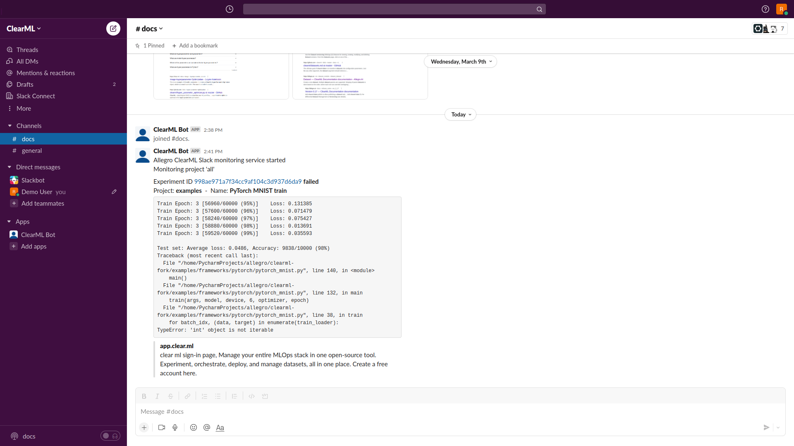
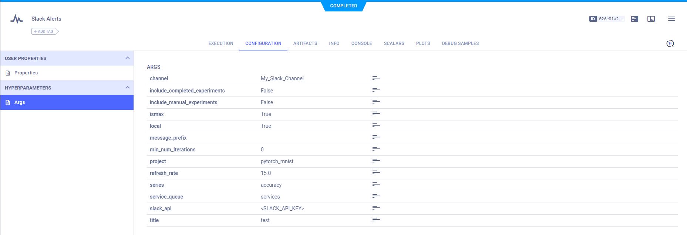

The [Slack alerts example](https://github.com/allegroai/clearml/blob/master/examples/services/monitoring/slack_alerts.py) 
demonstrates how to use the `clearml.automation.monitor` class to implement a service that monitors the completion and 
failure of tasks, and posts alert messages on a Slack channel.



## Creating a Slack Bot

Before configuring and running the Slack alert service, create a new Slack Bot (**ClearML Bot**). 

:::important
The Slack API token and channel you create are required to configure the Slack alert service.
:::

1. Login to your Slack account.
1. Go to [https://api.slack.com/apps/new](https://api.slack.com/apps/new).
1. In **App Name**, enter an app name; for example, "ClearML Bot".
1. In **Development Slack Workspace**, select a workspace.
1. Click **Create App**.
1. In **Basic Information**, under **Display Information**, complete the following:
    - In **Short description**, enter "Allegro Train Bot".
    - In **Background color**, enter "#202432".
1. Click **Save Changes**.
1. In **OAuth & Permissions**, under **Scopes**, click **Add an OAuth Scope**, and then select the following permissions 
   on the list:
    * **channels:join**
    * **channels:read**
    * **chat:write**
1. In **OAuth Tokens & Redirect URLs**:
    1. Click **Install App to Workspace**
    1. In the confirmation dialog, click **Allow**.
    1. Click **Copy** to copy the **Bot User OAuth Access Token**.

## Running the Script

:::info Self deployed ClearML server
A template `Slack Alerts` task is available in the `DevOps Services` project. You can clone it, adapt its [configuration](#configuration) 
to your needs and enqueue for execution directly from the ClearML UI. 
:::

Run the monitoring service in one of these ways:
* Run locally
* Run in ClearML Agent [services mode](../../clearml_agent.md#services-mode)

To run the monitoring service:

```bash
python slack_alerts.py --channel <Slack-channel-name> --slack-api <Slack-API-token> --local True [...]
```
   * `channel` - The Slack channel where alerts will be posted.
   * `slack_api` - Slack API key.
   * `local` - If `True`, run monitoring services locally. If `False`, enqueue the task in the queue passed as the 
     `service_queue` (by default `services` queue) for remote execution. 
    
The script supports the following additional command line options:
* `service_queue` - The queue to use when running remotely as a service. The default value is `services` (make sure 
  your workspace has such a queue and to assign a ClearML Agent to this queue).
* `message_prefix` - A message prefix for Slack alerts. For example, to alert all channel members use: "Hey <!here>". 
* `min_num_iterations` - Minimal iteration threshold below which experiments are ignored. Use this option to eliminate 
  debug sessions that fail quickly. The default value is 0.
* `project` - The name of the project to monitor. By default, all projects are monitored.  
* `include_manual_experiments` - Whether to include experiments that are running locally:
  * `True` - Monitor all experiments (both local and remote, executed by ClearML Agent).
  * `False` (default) - Monitor only remote experiments.
* `include_completed_experiments` - If `False` (default), send alerts only for failed tasks. If `True`, send an alert 
  for completed and failed tasks.
* `include_archived` - If `False` (default), only tasks that are not archived will be reported. This option can be
  useful if a task is archived between polling.
* `refresh_rate` - How often to monitor the experiments in seconds. The default value is 10.0.
* `include_users` - Only report tasks that were initiated by these users (usernames and user IDs are accepted).
  Mutually exclusive to `exclude_users`.
* `exclude_users` - Only report tasks that were NOT initiated by these users (usernames and user IDs are accepted).
  Mutually exclusive to `include_users`.
* `verbose` - If `True`, will increase verbosity of messages (such as when tasks are polled but filtered away).

## Configuration
    
ClearML automatically logs command line options defined with argparse. They appear in the experiment’s **CONFIGURATION** 
page under **HYPERPARAMETERS > Args**.



The task can be reused to launch another monitor instance: clone the task, edit its parameters, and enqueue the task for 
execution (you’ll typically want to use a ClearML Agent running in [services mode](../../clearml_agent.md#services-mode) 
for such service tasks).

## Console
All console output appears in the experiment’s **CONSOLE** page.

## Additional Information about slack_alerts.py

In `slack_alerts.py`, the class `SlackMonitor` inherits from the `Monitor` class in `clearml.automation.monitor`. 
`SlackMonitor` overrides the following `Monitor` class methods:

* `get_query_parameters` - Get the query parameters for Task monitoring.
* `process_task` - Get the information for a Task, post a Slack message, and output to console.
    * Allows skipping failed Tasks, if a Task ran for few iterations. Calls [`Task.get_last_iteration`](../../references/sdk/task.md#get_last_iteration) 
      to get the number of iterations.
    * Builds the Slack message which includes the most recent output to the console (retrieved by calling [`Task.get_reported_console_output`](../../references/sdk/task.md#get_reported_console_output)), 
      and the URL of the Task's output log in the ClearML Web UI (retrieved by calling [`Task.get_output_log_web_page`](../../references/sdk/task.md#get_output_log_web_page)).

The example provides the option to run locally or execute remotely by calling the [`Task.execute_remotely`](../../references/sdk/task.md#execute_remotely) 
method.

To interface to Slack, the example uses `slack_sdk.WebClient` and `slack_sdk.errors.SlackApiError`.
