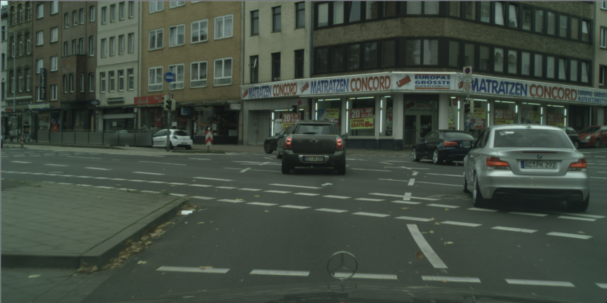
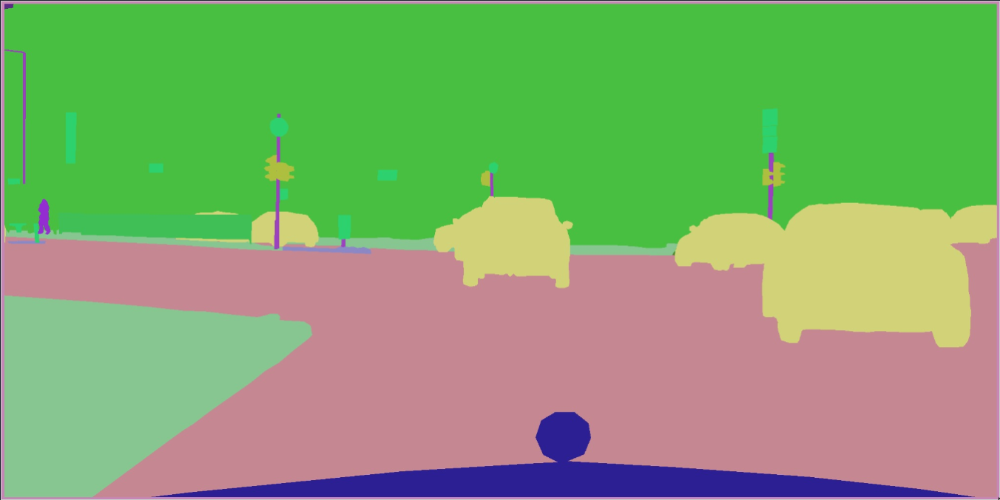

---
title: Masks
--- 

When applicable, [`sources`](sources.md) contains `masks`, a list of dictionaries used to connect a special type of 
source data to the ClearML Enterprise platform. That source data is a **mask**. 

Masks are used in deep learning for semantic segmentation.

Masks correspond to raw data where the objects to be detected are marked with colors in the masks. The colors 
are RGB values and represent the objects that are labeled for segmentation.

In frames used for semantic segmentation, the metadata connecting the mask files / images to the ClearML Enterprise platform,
and the RGB values and labels used for segmentation are separate. They are contained in two different dictionaries of 
a SingleFrame:

* **`masks`** (plural) is in [`sources`](sources.md) and contains the mask files / images `URI` (in addition to other keys 
  and values). 

* **`mask`** (singular) is in the `rois` array of a Frame. 
  
  Each `rois` dictionary contains: 

  * RGB values and labels of a **mask** (in addition to other keys and values)

  * Metadata and data for the labeled area of an image
  
  
See [Example 1](#example-1), which shows `masks` in `sources`, `mask` in `rois`, and the key-value pairs used to relate 
a mask to its source in a frame.


## Masks Structure

The chart below explains the keys and values of the `masks` dictionary (in the [`sources`](sources.md) 
section of a Frame).

|Key|Value Description|
|---|----|
|`id`|**Type**: integer. <ul><li> The ID is used to relate this mask data source to the `mask` dictionary containing the label and RGB value for the mask.</li><li> See the `mask` key in `rois`.</li></ul>| 
|`content_type`| **Type**: string. <ul><li> Type of mask data. For example, image / png or video / mp4.</li></ul>|
|`timestamp`|**Type**: integer. <ul><li>For images from a video, indicates the absolute position of the frame from the source (video) </li><li> For still images, set this to 0 (for example, video from a camera on a car, at 30 frames per second, would have a timestamp of 0 for the first frame, and 33 for the second frame).</li></ul>|
|`uri`|**Type**: string. <ul><li> URI of the mask file / image.</li></ul>|


## Examples
### Example 1

This example demonstrates an original image, its masks, and its frame containing
the `sources` and ROI metadata. 
<details className="cml-expansion-panel info">
<summary className="cml-expansion-panel-summary">Example 1: View the frame</summary>
<div className="cml-expansion-panel-content">


This frame contains the `masks` list of dictionaries in `sources`, 
and the `rois` array, as well as several top-level key-value pairs.


```json
{
    "timestamp": 1234567889,
    "context_id": "car_1",
    "meta": {
        "velocity": "60"
    },
    "sources": [
        {
            "id": "front",
            "content_type": "video/mp4",
            "width": 800,
            "height": 600,
            "uri": "https://s3.amazonaws.com/my_cars/car_1/front.mp4",
            "timestamp": 1234567889,
            "meta" :{
                "angle":45,
                "fov":129
            },
            "masks": [
                {
                    "id": "seg",
                    "content_type": "video/mp4",
                    "uri": "https://s3.amazonaws.com/seg_masks/car_1/front_seg.mp4",
                    "timestamp": 123456789
                },
                {
                    "id": "seg_instance",
                    "content_type": "video/mp4",
                    "uri": "https://s3.amazonaws.com/seg_masks/car_1/front_instance_seg.mp4",
                    "timestamp": 123456789
                }
            ]        
        }
    ],
    "rois": [
        {
            "sources":["front"],
            "label": ["seg"],
            "mask": {
                "id": "car",
                "value": [210,210,120]
            }
        },
        {
            "sources":["front"],
            "label": ["seg"],
            "mask": {
                "id": "person",
                "value": [147,44,209]
            }
        },
        {
            "sources":["front"],
            "label": ["seg"],
            "mask": {
                "id": "road",
                "value": [197,135,146]
            }
        },
        {
            "sources":["front"],
            "label": ["seg"],
            "mask": {
                "id": "street",
                "value": [135,198,145]
            }
        },
        {
            "sources":["front"],
            "label": ["seg"],
            "mask": {
                "id": "building",
                "value": [72,191,65]
            }
        }
    ]
}
```

</div>
</details>
<br/>


* In `sources`:
  * The source ID is `front`.
  * In the `masks` dictionary, the source contains mask sources with IDs of `seg` and `seg_instance`.
* In `rois`: 
  * Each ROI source is `front`, relating the ROI to its original source image.
  * Each ROI has a label of `seg`, indicating segmentation.
  * Each `mask` has an `id` (`car`, `person`, `road`, `street`, and `building`) and a unique RGB `value` 
  (color-coding).

  

<details className="cml-expansion-panel screenshot">
<summary className="cml-expansion-panel-summary">Example image and masks</summary>
<div className="cml-expansion-panel-content">

Original Image 



Mask image



</div>
</details>
<br/>


### Example 2 

This example shows two masks for video from a camera. The masks label cars and the road.

<details className="cml-expansion-panel info">
<summary className="cml-expansion-panel-summary">Example 2: View the frame</summary>
<div className="cml-expansion-panel-content">


```json
"sources": [
        {
            "id": "front",
            "content_type": "video/mp4",
            "width": 800,
            "height": 600,
            "uri": "https://s3.amazonaws.com/my_cars/car_1/front.mp4",
            "timestamp": 1234567889,
            "meta" :{
                "angle":45,
                "fov":129
            },
            "masks": [
                {
                    "id": "car",
                    "content_type": "video/mp4",
                    "uri": "https://s3.amazonaws.com/seg_masks/car_1/front_seg.mp4",
                    "timestamp": 123456789
                },
                {
                    "id": "road",
                    "content_type": "video/mp4",
                    "uri": "https://s3.amazonaws.com/seg_masks/car_1/front_instance_seg.mp4",
                    "timestamp": 123456789
                }
            ]        
        }
    ],
    "rois": [
    {
        "sources":["front"],
        "label": ["right_lane"],
        "mask": {
            "id": "car",
            "value": [210,210,120]
        }
    },
    {
        "sources":["front"],
        "label": ["right_lane"],
        "mask": {
            "id": "road",
            "value": [197,135,146]
        }
    }
```

</div>
</details>
<br/>

* In `sources`:
  * The source ID is `front`.
  * The source contains mask sources with IDs of `car` and `road`.
* In `rois`:
  * Each ROI source is `front` relating the ROI to its original source image.
  * Each ROI has a label of `right_lane` indicating the ROI object.
  * Each `mask` has an `id` (`car`, `person`) and a unique RGB `value` (color-coding).
 
## Usage

### Adding Mask Annotations 

To add a mask annotation to a frame, use the [`SingleFrame.add_annotation`](../references/hyperdataset/singleframe.md#add_annotation). 
This method is generally used to add ROI annotations, but it can also be used to add frame specific mask labels. Input the 
mask value as a list with the RGB values in the `mask_rgb` parameter, and a list of labels in the `labels` parameter.

```python
frame = SingleFrame(
    source='/home/user/woof_meow.jpg',
    preview_uri='https://storage.googleapis.com/kaggle-competitions/kaggle/3362/media/woof_meow.jpg',
)
    
frame.add_annotation(mask_rgb=[0, 0, 0], labels=['cat'])
```

