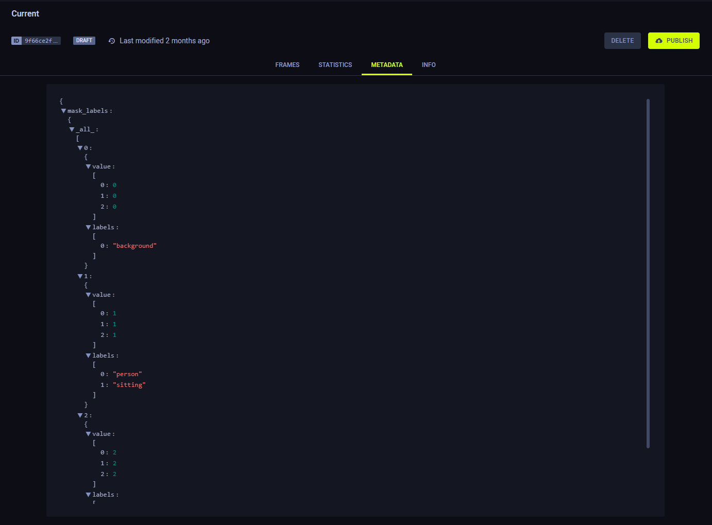
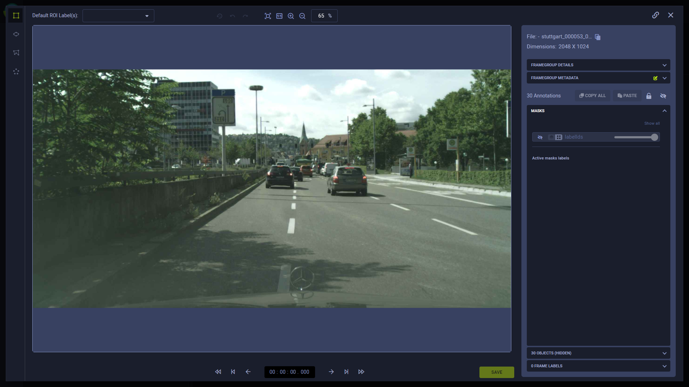
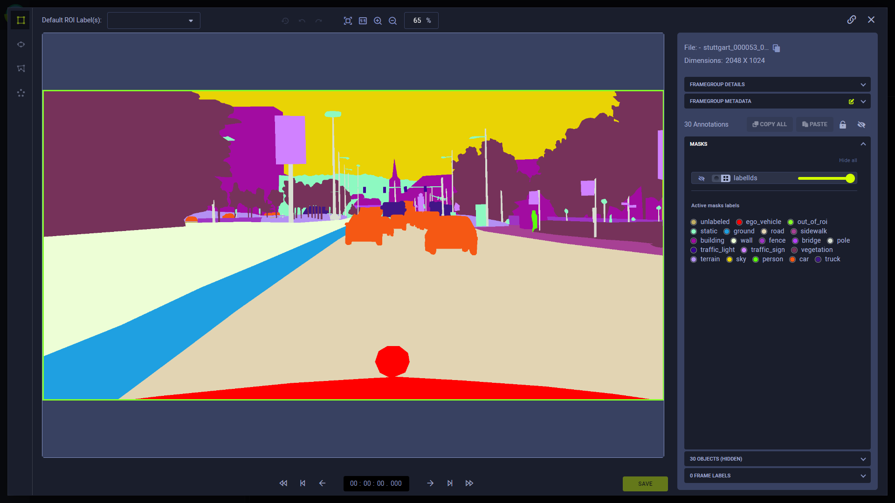
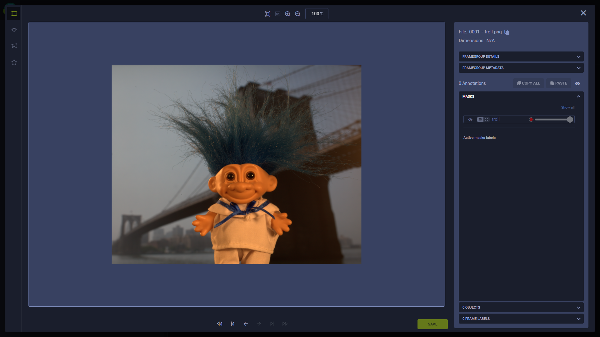

---
title: Masks
--- 

Masks are source data used in deep learning for image segmentation. Mask URIs are a property of a SingleFrame.

ClearML applies the masks in one of two modes:
* [Pixel segmentation](#pixel-segmentation-masks) - Pixel RGB values are each mapped to segmentation labels. 
* [Alpha channel](#alpha-channel-masks) - Pixel RGB values are interpreted as opacity levels. 

In the WebApp's [frame viewer](webapp/webapp_datasets_frames.md#frame-viewer), you can select how to apply a mask over 
a frame.

## Pixel Segmentation Masks
For pixel segmentation, mask RGB pixel values are mapped to labels.

Mask-label mapping is defined at the dataset level, through the `mask_labels` property in a version's metadata.

`mask_labels` is a list of dictionaries, where each dictionary includes the following keys:
* `value` - Mask's RGB pixel value
* `labels` - Label associated with the value.

See how to manage dataset version mask labels pythonically [here](dataset.md#managing-version-mask-labels).

In the UI, you can view the mapping in a dataset version's [Metadata](webapp/webapp_datasets_versioning.md#metadata) tab.



When viewing a frame with a mask corresponding with the version's mask-label mapping, the UI arbitrarily assigns a color 
to each label. The color assignment can be [customized](webapp/webapp_datasets_frames.md#labels).

For example:
* Original frame image:

  

* Frame image with the semantic segmentation mask enabled. Labels are applied according to the dataset version's 
  mask-label mapping:

  

The frame's sources array contains a masks list of dictionaries that looks something like this:

```editorconfig
{
 "id": "<framegroup_id>",
 "timestamp": "<timestamp>",
 "context_id": "car_1",
 "sources": [
   {
     "id": "<source_id>",
     "content_type": "<type>",
     "uri": "<image_uri>",
     "timestamp": 1234567889,
     ...
     "masks": [
       {
         "id": "<mask_id>",
         "content_type": "video/mp4",
         "uri": "<mask_uri>",
         "timestamp": 123456789
       }
     ]
   }
 ]
}
```

The masks dictionary includes the frame's masks' URIs and IDs.

## Alpha Channel Masks
For alpha channel, mask RGB pixel values are interpreted as opacity values so that when the mask is applied, only the 
desired sections of the source are visible.

For example:
* Original frame:
  
  

* Same frame with an alpha channel mask, emphasizing the troll doll:
  
  


The frame's sources array contains a masks list of dictionaries that looks something like this:

```editorconfig
{
 "sources" : [
   {
     "id" : "321"
     "uri" : "https://i.ibb.co/bs7R9k6/troll.png"
     "masks" : [
       {
         "id" : "troll",
         "uri" : "https://i.ibb.co/TmJ3mvT/troll-alpha.png"
       }
     ]
     "timestamp" : 0
   }
 ]
}
```

Note that for alpha channel masks, no labels are used.

## Usage
### Register Frames with a Masks
To register frames with a mask, create a frame and specify the frame's mask file's URI.

```python
# create dataset version
version = DatasetVersion.create_version(
 dataset_name="Example",
 version_name="Registering frame with mask"
)

# create frame with mask
frame = SingleFrame(
 source='https://s3.amazonaws.com/allegro-datasets/cityscapes/leftImg8bit_trainvaltest/leftImg8bit/val/frankfurt/frankfurt_000000_000294_leftImg8bit.png',
 mask_source='https://s3.amazonaws.com/allegro-datasets/cityscapes/gtFine_trainvaltest/gtFine/val/frankfurt/frankfurt_000000_000294_gtFine_labelIds.png'
)

# add frame to version
version.add_frames([frame])
```

To use the mask for pixel segmentation, define the pixel-label mapping for the DatasetVersion:

```python
version.set_masks_labels(
 {(0,0,0): ["background"], (1,1,1): ["person", "sitting"], (2,2,2): ["cat"]}
)
```

The relevant label is applied to all masks in the version according to the version's mask-label mapping dictionary.

### Registering Frames with Multiple Masks
Frames can contain multiple masks. To add multiple masks, use the SingleFrame's `masks_source` property. Input one of 
the following:
* A dictionary with mask string ID keys and mask URI values
* A list of mask URIs. Number IDs are automatically assigned to the masks ("00", "01", etc.)   

```python
frame = SingleFrame(source='https://s3.amazonaws.com/allegro-datasets/cityscapes/leftImg8bit_trainvaltest/leftImg8bit/val/frankfurt/frankfurt_000000_000294_leftImg8bit.png',)

# add multiple masks
# with dictionary 
frame.masks_source={"ID 1 ": "<mask_URI_1>", "ID 2": "<mask_URI_2>"}
# with list
frame.masks_source=[ "<mask_URI_1>", "<mask_URI_2>"]
``` 

