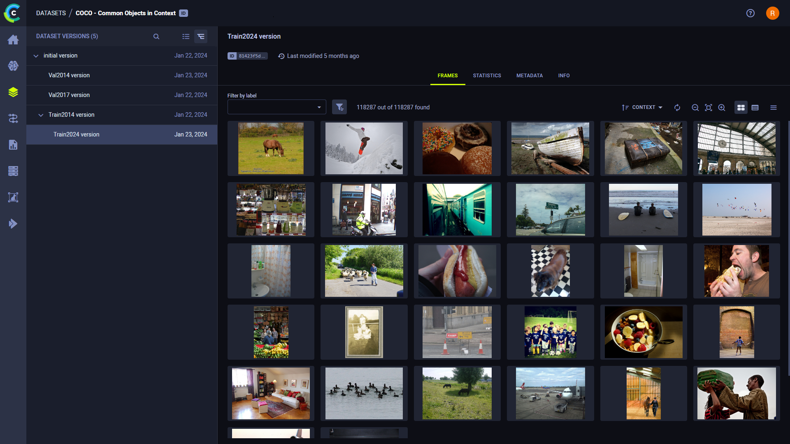

A `preview` is a dictionary containing metadata for optional thumbnail images that can be used in the ClearML Enterprise
WebApp (UI) to view selected images in a Dataset. `previews` includes the `uri` of the thumbnail image.

Previews are not mandatory. Their primary use is to view images with formats that cannot be displayed in a web browser 
(such as TIFF and 3D formats). 

## Example

The following is an example of preview metadata.

```json
"preview": {
        "content_type": "image/jpg",
        "uri": "https://s3.amazonaws.com/my_previews/car_1/front_preview.jpg",
        "timestamp": 0
    }
```
<details className="cml-expansion-panel configuration">
<summary className="cml-expansion-panel-summary">View an entire frame containing a preview</summary>
<div className="cml-expansion-panel-content">

```json
{
    "timestamp": 1234567889,
    "context_id": "car_1",
    "meta": {
        "velocity": "60"
    },
    "sources": [
        {
            "id": "front",
            "content_type": "video/mp4",
            "width": 800,
            "height": 600,
            "uri": "https://s3.amazonaws.com/my_cars/car_1/front.mp4",
            "timestamp": 1234567889,
            "meta" :{
                "angle":45,
                "fov":129
            },
            "preview": {
                "content_type": "image/jpg",
                "uri": "https://s3.amazonaws.com/my_previews/car_1/front_preview.jpg",
                "timestamp": 0
            },
            "masks": [
                {
                    "id": "seg",
                    "content_type": "video/mp4",
                    "uri": "https://s3.amazonaws.com/seg_masks/car_1/front_seg.mp4",
                    "timestamp": 1234567889
                },
                {
                    "id": "instances_seg",
                    "content_type": "video/mp4",
                    "uri": "https://s3.amazonaws.com/seg_masks/car_1/front_instance_seg.mp4",
                    "timestamp": 1234567889
                }
            ]
        },
        {
            "id": "rear",
            "uri": "https://s3.amazonaws.com/my_cars/car_1/rear.mp4",
            "content_type": "video/mp4",
            "timestamp": 1234567889
        }
    ],
    "rois": [
        {
            "sources":["front"],
            "label": ["right_lane"],
            "mask": {
                "id": "seg",
                "value": [-1, 1, 255]
            }
        },
        {
            "sources": ["front"],
            "label": ["bike"],
            "poly":[30, 50, 50,50, 100,50, 100,100],
            "meta": {
               "velocity": 5.4
            }
        },
        {
            "sources": ["front", "rear"],
            "label": ["car"],
            "poly":[30, 50, 50,50, 100,50, 100,100]
        }
    ]
}
```

</div>
</details> 
<br/>

Here's an example of Previews in the ClearML Enterprise WebApp (UI). Each thumbnail is a Preview.



