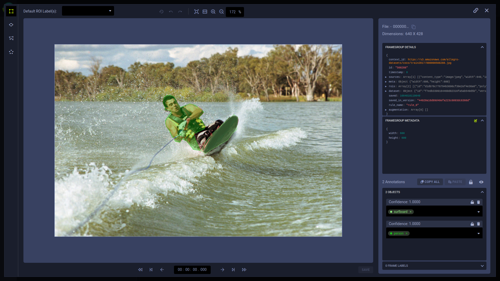

A `SingleFrame` contains metadata pointing to raw data, and other metadata and data, which supports experimentation and 
ClearML Enterprise's Git-like Hyper-Dataset versioning.

## Frame Components

A `SingleFrame` contains the following components:
* [Sources](#sources)
* [Annotations](#annotation)
* [Masks](#masks)
* [Previews](#previews)
* [Metadata](#metadata)
* [Context ID](#context-id)

### Sources
Every `SingleFrame` includes a [`sources`](sources.md) dictionary, which contains attributes of the raw data, including:
* URI pointing to the source data (image or video)
* Sources for masks used in semantic segmentation
* Image previews, which are thumbnails used in the WebApp (UI).

For more information, see [Sources](sources.md).

### Annotation
Each `SingleFrame` contains a list of dictionaries, where each dictionary includes information about a specific annotation. 

Two types of annotations are supported: 
* **FrameGroup objects** - label for Regions of Interest (ROIs) 
* **FrameGroup labels** - labels for the entire frame 

For more information, see [Annotations](annotations.md).


### Masks
A `SingleFrame` can include a URI link to a mask file if applicable. Masks correspond to raw data where the objects to be 
detected are marked with colors or different opacity levels in the masks.

For more information, see [Masks](masks.md).


### Previews 
`previews` is a dictionary containing metadata for optional thumbnail images that can be used in the ClearML Enterprise WebApp (UI) 
to view selected images in a Hyper-Dataset. `previews` includes the `uri` of the thumbnail image.

For more information, see [Previews](previews.md).


### Metadata
`metadata` is a dictionary with general information about the `SingleFrame`.

For more information, see [Custom Metadata](custom_metadata.md).

### Context ID
Frames' `context_id` property facilitates grouping SingleFrames and FrameGroups. When a `context_id` is not explicitly 
defined, the frame's source URI is used instead.

When you query the server for frames (e.g. with [`DataView.get_iterator()`](../references/hyperdataset/dataview.md#get_iterator)), 
the returned frames are grouped together according to their `context_id`, and within their context group are 
ordered according to their `timestamp`. 

Use the WebApp's dataset version frame browser "Group by URL" option to display a single preview for all frames with the 
same context ID. Click the preview to view the context group's frames in the frame viewer in order of their timestamps. 
This is useful when working with a video. You can give all the video frames the same context ID, and then view them in order.

## Frame Structure

The panel below describes the details contained within a `frame`:

<Collapsible type="configuration" title="Frame Structure">

* `id` (*string*) - The unique ID of this frame. 
* `blob` (*string*) - Raw data.
* `context_id` (*string*) - Source URL.
* `dataset` (*dict*) - The Hyper-Dataset and version containing the frame.

    * `id` - ID of the Hyper-Dataset.
    * `version` - ID of the version.

* `meta` (*dict*) - Frame custom metadata. Any custom key-value pairs (`sources` and `rois` can also contain a meta 
  dictionary for custom key-value pairs associated with individual sources and rois). See [Custom Metadata](custom_metadata.md).

* `num_frames`

* `rois` (*[dict]*) - Metadata for annotations, which can be Regions of Interest (ROIs) related to this frame's source data, 
  or frame labels applied to the entire frame (not a region). ROIs are labeled areas bounded by polygons or labeled RGB 
  values used for object detection and segmentation. See [Annotations](annotations.md).

    * `id` - ID of the ROI.
    * `confidence` (*float*) - Confidence level of the ROI label (between 0 and 1.0). 
    * `labels` (*[string]*)
    
        * For [FrameGroup objects](annotations.md#frame-objects) (Regions of Interest), these are the labels applied to the ROI. 
        * For [FrameGroup labels](annotations.md#frame-labels), this is the label applied to the entire frame. 
        
    * `mask` (*dict*) - RGB value of the mask applied to the ROI, if a mask is used (for example, for semantic segmentation). 
      The ID points to the source of the mask.
    
        * `id` - ID of the mask dictionary in `sources`.
        * `value` - RGB value of the mask.
    
      :::info
      The `mask` dictionary is deprecated. Mask labels and their associated pixel values are now stored in the dataset 
      version's metadata. See [Masks](masks.md).
      :::
  
    * `poly` (*[int]*) - Bounding area vertices.
    * `sources` (*[string]*) - The `id` in the `sources` dictionary which relates an annotation to its raw data source.

    
* `sources` (*[dict]*) - Sources of the raw data in this frame. For a SingleFrame this is one source. For a FrameGroup, 
  this is multiple sources. See [Sources](sources.md). 

    * `id` - ID of the source.
    * `uri` - URI of the raw data.
    * `width` - Width of the image or video.
    * `height` - Height of the image or video.
    * `masks` - List of available masks.
    
        * `id` - Mask ID
        * `content_type` - Mask type. For example, `image/jpeg`.
        * `uri` - Mask URI
        * `timestamp`
             
    * `preview` - URI of the thumbnail preview image used in the ClearML Enterprise WebApp (UI)
    * `timestamp` - For images from video, a timestamp that indicates the absolute position of this frame from the source (video). 
      For example, if video from a camera on a car is taken at 30 frames per second, it would have a timestamp of 0 for 
      the first frame, and 33 for the second frame. For still images, set this to 0.
    
* `saved_in_version` - The version in which the frame is saved.
* `saved` - The epoch time that the frame was saved.
* `timestamp` - For images from video, a timestamp that indicates the absolute position of this frame from the source (video).

</Collapsible>

## WebApp 

A frame that has been connected to the ClearML Enterprise platform is available to view and analyze on the 
WebApp (UI). 

When viewing a frame on the WebApp, all the information associated with it can be viewed, including its frame labels and
object annotations, its metadata, and other details.

<Collapsible type="screenshot" title="SingleFrame in the WebApp frame viewer">

This image shows a SingleFrame in the ClearML Enterprise WebApp (UI) [frame viewer](webapp/webapp_datasets_frames.md#frame-viewer). 
    


</Collapsible>


<Collapsible type="configuration" title="SingleFrame details represented in the WebApp">

```    
id : "287024"
timestamp : 0
rois : Array[2] [
    {   
        "label":["tennis racket"],
        "poly":[174,189,149,152,117,107,91,72,68,45,57,33,53,30,49,32,48,34,46,35,46,37,84,92,112,128,143,166,166,191,170,203,178,196,179,194,-999999999,194,238,204,250,212,250,221,250,223,249,206,230,205,230],
        "confidence":1,
        "sources":["default"],
        "id":"f9fc8629d99b4e65aecacedd32ac356e"
    },
    {
        "label":["person"],
        "poly":[158,365,161,358,165,335,170,329,171,321,171,307,173,299,172,292,171,277,171,269,170,260,170,254,171,237,177,225,172,218,167,215,164,207,167,205,171,199,174,196,183,193,188,192,192,192,202,199,207,200,232,187,238,182,240,178,244,172,245,169,245,166,241,163,235,164,233,159,239,150,240,146,240,134,237,137,231,141,222,142,217,136,216,130,215,123,215,116,224,102,229,99,233,96,245,108,256,92,272,84,292,87,309,92,319,101,328,121,329,134,327,137,325,140,331,152,327,155,323,159,324,167,320,174,319,183,327,196,329,232,328,243,323,248,315,254,316,262,314,269,314,280,317,302,313,326,311,330,301,351,299,361,288,386,274,410,269,417,260,427,256,431,249,439,244,448,247,468,249,486,247,491,245,493,243,509,242,524,241,532,237,557,232,584,233,608,233,618,228,640,172,640,169,640,176,621,174,604,147,603,146,609,151,622,144,634,138,638,128,640,49,640,0,640,0,636,0,631,0,630,0,629,37,608,55,599,66,594,74,594,84,593,91,593,99,571,110,534,114,523,117,498,116,474,113,467,113,459,113,433,113,427,118,412,137,391,143,390,147,386,157,378,157,370],
        "confidence":1,
        "sources":["default"],
        "id":"eda8c727fea24c49b6438e5e17c0a846"
    }
    ]
sources : Array[1] [
    {
        "id":"default",
        "uri":"https://s3.amazonaws.com/allegro-datasets/coco/train2017/000000287024.jpg",
        "content_type":"image/jpeg",
        "width":427,
        "height":640,
        "timestamp":0
    }
    ]
dataset : Object 
    {
        "id":"f7edb3399164460d82316fa5ab549d5b",
        "version":"6ad8b10c668e419f9dd40422f667592c"
    }
context_id : https://s3.amazonaws.com/allegro-datasets/coco/train2017/000000287024.jpg
saved : 1598982880693
saved_in_version : "6ad8b10c668e419f9dd40422f667592c"
num_frames : 1
```

</Collapsible>

For more information about using Frames in the WebApp, see [Working with Frames](webapp/webapp_datasets_frames.md). 

## Usage

### Creating a SingleFrame

To create a [`SingleFrame`](../references/hyperdataset/singleframe.md), instantiate a `SingleFrame` class and populate it with:
* The URI link to the source file of the data frame
* A preview URI that is accessible by browser, so you will be able to visualize the data frame in the web UI

```python
from allegroai import SingleFrame

frame = SingleFrame(
    source='s3://my/bucket/path_to_file.jpg',
    width=None, 
    height=None, 
    preview_uri='s3://my/bucket/path_to_file.jpg',
    metadata=None, 
    annotations=None,  
    mask_source=None,
)
```

:::tip Previewing Frames in non-AWS S3-like services
For the ClearML UI to be able to show frames stored in non-AWS S3-like services (e.g. MinIO), make sure the `preview_uri` link
uses the `s3://` prefix and **explicitly specifies the port number** in the URL (e.g. `s3://my_address.com:80/bucket/my_image.png`).

Additionally, make sure to provide cloud storage access in the WebApp [**Settings > Configuration > Web App Cloud Access**](../webapp/settings/webapp_settings_profile.md#browser-cloud-storage-access). 
Input `<host_address>:<port_number>` in the **Host** field.
:::


There are also options to populate the instance with:
* Dimensions - `width` and `height`
* General information about the frame - `metadata`
* A dictionary of annotation objects - `annotations`
* A URI link to a mask file for the frame - `mask_source`

For more information, see the [`SingleFrame`](../references/hyperdataset/singleframe.md) class description.

### Adding SingleFrames to a Dataset Version

Use [`DatasetVersion.add_frames()`](../references/hyperdataset/hyperdatasetversion.md#add_frames) to add 
SingleFrames to a [Dataset version](dataset.md#dataset-versioning) (see [Creating snapshots](dataset.md#creating-snapshots) 
or [Creating child versions](dataset.md#creating-child-versions)). Frames that are already a part of the dataset version 
will only be updated. 

Use the `upload_retries` parameter to set the number of times the upload of a frame should be retried in case of failure, 
before marking the frame as failed and continuing to upload the next frames. The method returns a list of frames that 
were not successfully registered or uploaded. 

```python
from allegroai import DatasetVersion, SingleFrame

# a frames list is required for adding frames
frames = []

# create a frame
frame = SingleFrame(
    source='s3://my/bucket/path_to_file.jpg',
    width=512, 
    height=512, 
    preview_uri='s3://my/bucket/path_to_file.jpg',
    metadata={'alive':'yes'}, 
)

frames.append(frame)

# add frame to the Dataset version
myDatasetversion.add_frames(frames)
```


### Accessing SingleFrames
To access a SingleFrame, use [`DatasetVersion.get_single_frame()`](../references/hyperdataset/hyperdatasetversion.md#datasetversionget_single_frame):

```python
from allegroai import DatasetVersion
frame = DatasetVersion.get_single_frame(
    frame_id='dcd81d094ab44e37875c13f2014530ae', 
    dataset_name='MyDataset', # OR dataset_id='80ccb3ae11a74b91b1c6f25f98539039' 
    version_name='SingleFrame' # OR version_id='b07b626e3b6f4be7be170a2f39e14bfb'
) 
```

To access a SingleFrame, the following must be specified:
* `frame_id`, which can be found in the WebApp, in the frame's **FRAMEGROUP DETAILS** 
* The frame's dataset - either with `dataset_name` or `dataset_id`
* The dataset version - either with `version_id` or `version_name`

### Updating SingleFrames

To update a SingleFrame: 
* Access the SingleFrame by calling [`DatasetVersion.get_single_frame()`](../references/hyperdataset/hyperdatasetversion.md#datasetversionget_single_frame)
* Make changes to the frame
* Update the frame in a DatasetVersion using [`DatasetVersion.update_frames()`](../references/hyperdataset/hyperdatasetversion.md#update_frames)

```python
frames = []                

# get the SingleFrame
frame = DatasetVersion.get_single_frame(
    frame_id='dcd81d094ab44e37875c13f2014530ae', 
    dataset_name='MyDataset', 
    version_name='SingleFrame'
)
    
# make changes to the frame
## add a new annotation
frame.add_annotation(
    poly2d_xy=[154, 343, 209, 343, 209, 423, 154, 423],
    labels=['tire'], 
    metadata={'alive': 'no'}, 
    confidence=0.5
)
        
## add metadata
frame.meta['road_hazard'] = 'yes'
    
# update the SingeFrame
frames.append(frame)
myDatasetVersion.update_frames(frames)                
```


### Deleting Frames

To delete a SingleFrame, use [`DatasetVersion.delete_frames()`](../references/hyperdataset/hyperdatasetversion.md#delete_frames):

```python
frames = []                

# get the SingleFrame
frame = DatasetVersion.get_single_frame(
    frame_id='f3ed0e09bf23fc947f426a0d254c652c', 
    dataset_name='MyDataset', 
    version_name='FrameGroup'
)

# delete the SingleFrame
frames.append(frame)
myDatasetVersion.delete_frames(frames)
```
