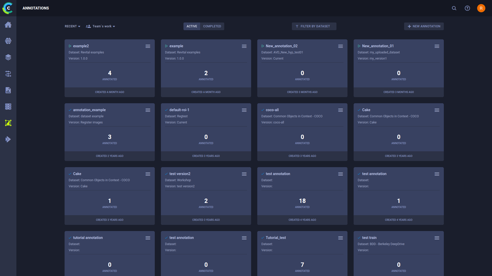
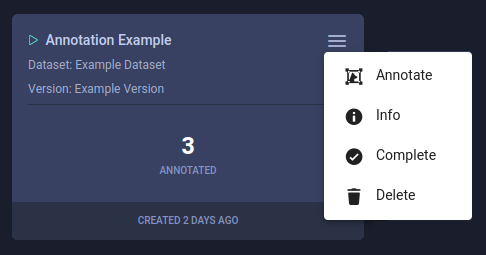
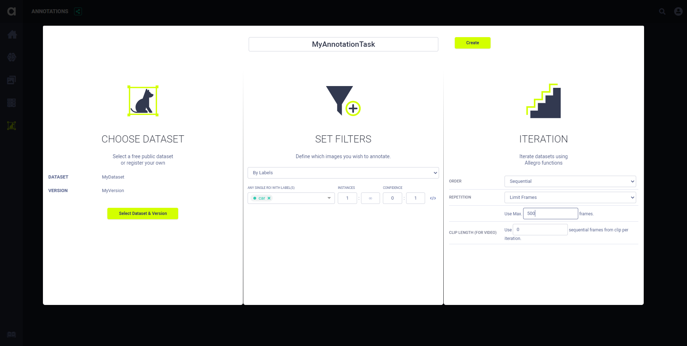

Use the Annotations page to access and manage annotation Tasks.  

Use annotation tasks to efficiently organize the annotation of frames in Dataset versions and manage the work of annotators 
(see [Annotating Images and Videos](#annotating-images-and-video)).

 

Click on an annotation task card to open the frame viewer, where you can view the task’s frames and annotate them.

## Annotation Task Actions
Click  on the top right 
of an annotation task card to open its context menu and access annotation task actions.  

* **Annotate** - Go to annotation task frame viewer
* **Info** - View annotation task’s definitions: dataset versions, filters, and frame iteration specification
* **Complete** - Mark annotation task as Completed
* **Delete** - Delete annotation task

## Page View Options 
The following are options for filtering annotation tasks:
* Active / Completed Filter - Toggle to show annotation tasks that are either Active or Completed
* Dataset Filter - Use to view only the annotation tasks for a specific Dataset
* My / Team Work - Toggle to show annotation tasks that either only you created or any team member created

Sort the annotation tasks by either using **RECENT** or **NAME** option.

## Creating Annotation Tasks

**To create an annotation task:**

1. On the Annotator page, click **+ NEW ANNOTATION**.
1. Enter a name for your new annotation task. 
1. Choose a Dataset version to annotate. If the selected Dataset version's status is *Published*, then creating this 
   annotation task also creates a child version of the selected version. The new child version's status is *Draft*, and 
   its name is the same as the annotation task.
1. Set the filters for the frames this annotation task presents to the annotator.

    * In the **SET FILTERS** list, choose either:
    
        * **All Frames** - Include all frames in this task.
        * **Empty Frames** - Include only frames without any annotations in this task.
        * **Custom Filters** - Apply any combination of ROI, frame, and source filtering rules. See [Advanced Frame Filtering](webapp_datasets_versioning.md#advanced-frame-filtering). 
1. Choose the iteration parameters specifying how frames in this version are presented to the annotator.
        
    1. In **ITERATION**, in the **ORDER** list, choose either:
                
        * **Sequential** - Frames are sorted by the frame top-level `context_id` (primary sort key) and `timestamp` (secondary sort key) metadata key values, and returned by the iterator in the sorted order.
        * **Random** - Frames are randomly returned using the value of the `random_seed` argument. The random seed is maintained with the experiments. Therefore, the random order is reproducible if the experiment is rerun.

    1. In **REPETITION**, choose either **Use Each Frame Once** or **Limit Frames**. If you select **Limit Frames**, then in **Use Max. Frames**, type the number of frames to annotate.
    1. If iterating randomly, in **RANDOM SEED** type your seed or leave blank, and the ClearML Enterprise platform generates a seed for you.
    1. If annotating video, then in **CLIP LENGTH (FOR VIDEO)**, type of the number of sequential frames per iteration to annotate.
            
1. Click **Create**.

## Annotating Images and Video 
Annotate images and video by labeling regions of interest in Dataset version frames. The frames presented for annotation 
depend upon the settings in the annotation task (see [Creating Annotation Tasks](#creating-annotation-tasks)).

### Creating New Frame Objects

To draw a new annotation

1. Click one of the following modes to choose what annotation to create:   
   
    *  - Rectangle mode: 
   Click then drag the cursor to create a rectangle annotation on the frame.
    
    *  - Ellipse mode: 
   Click then drag the cursor to create an ellipse annotation on the frame.
 
    *  - Polygon mode: 
   Each click sets polygon vertices on the frame. Click again on the initial vertex to close the polygon.
     
    *  - Key points mode: 
   Each click adds a keypoint to the frame. After clicking the last keypoint, click   
   or <code>Enter</code> to save the annotation. Click <code>Esc</code> to cancel the annotation.

    A new annotation is created. 

1. In the newly created annotation, select or type-in a label(s). Click the circle in the label name to select a 
   different label color. 

You can use the **Default ROI Label(s)** list to automatically set labels to all new annotations. 

#### Copying Frame Objects 
You can copy existing annotations, and paste them to any frame of your choice:
1. Click the annotation or bounded area in the frame.
1. Click  
   (copy annotation).
1. Navigate to the frame of your choice (you can remain in the same frame).
1. Click **PASTE**. The new annotation appears in the same location as the one you copied. You can paste the annotation
   multiple times.
   
Copy all annotations in a frame by clicking the **COPY ALL** button.

### Annotation Actions

The following table describes the actions that can be performed on existing annotations. The frame editor automatically 
saves changes when you move to another frame using the frame navigation controls 
(, , , , , ,
or the arrow keys on the keyboard). Closing the frame editor will prompt you to save any changes.

| Icon (when applicable) | Action | Description |
|---|---|---|
|| Move annotation | Click on a bounded area and drag it. |
|| Resize annotation| Select an annotation, then click on a bounded area’s vertex and drag it. |	
||Edit metadata|Hover over an annotation in the list and click the icon to open the edit window. Input the metadata dictionary in JSON format. This metadata is specific to the selected annotation, not the entire frame.|
||Lock / Unlock annotation |Click the button on a specific annotation to make it uneditable. You can also click the button on top of the annotations list to lock all annotations in the frame.|
||Delete annotation|Click the annotation or bounded area in the frame and then click the button to delete the annotation.|
||Show/hide all annotations |Click the button to view the frame without annotations. When annotations are hidden, they can’t be modified. |
||Delete label |In the relevant annotation, click **x** on the label you want to remove.| 

### Frame Labels

You can add labels which describe the whole frame, with no specific coordinates. 

**To add frame labels:**

1. Expand the **FRAME LABELS** area (below **OBJECTS**)
1. Click **+ Add new**
1. Enter a label(s)

## Frame Metadata

**To edit frame metadata:** 
1. Expand the **FRAME METADATA** area 
1. Click edit  
   which will open an editing window
1. Modify the metadata dictionary in JSON format

