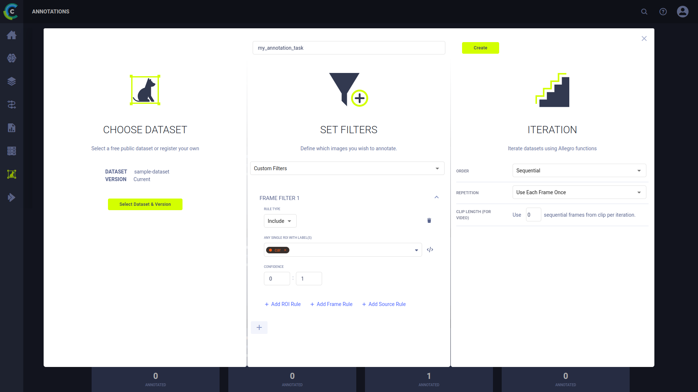

Use the Annotations page to access and manage annotation Tasks.
Use annotation tasks to efficiently organize the annotation of frames in Dataset versions and manage the work of annotators
(see [Annotating Images and Videos](#annotating-images-and-video)).

## Managing Annotation Tasks

### Creating Annotation Tasks

**To create an annotation task:**

1. On the Annotator page, click **+ ADD NEW ANNOTATION**.
1. Enter a name for your new annotation task.
1. Choose a Dataset version to annotate. If the selected Dataset version's status is *Published*, then creating this
   annotation task also creates a child version of the selected version. The new child version's status is *Draft*, and
   its name is the same as the annotation task.
1. Set the filters for the frames this annotation task presents to the annotator.

    * In the **SET FILTERS** list, choose either:

        * **All Frames** - Include all frames in this task.
        * **Empty Frames** - Include only frames without any annotations in this task.
        * **By Label** - Include only frames with specific labels, and optionally filter these frames by confidence level and
         the number of instances. You can also click  and then add a Lucene query for this ROI label filter.

1. Choose the iteration parameters specifying how frames in this version are presented to the annotator.

    1. In **ITERATION**, in the **ORDER** list, choose either:

        * **Sequential** - Frames are sorted by the frame top-level `context_id` (primary sort key) and `timestamp` (secondary sort key) metadata key values, and returned by the iterator in the sorted order.
        * **Random** - Frames are randomly returned using the value of the `random_seed` argument. The random seed is maintained with the experiments. Therefore, the random order is reproducible if the experiment is rerun.

    1. In **REPETITION**, choose either **Use Each Frame Once** or **Limit Frames**. If you select **Limit Frames**, then in **Use Max. Frames**, type the number of frames to annotate.
    1. If iterating randomly, in **RANDOM SEED** type your seed or leave blank, and the ClearML Enterprise platform generates a seed for you.
    1. If annotating video, then in **CLIP LENGTH (FOR VIDEO)**, type of the number of sequential frames per iteration to annotate.

1. Click **Create**.

### Completing annotation tasks

To mark an annotation task as **Completed**:

* In the annotation task card, click  (menu) **>** **Complete** **>** **CONFIRM**.

### Deleting annotation tasks

To delete an annotation task:

* In the annotation task card, click  (menu) **>** **Delete** **>** **CONFIRM**.

### Filtering annotation tasks

There are two option for filtering annotation tasks:

* Active / Completed Filter - Toggle to show annotation tasks that are either **Active** or **Completed**
* Dataset Filter - Use to view only the annotation tasks for a specific Dataset.

### Sorting annotation tasks

Sort the annotation tasks by either using **RECENT** or **NAME** from the drop-down menu on the top left of the page.

### Viewing annotation task information

To View the Dataset version, filters, and iteration information:

* In the annotation task card, click  (menu) **>** **Info**

## Annotating Images and Video

Annotate images and video by labeling regions of interest in Dataset version frames. The frames presented for annotation
depend upon the settings in the annotation task (see [Creating Annotation Tasks](#creating-annotation-tasks)).

### Annotating Frames

**To annotate frames:**

1. On the Annotator page, click the annotation task card, or click  (menu)
   and then click **Annotate**.
1. See instructions below about annotating frames.

#### Add FrameGroup objects

1. Select an annotation mode and add the bounded area to the frame image.

    * Rectangle mode - Click  and then click the image, drag and release.
    * Polygon mode - Click  and then click the image for the first vertex,
      move to another vertex and click, continue until closing the last vertex.
    * Key points mode - Click  and then click each key point.

1. In the new label area, choose or enter a label.
1. Optionally, add metadata.
1. Optionally, lock the annotation.

#### Add frame labels

1. In **FRAME LABEL**, click **+ Add new**.
1. In the new label area, choose or enter a label.
1. Optionally, add metadata.
1. Optionally, lock the annotation.

#### Copy / paste an annotations

1. Click the annotation or bounded area in the image or video clip.
1. Optionally, navigate to a different frame.
1. Click **PASTE**. The new annotation appears in the same location as the one you copied.
1. Optionally, to paste the same annotation, again, click **PASTE**.

#### Copy / paste all annotations

1. Click **COPY ALL**.
1. Optionally, navigate to a different frame.
1. Click **PASTE**.

#### Move annotations

* Move a bounded area by clicking on it and dragging.

#### Resize annotations

* Resize a bounded area by clicking on a vertex and dragging.

#### Delete annotations

1. Click the annotation or bounded area in the image or video clip.
1. Press **DELETE** or in the annotation, click **>X**.

#### Add labels

* Click in the annotation and choose a label from the label list, or type a new label.

#### Modify labels

* In the annotation label textbox, choose a label from the list or type a new label.

#### Delete labels

* In the annotation, in the label area, click the label's **X**.

#### Modify annotation metadata

* In the label, click edit and then in the popup modify the metadata dictionary (in JSON format).

#### Modify annotation color

* Modify the color of an area by clicking the circle in the label name and select a new color.

#### Lock / unlock annotations

* Click the lock.

#### Modify frame metadata

* Expand the **FRAME METADATA** area, click edit, and then in the popup modify the metadata dictionary (in JSON format).
