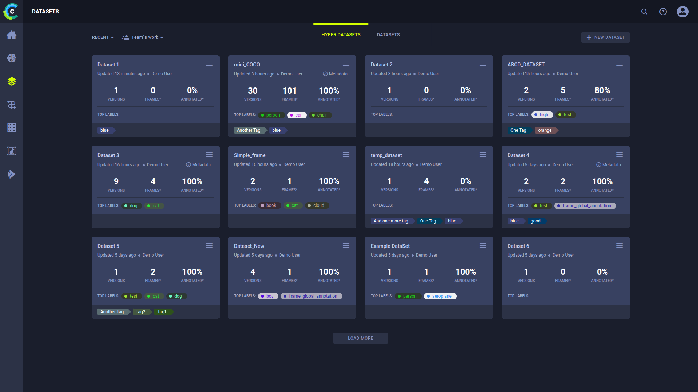
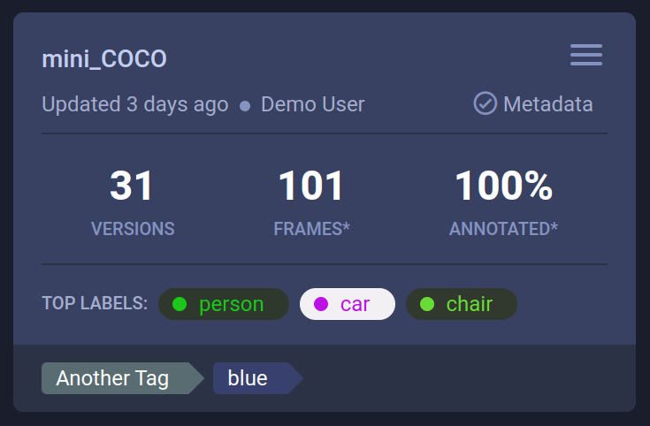
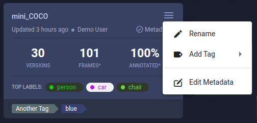
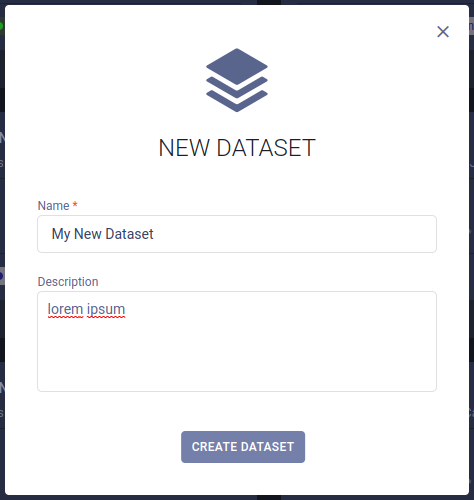

Use the Hyper-Datasets Page to navigate between and manage hyper-datasets. 

Click on a Hyper-Dataset card to open the dataset’s [version list](webapp_datasets_versioning.md), where you can view 
and manage the dataset versions' lineage and contents. 

Filter the hyper-datasets to find the one you’re looking for more easily. These filters can be applied by clicking :
* My Work - Show only hyper-datasets that you created
* Tags - Choose which tags to filter by from a list of tags used in the hyper-datasets.
  * Filter by multiple tag values using the **ANY** or **ALL** options, which correspond to the logical "AND" and "OR" 
  respectively. These options appear on the top of the tag list.
  * Filter by the absence of a tag (logical "NOT") by clicking its checkbox twice. An X will appear in the tag's checkbox.

## Hyper-Dataset Cards

The Hyper-Dataset cards display summarized dataset information: 

* Dataset name
* Time since last update. Hover over elapsed time to view date of last update
* User updating the Dataset
* If the dataset contains dataset-level metadata, the card displays the  
    `Metadata` indicator, which opens the Metadata editor on click 
* The number of versions in the Dataset
* The total number of frames in all versions of the Dataset. If an asterisk (\*) appears next to **FRAMES**, then you can hover over it and see the name of the version whose frames were last updated
* The percentage of frames annotated in all versions of the Dataset. If an asterisk (\*) appears next to **ANNOTATED**, then you can hover over it and see the name of the version whose frames were last annotated
* If the Dataset version's status is *Published*, then the Dataset's top labels appear (colors are editable). If the 
  Dataset version is *Draft*, then no labels appear
* Tags

:::note Change Label Color
To change the label color coding, hover over a label color, click the hand pointer, and then select a new color.
:::

### Hyper-Dataset Actions

Click  on the top right
of a dataset card to open its context menu and access dataset actions:  

* **Rename** - Change the dataset’s name
* **Add Tag** - Add label to the dataset to help easily classify groups of datasets.
* **Edit Metadata** - Modify dataset-level metadata. This will open the metadata edit window, where you can edit the section

## Create New Hyper-Datasets

To create a new Hyper-Dataset, click the **+ NEW DATASET** button in the top right of the page, which will open a 
**New Dataset** modal.

This creates a new Hyper-Dataset that contains a single, empty draft version.
