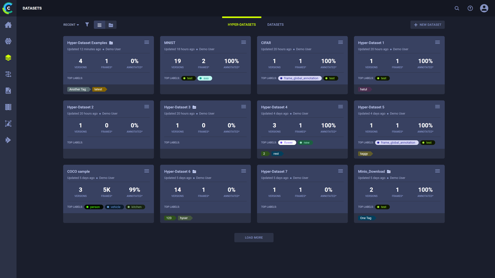

The Datasets page offers the following functionalities: 
* Managing the ClearML Enterprise **Datasets** and **versions**, which connect raw data to the ClearML Enterprise platform
* Using ClearML Enterprise's Git-like Dataset versioning features
* Managing SingleFrames and FrameGroups.

## Dataset Cards

Dataset cards show summary information about versions, frames, and labels in a Dataset, and the elapsed time since the Dataset was last update and the user doing the update. Dataset cards allow you to open a specific Dataset to perform Dataset versioning and frames management.

* Dataset name
* Elapsed time since the last update. Hover over elapsed time and view date of last update.
* User updating the Dataset
* The number of versions in the Dataset
* The total number of frames in all versions of the Dataset. If an asterisk (\*) appears next to **FRAMES**, then you can hover it and see the name of the version whose frames were last updated appears.
* The percentage of frames annotated in all versions of the Dataset. If an asterisk (\*) appears next to **ANNOTATED**, then you can hover it and see the name of the version whose frames were last annotated appears.
* If the Dataset version's status is *Published*, then the top labels in the Dataset, color coded (colors are editable) appear. If the Dataset version is Draft, then no labels appear.

:::note
To change the label color coding, hover over a label color, click thr hand pointer, and then select a new color.
:::
        
## Creating New Datasets

Create a new Dataset which will contain one version named `Current`. The new version will not contain any frames. 

* Click **+ NEW DATASET** **>** Enter a name and optionally a description **>** **CREATE DATASET**.

## Sort Datasets

* In **RECENT**, choose either:

    * **RECENT** - Most recently update of the Datasets.
    * **NAME** - Alphabetically sort by Dataset name.
  

