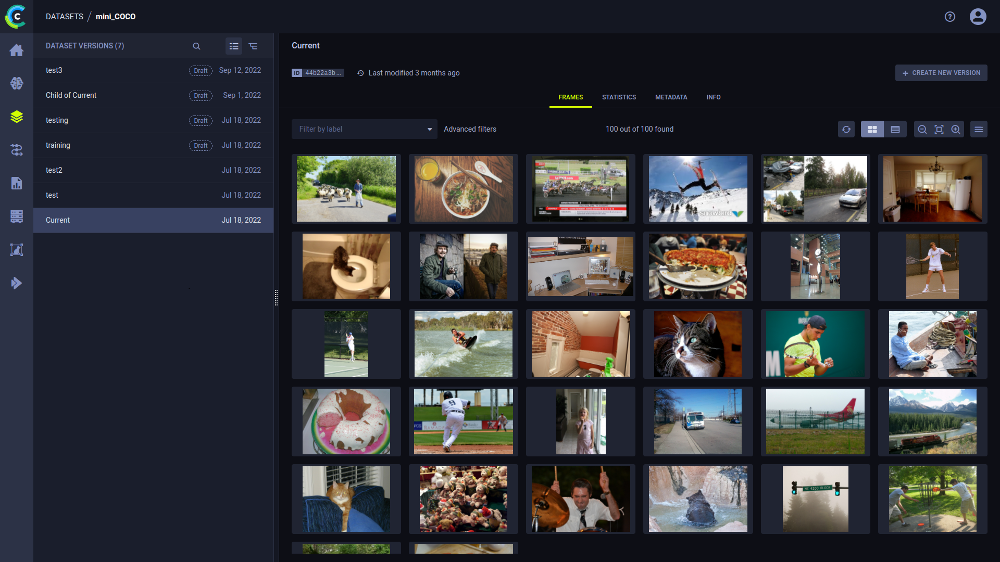
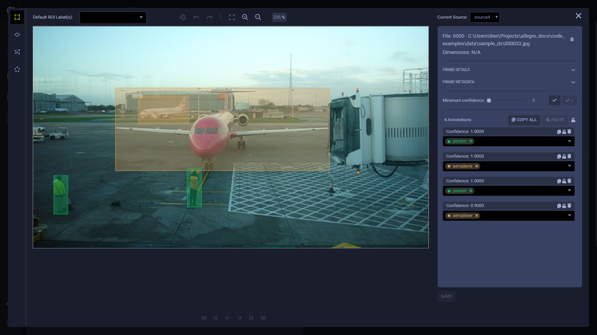

View and edit SingleFrames in the Dataset page. After selecting a Hyper-Dataset version, the **Version Browser** shows a sample 
of frames and enables viewing SingleFrames and FramesGroups, and edit SingleFrames, in the [frame viewer](#frame-viewer). 
Before opening the frame viewer, you can filter the frames by applying [simple](#simple-frame-filtering) or [advanced](#advanced-frame-filtering) 
filtering logic. 

## Frame Viewer

Frame viewer allows you to view and edit annotations which can be FrameGroup objects (Regions of Interest) and FrameGroup 
labels applied to the entire frame not a region of the frame, the frame details (see [frames](../frames.md)), 
frame metadata, the raw data source URI, as well as providing navigation and viewing tools. 

### Frame Viewer Controls

Use frame viewer controls to navigate between frames in a Hyper-Dataset Version, and control frame changes and viewing.

|Control Icon|Actions|Shortcut|
|-----|------|----|
|| Jumps backwards ten frames | CTRL + Left arrow |
||Go to the previous frame containing a non-filtered annotation. The filter is the minimum confidence level setting. If the confidence level filter is set to zero, any frame containing annotations matches the filter.|  |
||Go to the previous frame | Left arrow |
||Go to the next frame | Right arrow |
||Go to the next frame containing a non-filtered annotation (same filter as ).|  |
||Jump forwards ten frames | CTRL + Right arrow |
||Reload the frame.|  |
||Undo changes.|Ctrl + Z| 
||Redo changes.|Ctrl + Y| 
||Autofit|  |
||Zoom in| **+** or Ctrl + Mouse wheel| 
||Zoom out| **-** or Ctrl + Mouse wheel |
|Percentage textbox|Zoom percentage|  |

#### Additional Keyboard Shortcuts

**General Controls**

|Control|Action|
|----|-----|
|Hold Spacebar + Press and hold image + Drag| Move around image. NOTE: If using a touchpad, this only works if the *Disable touchpad while typing* setting is turned off | 
|Esc | Escape frame viewer and return to dataset page |

**General Annotation Controls**

|Control|Action|
|----|-----|
| Delete | Remove annotation |
| Alt + ] / [ | Choose a default ROI label by navigating between previous / next labels  |
| Shift + M | Edit metadata | 
| Shift + Tab | Previous annotation (use after clicking an annotation) |

**Mode-specific annotation controls**

|Control |Mode |Action|
|----|-----|----|
| Hold Shift | Key points () | While holding Shift, add new points to the ROI by left clicking, and move a single point by dragging it with your mouse | 
| Enter | Key points () | Complete annotation |
| Esc | Key points (), Polygon () | Cancel annotation process | 

### Viewing and Editing Frames

**To view / edit a frame in the frame editor**

1. Locate your frame by applying a [simple frame filter](#simple-frame-filtering) or [advanced frame filter](#advanced-frame-filtering), and clicking **LOAD MORE**, if required.
1. Click the frame thumbnail. The frame editor appears.
1. Do any of the following:
    * View frame details, including:
        * Frame file path
        * Dimensions of the image or video
        * Frame details
        * Frame metadata
        * Annotations
            * Frame objects - Labeled Regions of Interest, with confidence levels and custom metadata per frame object.
            * Frame labels - Labels applied to the entire frame, not a region in the frame.
    * Optionally, filter annotations by confidence level using the **Minimum confidence** slider.
    * Add, change, and delete [annotations](#annotations) and [frame metadata](#frame-metadata).
      
:::important Saving Frame Changes
To save frames changes at any time, click **SAVE** (below the annotation list area).
:::
 

### Viewing FrameGroups

Viewing and editing frames in a FrameGroup is similar to viewing and editing SingleFrames. 
Click the FrameGroup in the Hyper-Dataset. In the frame viewer, select SingleFrame to view / modify from 
a dropdown list in the **Current Source** section.

## Masks 

Use the **MASKS** panel to select which masks to apply over the frame. 

To view / hide a specific mask, click .
In order to view all masks, click **Show all** / **Hide all**. 

Masks are applied over the image either by pixel segmentation or as an alpha channel:
*  Pixel 
segmentation - Class labels are mapped onto the mask according to their pixel value definitions, and each 
class is assigned a unique color. 
*  Alpha 
channel - Mask pixel values are translated to transparency. Additionally, a color can be applied to the mask to help 
distinguish multiple masks. Click  to select 
a color. 

To adjust the transparency of a mask, use its opacity slider. 

### Labels 

The **Active mask labels** section displays the color mapping of the mask labels. 
The panel presents labels only from masks that are currently displayed.

**To modify a label's color and opacity:**
1. Click the colored circle next to the label 
1. Select a new color
1. Adjust the opacity slider 
1. Click **OK**

## Annotations
### Adding Frame Objects (Regions of Interest)

Annotate images and video by labeling regions of interest in Dataset version frames. You can create new annotations
and copy existing annotations.

#### Creating New Frame Objects

To draw a new annotation:

1. Click one of the following modes to choose what annotation to create:
   
    *  - Rectangle mode: 
   Click then drag the cursor to create a rectangle annotation on the frame.  
    
    *  - Ellipse mode: 
   Click then drag the cursor to create an ellipse annotation on the frame. 
    
    *  - Polygon mode: 
   Each click sets polygon vertices on the frame. Click again on the initial vertex to close the polygon. 
    
    *  - Key points mode: 
   Each click adds a keypoint to the frame. After clicking the last keypoint, click   
   or <code>Enter</code> to save the annotation. Click <code>Esc</code> to cancel the annotation.

    A new annotation is created. 

1. In the newly created annotation, select or type-in a label(s). Click the circle in the label name to select a 
   different label color. 

You can use the **Default ROI Label(s)** list to automatically set labels to all new annotations. 

#### Copying Frame Objects 
You can copy existing annotations, and paste them to any frame of your choice:
1. Click the annotation or bounded area in the frame.
1. Click  
   (copy annotation).
1. Navigate to the frame of your choice (you can remain in the same frame).
1. Click **PASTE**. The new annotation appears in the same location as the one you copied. You can paste the annotation
   multiple times.
   
Copy all annotations in a frame by clicking the **COPY ALL** button.

### Annotation Actions

The following table describes the actions that can be performed on existing annotations. The frame editor automatically 
saves changes when you move to another frame using the frame navigation controls 
(, , , , , ,
or the arrow keys on the keyboard). Closing the frame editor will prompt you to save any changes.

| Icon (when applicable) | Action | Description |
|---|---|---|
|| Move annotation | Click on a bounded area and drag it. |
|| Resize annotation| Select an annotation, then click on a bounded area’s vertex and drag it. |	
||Edit metadata|Hover over an annotation in the list and click the icon to open the edit window. Input the metadata dictionary in JSON format. This metadata is specific to the selected annotation, not the entire frame.|
||Lock / Unlock annotation |Click the button on a specific annotation to make it uneditable. You can also click the button on top of the annotations list to lock all annotations in the frame.|
||Delete annotation|Click the annotation or bounded area in the frame and then click the button to delete the annotation.|
||Show/hide all annotations |Click the button to view the frame without annotations. When annotations are hidden, they can’t be modified. |
||Delete label |In the relevant annotation, click **x** on the label you want to remove.| 

### Frame Labels

You can add labels which describe the whole frame, with no specific coordinates. 

**To add frame labels:**

1. Expand the **FRAME LABELS** area (below **OBJECTS**)
1. Click **+ Add new**
1. Enter a label(s)

## Frame Metadata

**To edit frame metadata:** 
1. Expand the **FRAME METADATA** area 
1. Click edit  
   which will open an editing window
1. Modify the metadata dictionary in JSON format

