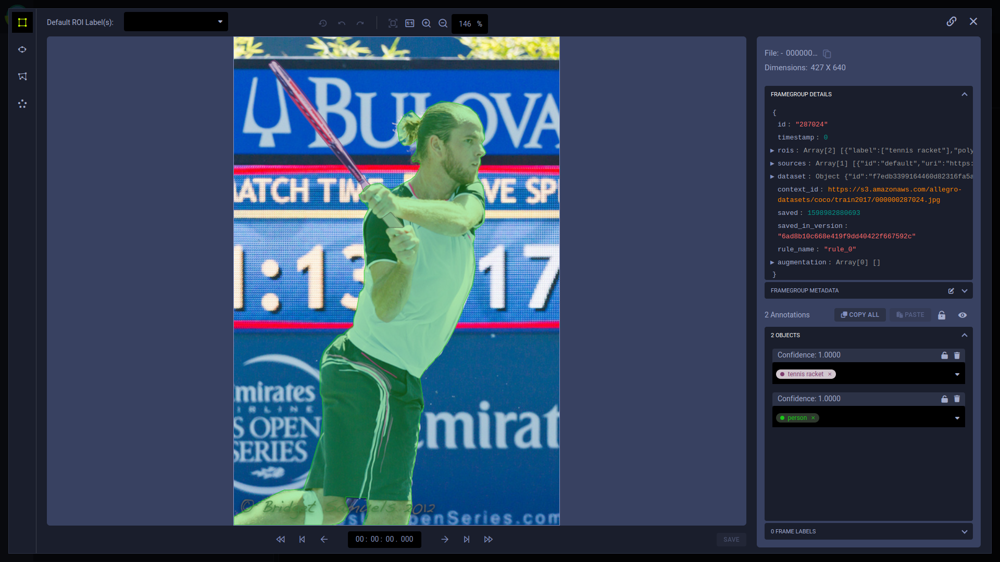
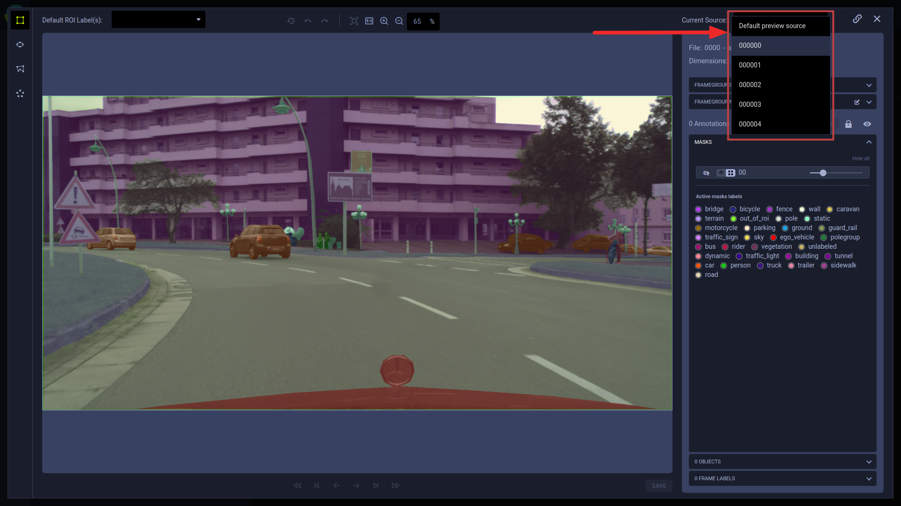
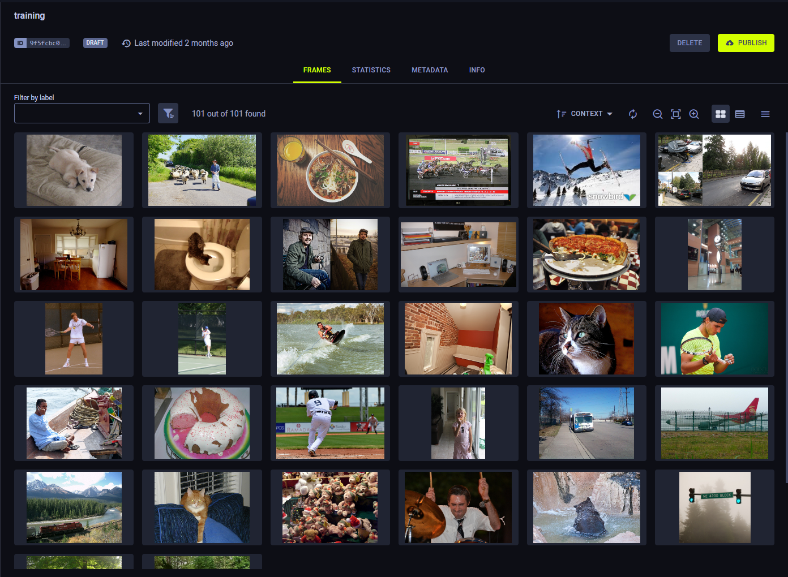
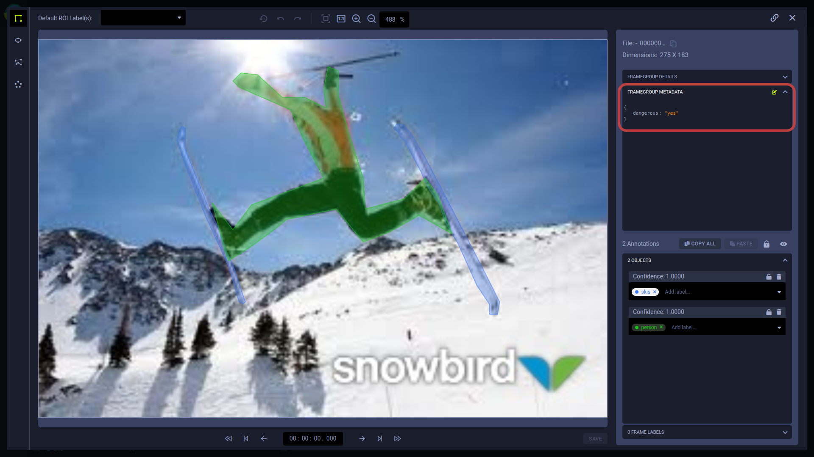

View and edit SingleFrames in the Dataset page. After selecting a Dataset version, the **Version Browser** shows a sample 
of frames and enables viewing SingleFrames and FramesGroups, and edit SingleFrames, in the [frame viewer](#frame-viewer). 
Before opening the frame viewer, you can filter the frames by applying [simple](#simple-frame-filtering) or [advanced](#advanced-frame-filtering) 
filtering logic. 

## Frame viewer

Frame viewer allows you to view and edit annotations which can be FrameGroup objects (Regions of Interest) and FrameGroup 
labels applied to the entire frame not a region of the frame, the frame details (see [frames](../frames.md)), 
frame metadata, the raw data source URI, as well as providing navigation and viewing tools. 

### Frame viewer controls

Use frame viewer controls to navigate between frames in a Dataset Version, and control frame changes and viewing.

|Control Icon|Actions|Shortcut|
|-----|------|----|
|| Jumps backwards ten frames | CTRL + Left arrow |
||Go to the previous frame containing a non-filtered annotation. The filter is the minimum confidence level setting. If the confidence level filter is set to zero, any frame containing annotations matches the filter.|  |
||Go to the previous frame | Left arrow |
||Go to the next frame | Right arrow |
||Go to the next frame containing a non-filtered annotation (same filter as ).|  |
||Jump forwards ten frames | CTRL + Right arrow |
||Reload the frame.|  |
||Undo changes.|Ctrl + Z| 
||Redo changes.|Ctrl + Y| 
||Autofit|  |
||Zoom in| **+** or Ctrl + Mouse wheel| 
||Zoom out| **-** or Ctrl + Mouse wheel |
|Percentage textbox|Zoom percentage|  |

#### Additional keyboard shortcuts

**General controls**

|Control|Action|
|----|-----|
|Hold Spacebar + Press and hold image + Drag| Move around image. NOTE: If using a touchpad, this only works if the *Disable touchpad while typing* setting is turned off | 
|Esc | Escape frame viewer and return to dataset page |

**General annotation controls**

|Control|Action|
|----|-----|
| Delete | Remove annotation |
| Alt + ] / [ | Choose a default ROI label by navigating between previous / next labels  |
| Shift + M | Edit metadata | 
| Shift + Tab | Previous annotation (use after clicking an annotation) |

**Mode-specific annotation controls**

|Control |Mode |Action|
|----|-----|----|
| Hold Shift | Key points () | While holding Shift, add new points to the ROI by left clicking, and move a single point by dragging it with your mouse | 
| Enter | Key points () | Complete annotation |
| Esc | Key points (), Polygon () | Cancel annotation process | 

### Viewing and editing frames

**To view / edit a frame in the frame editor**

1. Locate your frame by applying a [simple frame filter](#simple) or [advanced frame filter](#advanced), and clicking LOAD MORE, if required.
1. Click the frame thumbnail. The frame editor appears.
1. Do any of the following:
    * View frame details, including:
        * Frame file path
        * Dimensions of the image or video
        * Frame details
        * Frame metadata
        * Annotations
            * Frame objects - Labeled Regions of Interest, with confidence levels and custom metadata per frame object.
            * Frame labels - Labels applied to the entire frame, not a region in the frame.
    * Optionally, filter annotations by confidence level using the Minimum confidence slider.
    * Add, change, and delete [annotations](#annotations) and [frame metadata](#frame-metadata).
      
:::important
To save frames changes at any time, click **SAVE** (below the annotation list area).
:::
 

### Viewing FrameGroups

Viewing and editing frames in a FrameGroup is similar to viewing and editing SingleFrames. 
Click the FrameGroup in the Dataset. In the frame viewer, select SingleFrame to view / modify from 
a dropdown list in the **Current Source** section.

## Filtering frames
### Simple frame filtering

Simple frame filtering applies one annotation object (ROI) label and returns frames containing at least one annotation 
with that label. 

**To apply a simple frame filter:**

* In the **Version Browser**, choose a label on the label list.

For example: 
* Before filtering, the **Version Browser** in the image below contains seven frames.

View a screenshot

      

      

   

* A simple label filter for `person` shows three frames with each containing at least one ROI labeled `person`.

View a screenshot

### Advanced frame filtering

Advanced frame filtering applies sophisticated filtering logic, which is composed of as many frame filters as needed, 
where each frame filter can be a combination of ROI, frame, and source rules. 
* ROI rules use include and exclude logic to match frames by ROI label; an ROI label can match frames containing at least 
  one annotation object (ROI) with all labels in the rule.
* Frame rules and source rules use Lucene queries with AND, OR, and NOT logic. Frame rules apply to frame metadata.
* Source rules apply to frame source information.

**To apply advanced filters:**

1. In the **Version Browser**, click **Switch to advanced filters**.
1. In a **FRAME FILTER**, create one of the following rules:

    * ROI rule

        * Choose **Include** or **Exclude**, select ROI labels, and optionally set the confidence level range.

        * To switch from the ROI dropdown list to a Lucene query mode, click .
            
    * Frame rule - Enter a Lucene query using frame metadata fields in the format `meta.<key>:<value>`.
    
    * Source rule - Enter a Lucene query using frame metadata fields in the format `sources.<key>:<value>`.            

### Examples
        
#### ROI rules

* Create one ROI rule for <code>person</code> shows the same three frames as the simple frame filter (above).
  

  
View a screenshot

  

  

  

  
            
   

* In the ROI rule, add a second label. Add `partially_occluded`. Only frames containing at least one ROI labeled as both <code>person</code> and <code>partially_occluded</code> match the filter.

   
View a screenshot

   

   

   

   
            
    

   By opening a frame in the frame viewer, you can see an ROI labeled with both.

   

   
View a screenshot

   

   

   

   
            
    

#### Frame rules

Filter by metadata using Lucene queries.

* Add a frame rule to filter by the metadata key <code>dangerous</code> for the value of <code>no</code>.

    

    
View a screenshot

    

    

    

    
            
     

    By opening a frame in the frame viewer, you can see the metadata.

    

    
View a screenshot

    

    

    

    
            
     

    
#### Source rules

Filter by sources using Lucene queries.    

* Add a source rule to filter for sources URIs with a wildcards.

    

    
View a screenshot

    

    

    

    
            
     

Use Lucene queries in ROI label filters and frame rules.
        
## Annotations

### Frame objects (Regions of Interest)

You can add annotations by drawing new bounding areas, and copying existing annotations in the same or other frames.

**To draw a bounding area for a new annotation:**

1. Optionally, select a default label in the Default ROI Label(s) list. New annotations are automatically assigned this label.

1. Click one of the following modes and create a bounding area in the frame:   
   
    *  - Rectangle mode: Drag a 
   rectangle onto the frame.   
    
    *  - Ellipse mode: Drag an ellipse 
   onto the frame.   
    
    *  - Polygon mode: Click the polygon
   vertices onto the frame.       
    
    *  - Key points mode: Click each 
   keypoint onto the frame. After the clicking the last keypoint, click the first again to close the bounding area.   

    A new annotation is created. 

1. In the newly created annotation, select or type a label. 
1. Optionally, add metadata. This is metadata for the annotation, not the entire frame. 
1. Optionally, lock the annotation.
1. If you move to another frame, the frame editor automatically saves changes. Otherwise, if you exit the frame editor, 
   you are prompted to save.

**To copy an annotation:**

1. Click the annotation or bounded area in the image or video clip.
1. In the annotation, click  
   (copy annotation)   
1. Optionally, navigate to a different frame.
1. Click **PASTE**. The new annotation appears in the same location as the one you copied.
1. Optionally, to paste the same annotation, click **PASTE** again in the desired frame.

**To copy all annotations:**

1. Click **COPY ALL**.
1. Optionally, navigate to a different frame.
1. Click **PASTE**.

### Frame labels

**To add frame labels:**

1. Expand the **FRAME LABELS** area.
1. Click **+ Add new**.
1. Enter a label.
1. Optionally, click .

### Annotation management

**To move annotations:**

* Move a bounded area by clicking on it and dragging.

**To resize annotations:**

* Resize a bounded area by clicking on a vertex and dragging.

**To modify annotation metadata:**
 
* In the label, click edit and then in the popup modify the metadata dictionary (in JSON format).

**To modify annotation colors:**
    
* Modify the color of an area by clicking the circle in the label name and select a new color.
 
**To lock annotations:**

* All annotations - Above the annotations, click the lock / unlock.
* A specific annotation - In an annotation, click the lock / unlock.

**To delete annotations:**

1. Click the annotation or bounded area in the image or video clip.
1. Press the **DELETE** key, or in the annotation, click **X**.

**To add, change, or delete labels to annotations labels:**

* Add - Click in the annotation and choose a label from the label list, or type a new label.
* Change - In the annotation label textbox, choose a label from the list or type a new label.
* Delete - In the annotation, in the label area, click the label's **X**.

## Frame metadata

**To edit frame metadata:** 

* Expand the **FRAME METADATA** area, click edit, and then in the popup modify the metadata dictionary (in JSON format).
