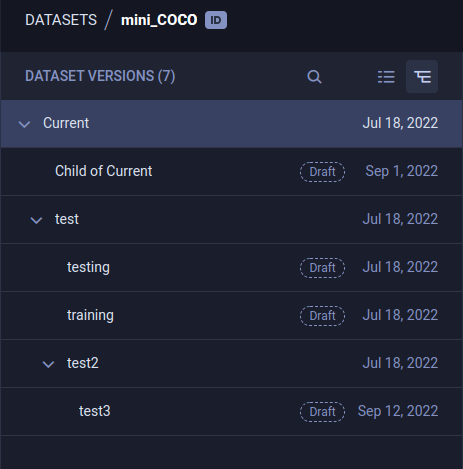

Use the Dataset versioning WebApp (UI) features for viewing, creating, modifying, and 
deleting [Dataset versions](../dataset.md#dataset-versioning).

## Dataset Version History
The WebApp (UI) presents your dataset version structure in [simple view](#simple-view) or [advanced view](#advanced-view), 
depending on the structure implemented. 

Use the search bar to find specific versions. You can query by version name or version description. The search returns 
all versions that match the query.

In advanced view, parent versions that do not match the query where a child version does appear in a muted color.

## Simple View 
While your dataset maintains a simple (linear) [version structure](../dataset.md#dataset-version-structure), the WebApp 
(UI) will present the version history as a table of historic snapshots:

### Creating Snapshots

To create a snapshot, you must be in the simple (version table) view. 

**To create a snapshot, do the following:**

1. Click **+ CREATE SNAPSHOT**.
1. Enter a version name, and optionally a description.
1. Click **CREATE**.

:::note VERSION BROWSING
Snapshots are always taken of the current version. If you are currently viewing a previous snapshot, click 
**RETURN TO CURRENT VERSION** to make snapshot creation available.
:::

You can view your dataset’s explicit version structure and create a more complex structure by switching to the advanced 
view.

### Modifying Snapshot Name
To modify a Dataset version name:
1. Click the snapshot name on the top left of the dataset page
1. Edit the name,
1. Click  (check).

        
## Advanced View

When employing a non-trivial [version structure](../dataset.md#dataset-version-structure) of your dataset, the WebApp 
(UI) presents the version history as a tree of versions.

### Creating Versions

**To create a child version, do the following:**

1. Click the (parent) version from which to create a child (inherit all frames).
1. Click **+ CREATE NEW VERSION**.
1. Enter a version name, and optionally a description.
1. Click **CREATE**.

### Publishing Versions

Publish (make read-only) any Dataset version whose status is *Draft*. If you publish a dataset's current version, the
dataset's structure will no longer be considered a simple version structure. 

**To publish a version, do the following:**

1. Click the version to publish.
1. Click **PUBLISH**.
1. Click **PUBLISH** again to confirm.

### Modifying Version Names

**To modify a Dataset version name:**
1. Click the dataset version name on the top left of the dataset page
1. Edit the name,
1. Click  (check).

### Deleting Versions

You can delete versions whose status is *Draft*. 

1. Click the version to delete.
1. Click **DELETE**.
1. Click **DELETE** again to confirm.

## Version Information
Additional information about the selected dataset version is presented below the version selection panel in collapsible 
panels:

### Version Info Panel 
Provides general version information:
* Version ID 
* Dataset ID 
* Dataset name 
* Status (*Draft* or *Published*) 
* Creating user
* Version update time
* Version description.

**To modify a version description, do the following:**

1. Expand the **INFO** area 
1. Hover over the **Description** element
1. Click 
1. Edit the description
1. Click  (check)

### Version Metadata Panel 
Any version specific metadata, in JSON format.
The content icon color signifies whether any metadata is currently accompanying the dataset version.

**To edit a version's metadata:**

1. Click  on the 
   **VERSION METADATA** panel to open the edit window
1. Edit the section contents (JSON format)
1. Click **OK**

### Version Label Statistics Panel
Label usage stats for this dataset version. 
* Each label is listed along with the number of times it was used in the version
* The pie chart visualizes these stats. Hover over a chart slice and its associated label and usage 
  percentage will appear at the center of the chart. 
  
  
## Version Frame Browser
The **Version Frame Browser** displays a preview of the contents of the selected dataset version.

View the version's frames as thumbnails or in a table. Use the view toggle to switch between thumbnail 
view  and 
table view  . 

Use the thumbnail view for a visual preview of the version's frames:

Use the table view to list the version’s frames in a customizable table. Click 
for column customization options.

The dataset version can be filtered by multiple criteria. The resulting frames can be exported as a JSON file. 

To view further details about a specific frame, click on its preview, which will open the [Frame Viewer](webapp_datasets_frames.md#frame-viewer).

### Simple Frame Filtering
Simple frame filtering applies one annotation object (ROI) label and returns frames containing at least one annotation 
with that label. 

**To apply a simple frame filter,**  select a label from the **LABEL FILTER** list.

Simple filter example

* The **version browser** in the image below contains 101 frames.

* A simple label filter for `teddy bear` shows three frames, each containing at least one ROI labeled `teddy bear`.

### Advanced Frame Filtering

Advanced frame filtering applies sophisticated filtering logic, which is composed of as many frame filters as needed, 
where each frame filter can be a combination of ROI, frame, and source rules. 
* ROI rules use include and exclude logic to match frames by ROI label; an ROI label can match frames containing at least 
  one annotation object (ROI) with all labels in the rule.
* Frame rules and source rules use Lucene queries with AND, OR, and NOT logic. Frame rules apply to frame metadata.
* Source rules apply to frame source information.

**To apply advanced filters:**
1. In the **Version Browser**, click **Switch to advanced filters**.
1. In a **FRAME FILTER**, create one of the following rules:
    * ROI rule
        * Choose **Include** or **Exclude**, select ROI labels, and optionally set the confidence level range.
        * To switch from the ROI dropdown list to a Lucene query mode, click .
    * Frame rule - Enter a Lucene query using frame metadata fields in the format `meta.<key>:<value>`.
    * Source rule - Enter a Lucene query using frame metadata fields in the format `sources.<key>:<value>`.            

#### Filtering Examples

ROI Rules

      

* Create one ROI rule for the `teddy bear` label, which shows the same three frames as the simple frame filter (above).

* In the ROI rule, add a second label. Add `partially_occluded`. Only frames containing at least one ROI labeled as both 
  `teddy bear` and `partially_occluded` match the filter.
  

   
* By opening a frame in the frame viewer, you can see an ROI labeled with both.

 

    
Frame Rules

    

Filter by metadata using Lucene queries.

* Add a frame rule to filter by the metadata key `dangerous` for the value of `yes`.
  

* Open a frame in the frame viewer to see its metadata.
  

            
 

Source Rules

Filter by sources using Lucene queries.    

* Add a source rule to filter for sources URIs with wildcards.
  

Lucene queries can also be used in ROI label filters and frame rules.

      

### Exporting Frames

To export (download) the filtered frames as a JSON file, click  > **EXPORT FRAMES**. 

### Frame Browser Configuration
Click   to open the
frame browser configuration settings. 

#### Grouping Previews
FrameGroups or SingleFrames can share the same `context_id` (URL). For example, users can set the same `context_id` 
to multiple FrameGroups that represent frames in a single video. 

Use the **Grouping** menu to select one of the following options:
* Split Preview - Show separate previews for each individual FrameGroup, regardless of shared context.
* Group by URL - Show a single preview for all FrameGroups with the same context   

#### Preview Source
When using multi-source FrameGroups, users can choose which of the FrameGroups’ sources will be displayed as the preview. 

Select a source from the **PREVIEW SOURCE** menu.
Choose the `Default preview source` option to present the first available source.

:::note Unavailable Source
If a FrameGroup doesn't have the selected preview source, the preview displays the "Source not available" message.
::: 

