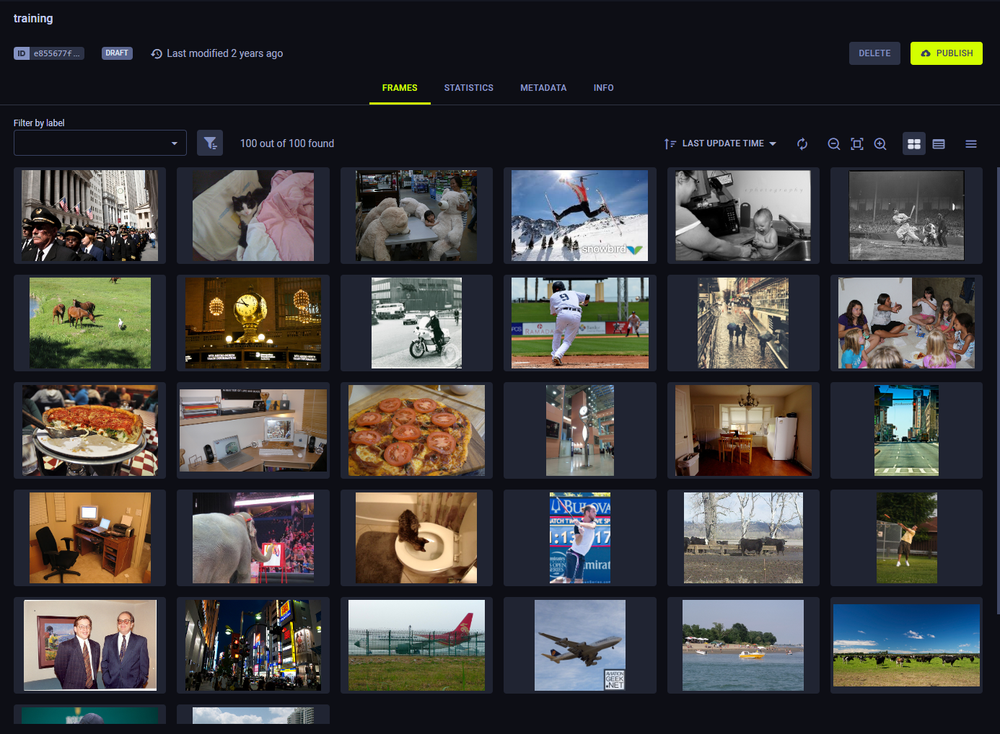
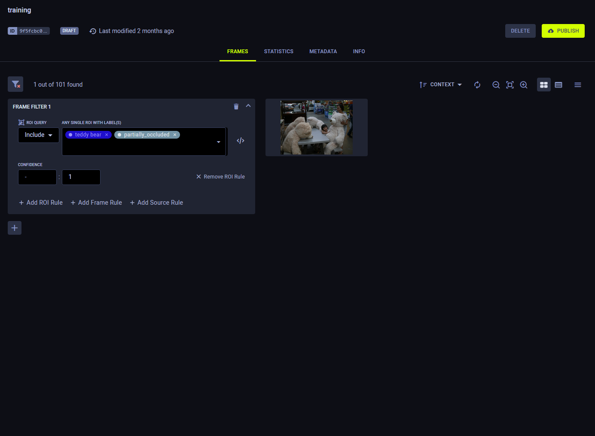
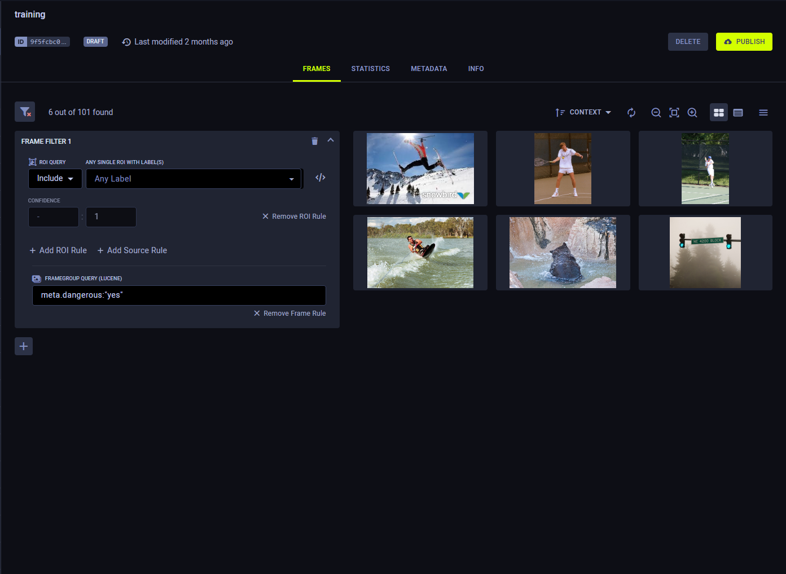
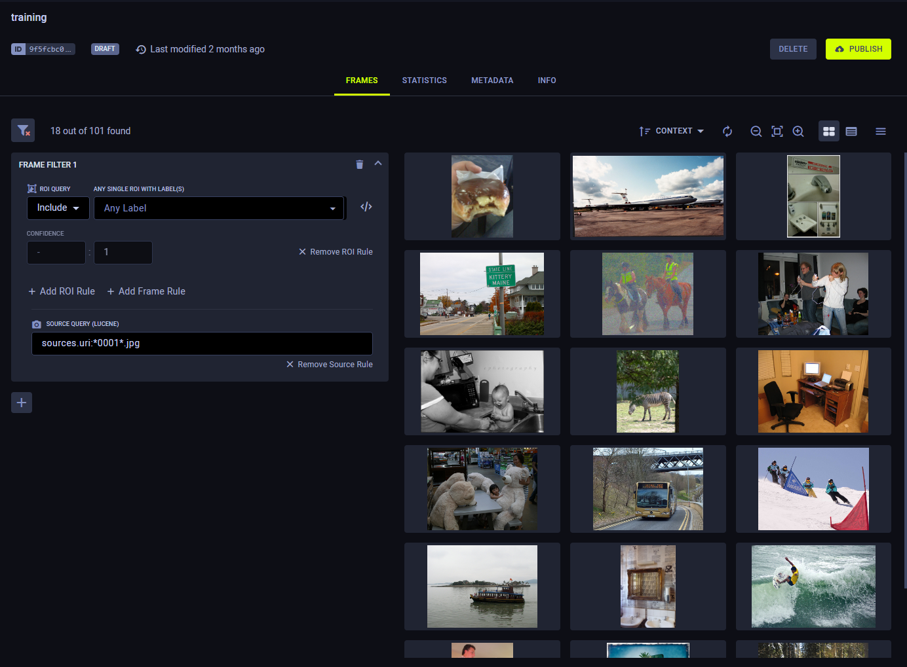
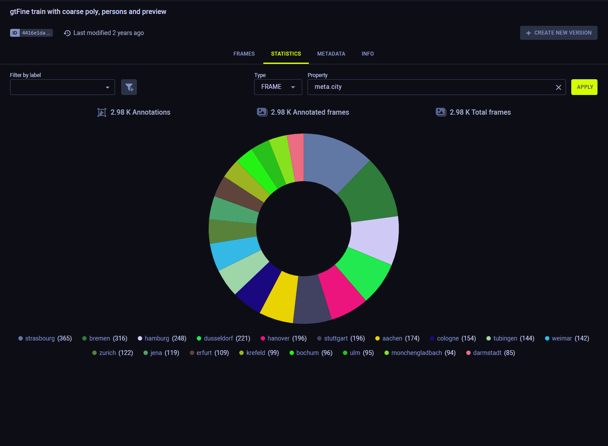

Use the Dataset versioning WebApp (UI) features for viewing, creating, modifying, and 
deleting [Dataset versions](../dataset.md#dataset-versioning).

## Dataset Version History
The WebApp (UI) presents your dataset version structure in list view  
or tree view . 

The list view lists the dataset's versions chronologically by last update time.

The tree view shows the lineage of the dataset's versions.

Use the search bar to find specific versions. You can query by version name or version description. The search returns 
all versions that match the query.

In tree view, parent versions that do not match the query where a child version does appear in a muted color.

### Version Actions 

Access dataset version actions, by right-clicking a version, or through the menu button  (available on hover).

* **Rename** - Change the version’s name
* **Create New Version** - Creates a child version of a *Published* dataset version. The new version is created in a *draft*
  state, and inherits all the parent version's frames
* **Delete** - Delete the version. Only *Draft* versions can be deleted.  
* **Publish** - Make a *Draft* version read-only to preserve its contents. 
 
## Version Data
A selected dataset version's information and contents are presented on the main section of the page, to the right of 
the dataset's version list.

The version information is presented in the following tabs:
* [Frames](#frames)
* [Statistics](#statistics)
* [Metadata](#metadata) 
* [Info](#info) 
   
## Frames
The **Frames**  tab displays the contents of the selected dataset version.

View the version's frames as thumbnail previews or in a table. Use the view toggle to switch between thumbnail 
view  and 
table view  . 

Use the thumbnail view for a visual preview of the version's frames. You can increase  
and decrease  the size of 
the previews.

Use the table view to list the version’s frames in a customizable table. Click 
for column customization options.

The dataset version's frames can be filtered by multiple criteria. The resulting frames can be exported as a JSON file. 

To view the details of a specific frame, click on its preview, which will open the [Frame Viewer](webapp_datasets_frames.md#frame-viewer).

### Simple Frame Filtering
Simple frame filtering returns frames containing at least one annotation with a specified label.

**To apply a simple frame filter,**  select a label from the **LABEL FILTER** list.

Simple filter example

* The **FRAMES** tab in the image below contains 101 frames.

* A simple label filter for `teddy bear` shows three frames, each containing at least one ROI labeled `teddy bear`.

### Advanced Frame Filtering

Alternatively, a combination of ROI, frame, and source rules can be specified to apply more elaborate and specific 
filters.
* ROI rules use include and exclude logic to match frames by ROI label; an ROI label can match frames containing at least 
  one annotation object (ROI) with all labels in the rule.
* Frame rules and source rules use Lucene queries with AND, OR, and NOT logic. Frame rules apply to frame metadata.
* Source rules apply to frame source information.

**To apply advanced filters:**
1. In the **FRAMES** tab, click **Advanced filters**.
1. In a **FRAME FILTER**, create one of the following rules:
    * ROI rule
        * Choose **Include** or **Exclude**, select ROI labels, and optionally set the confidence level range.
        * To switch from the ROI dropdown list to a Lucene query mode, click .
    * Frame rule - Enter a Lucene query using frame metadata fields in the format `meta.<key>:<value>`.
    * Source rule - Enter a Lucene query using frame metadata fields in the format `sources.<key>:<value>`.            

To clear all filters click . 

### Filtering Examples

ROI Rules

      

* Create one ROI rule for the `teddy bear` label, which shows the same three frames as the simple frame filter (above).

* In the ROI rule, add a second label. Add `partially_occluded`. Only frames containing at least one ROI labeled as both 
  `teddy bear` and `partially_occluded` match the filter.
  

   
* By opening a frame in the frame viewer, you can see an ROI labeled with both.

 

    
Frame Rules

    

Filter by metadata using Lucene queries.

* Add a frame rule to filter by the metadata key `dangerous` for the value of `yes`.
  

* Open a frame in the frame viewer to see its metadata.
  

            
 

Source Rules

Filter by sources using Lucene queries.    

* Add a source rule to filter for sources URIs with wildcards.
  

Lucene queries can also be used in ROI label filters and frame rules.

      

### Exporting Frames

To export (download) the filtered frames as a JSON file, click  > **EXPORT FRAMES**. 

### Frame Browser Configuration
Click   to open the
frame browser configuration settings. 

#### Grouping Previews
FrameGroups or SingleFrames can share the same `context_id` (URL). For example, users can set the same `context_id` 
to multiple FrameGroups that represent frames in a single video. 

Use the **Grouping** menu to select one of the following options:
* Split Preview - Show separate previews for each individual FrameGroup, regardless of shared context.
* Group by URL - Show a single preview for all FrameGroups with the same context   

#### Preview Source
When using multi-source FrameGroups, users can choose which of the FrameGroups’ sources will be displayed as the preview. 

Select a source from the **PREVIEW SOURCE** menu.
Choose the `Default preview source` option to present the first available source.

:::note Unavailable Source
If a FrameGroup doesn't have the selected preview source, the preview displays the "Source not available" message.
::: 

## Statistics

The **Statistics** tab displays a dataset version's label usage stats. 
* Each label is listed along with the number of times it was used in the version
* The pie chart visualizes these stats. Hover over a chart slice and its associated label and usage 
  percentage will appear at the center of the chart. 
  

## Metadata 
The **Metadata** tab presents any additional metadata that has been attached to the dataset version.

**To edit a version's metadata,**

1. Hover over the metadata box and click on the **EDIT** button
1. Edit the section contents (JSON format)
1. Click **OK**

## Info 

The **Info** tab presents a version's general information:
* Version ID 
* Version name  
* Dataset ID 
* Dataset name 
* Dataset description
* Dataset tags  
* Status (*Draft* or *Published*) 
* Creating user
* Version update time
* Number of frames
* Percentage of annotated frames  
* Version description (editable, hover over element and click ) 

