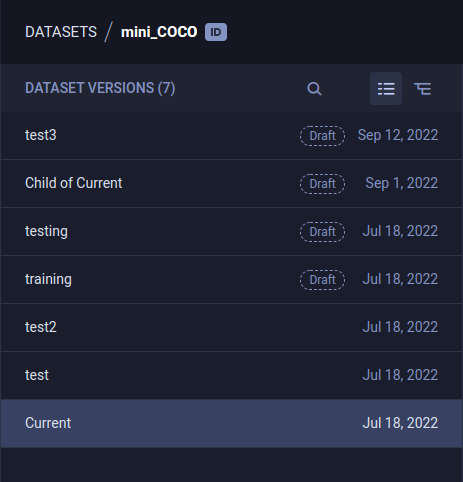
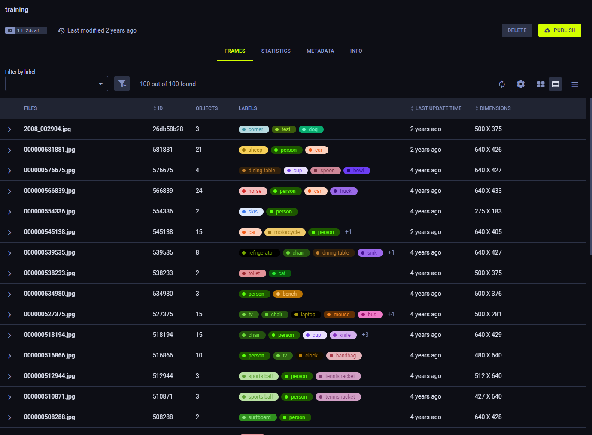
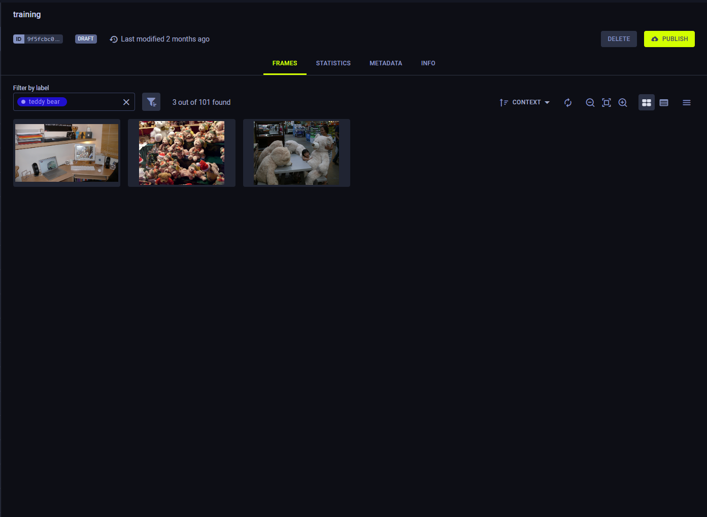
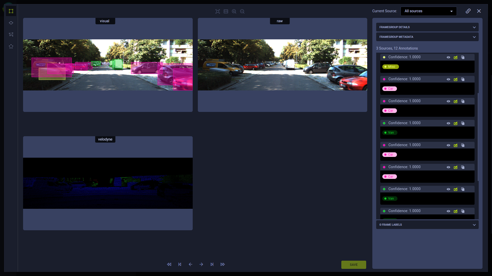

Use the Dataset versioning WebApp (UI) features for viewing, creating, modifying, and 
deleting [Dataset versions](../dataset.md#dataset-versioning).

## Dataset Version History
The WebApp (UI) presents your dataset version structure in list view  
or tree view . 

The list view lists the dataset's versions chronologically by last update time.

The tree view shows the lineage of the dataset's versions.

Use the search bar to find specific versions. You can query by version name, version description, or version ID. The search returns 
all versions that match the query.

In tree view, parent versions that do not match the query where a child version does appear in a muted color.

### Version Actions 

Access dataset version actions, by right-clicking a version, or through the menu button  (available on hover).

* **Rename** - Change the version's name
* **Create New Version** - Creates a child version of a *Published* dataset version. The new version is created in a *draft*
  state, and inherits all the parent version's frames
* **Delete** - Delete the version. Only *Draft* versions can be deleted.  
* **Publish** - Make a *Draft* version read-only to preserve its contents. 
 
:::tip Publishing versions
When publishing a version, you can create an additional working copy. The new version is created in a *draft* state, and 
inherits all the published version's frames. 

:::

## Version Data
A selected dataset version's information and contents are presented on the main section of the page, to the right of 
the dataset's version list.

The version information is presented in the following tabs:
* [Frames](#frames)
* [Statistics](#statistics)
* [Metadata](#metadata) 
* [Info](#info) 
   
## Frames
The **Frames** tab displays the contents of the selected dataset version.

View the version's frames as thumbnail previews or in a table. Use the view toggle to switch between thumbnail 
view  and 
table view . 

Use the thumbnail view for a visual preview of the version's frames. You can increase  
and decrease  the size of 
the previews.

Use the table view to list the version's frames in a customizable table. Click 
for column customization options.

The dataset version's frames can be filtered by multiple criteria. The resulting frames can be [exported as a JSON file](#exporting-frames). 

To view the details of a specific frame, click on its preview, which will open the [Frame Viewer](webapp_datasets_frames.md#frame-viewer).

### Simple Frame Filtering
Simple frame filtering returns frames containing at least one annotation with a specified label.

**To apply a simple frame filter,** select a label from the **LABEL FILTER** list.

<Collapsible type="screenshot" title="Simple filter example">

* The **FRAMES** tab in the image below contains 101 frames.

* A simple label filter for `teddy bear` shows three frames, each containing at least one ROI labeled `teddy bear`.

</Collapsible>

### Advanced Frame Filtering

Alternatively, a combination of ROI, frame, and source rules can be specified to apply more elaborate and specific 
filters.

**To apply advanced filters:**
1. In the **FRAMES** tab, click  (**Advanced filters**).
1. In a **FRAME FILTER**, create one of the following rules:
   * ROI rule - Use "Include" and "Exclude" conditions to match frames by ROI label; frames match the rule when 
   containing at least one annotation object (ROI) with **all** labels in the rule. Click  
   to explicitly specify your rule with Lucene 
   * Frame rule - Query frame metadata. Enter a Lucene query of frame metadata fields in the format `meta.<key>:<value>` 
   (can use AND, OR, and NOT operators).
   * Source rule - Query frame source information. Enter a Lucene query of frame metadata fields in the format 
   `sources.<key>:<value>` (can use AND, OR, and NOT operators).
   
A frame filter can contain a number of rules. For each frame filter, the rules are applied with a logical AND operator. For example, the dataset version in the image below has one filter. “Frame Filter 1” has two rules: 
1. ROI rule - the frame must include an ROI with the `cat` label
2. Source rule - the frames must be 640 pixels wide. 

The returned frames are those that match the first rule AND the second rule within the frame filter.

Create additional frame filters by clicking . 
Multiple frame filters are applied with a logical OR operator. 

For example, the dataset version in the image below has two frame filters. "Frame Filter 1" has the same two rules 
described in the example above. "Frame Filter 2" specifies an ROI rule for the frame to contain an ROI with the label 
`dog`. So the frames returned are those that match ALL of Frame Filter 1's rules OR ALL of Frame Filter 2's rules.  

To clear all filters click . 

#### Filtering Examples

<Collapsible type="screenshot" title="ROI Rules"> 

* Create one ROI rule for the `teddy bear` label, which shows the same three frames as the simple frame filter (above).

* In the ROI rule, add a second label. Add `partially_occluded`. Only frames containing at least one ROI labeled as both 
  `teddy bear` and `partially_occluded` match the filter.
  

   
* By opening a frame in the frame viewer, you can see an ROI labeled with both.

</Collapsible>

<Collapsible type="screenshot" title="Frame Rules">

Filter by metadata using Lucene queries.

* Add a frame rule to filter by the metadata key `dangerous` for the value of `yes`.
  

* Open a frame in the frame viewer to see its metadata.
  

</Collapsible>

<Collapsible type="screenshot" title="Source Rules">

Filter by sources using Lucene queries.    

* Add a source rule to filter for source URIs with wildcards.
  

Lucene queries can also be used in ROI label filters and frame rules.

</Collapsible>      

### Sorting Frames 

Sort the dataset version’s frames by any of the following attributes:
* ID 
* Last update time
* Dimensions (height)
* Timestamp
* Context ID
* Metadata key - Click `+ Metadata Key` and select the desired key for sorting

Click  to toggle between ascending and descending sort orders.

### Exporting Frames

To export (download) the filtered frames as a JSON file, click  > **EXPORT FRAMES**. 

### Frame Browser Configuration
Click   to open the
frame browser configuration settings. 

#### Grouping Previews

Use the **Grouping** menu to set how to display frames that share a common property:
* **Split Preview** - Show a separate preview for each individual FrameGroup
* **Group by URL** - Show a single preview for all FrameGroups with the same context ID. For example, users can set the 
same `context_id` to multiple FrameGroups that represent frames in a single video.
* **Sample by Property** - Specify a frame or ROI property whose value to group frames by and set the number of frames 
to preview for each group. For example, in the image below, frames are grouped by ROI labels. Each group displays six 
samples of frames that contain an ROI with the same label.

**To sample by property:**
1. In the **Grouping** menu, click **Sample by Property**
1. In the **Sample by Property** modal, input the following:
      * Select the Property type:
         * ROI - Properties associated with the frame ROIs (e.g. ROI label names, IDs, confidence, etc.) 
         * Frame -  Properties associated with the frames (e.g. update time, metadata, timestamp, etc.)
      * Property name - Property whose value to group the frames by 
      * Sample size - Number of frames to preview for each group
      * ROI match query (*For grouping by ROI property only*) - A Lucene query to filter which of a frame's ROIs
      to use in grouping by their properties. For example, in a Hyper-Dataset where ROIs have object labels and type labels, 
      view a sample of frames with different types of the same object by grouping frames according to `label.keyword`
      with a match query for the object of interest.
   
      

      The image below shows a sample of 3 frames which have ROIs of each type (`pedestrian`, `rider`, `sitting`) of `person`.

      
      :::note Property N/A group
      If there are frames which have no value for the grouped by property, a sample of them will be provided as a final
      group. If you sample according to an ROI property, this group will NOT include frames that have no ROIS at all.
      :::
1. Click **Save**

Once saved, whenever you select the **Sample by Property** option in the **Grouping** menu, the frame will be grouped 
according to the previously configured setting. 

**To modify the grouping property:**
1. Hover over **Sample by Property** 
1. Click 
1. Modify the **Sample by Property** configuration
1. Click **Save**

#### Preview Source
When using multi-source FrameGroups, users can choose which of the FrameGroups' sources will be displayed as the preview. 

Select a source from the **Current Source** menu.
Choose the `Default preview source` option to present the first available source for each frame (sources are retrieved in ASCIIbetical order).

Choose the `All sources` option to present all the FrameGroup’s sources in a grid. In this view, the annotation panel 
shows annotations grouped by their respective sources. Additionally, annotation tools  (e.g. create/delete/modify 
annotations) are not available in this view.    

:::note Unavailable Source
If a FrameGroup doesn't have the selected preview source, the preview displays the "Source not available" message.
::: 

## Statistics

The **Statistics** tab allows exploring frame and ROI property distribution across a Hyper-Dataset version:
1. Query the frames to include in the statistics calculations under **Filter by label**. Use [simple](#simple-frame-filtering) 
or [advanced](#advanced-frame-filtering) frame filters. If no filter is applied, all frames in the dataset version will 
be included in the calculation. 
1. Select the property whose distribution should be calculated 
   * Select the property **Type**:
      * **ROI** - Frame ROI properties (e.g. ROI label, ID, confidence, etc.). This will calculate the distribution of 
     the specified property across all ROIs in the version's frames.
      * **Frame** - Frames properties (e.g. update time, metadata keys, timestamp, etc.)
   * Input the **Property** key (e.g. `meta.location`) 
   * If **ROI** property was selected, you can also limit the scope of ROIs included in the calculation with the
   **Count ROIs matching** filter: Input a Lucene query to specify which ROIs to count
1. Click **Apply** to calculate the statistics 

For example, calculating the distribution for the `label` ROI property, specifying `rois.confidence: 1` for ROI matching 
will show the label distribution across only ROIs with a confidence level of 1.

By default, the ROI label distribution across the entire Hyper-Dataset version is shown.
The tab displays the following information
* Object counts:
    * Number of annotations matching specification
    * Number of annotated frames in the current frame filter selection
    * Total number of frames in the current frame filter selection
* Each property is listed along with its number of occurrences in the current frame filter selection
* The pie chart visualizes this distribution. Hover over a chart segment and its associated property and count will 
appear in a tooltip and its usage percentage will appear at the center of the chart.
  

## Metadata 
The **Metadata** tab presents any additional metadata that has been attached to the dataset version.

**To edit a version's metadata,**

1. Hover over the metadata box and click on the **EDIT** button
1. Edit the section contents (JSON format)
1. Click **OK**

## Info 

The **Info** tab presents a version's general information:
* Version ID 
* Version name  
* Dataset ID 
* Dataset name 
* Dataset description
* Dataset tags  
* Status (*Draft* or *Published*) 
* Creating user
* Version update time
* Number of frames
* Percentage of annotated frames  
* Version description (editable, hover over element and click ) 

