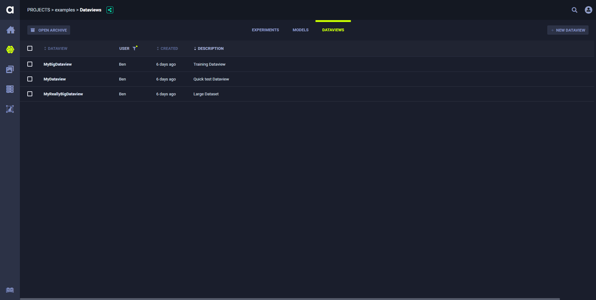
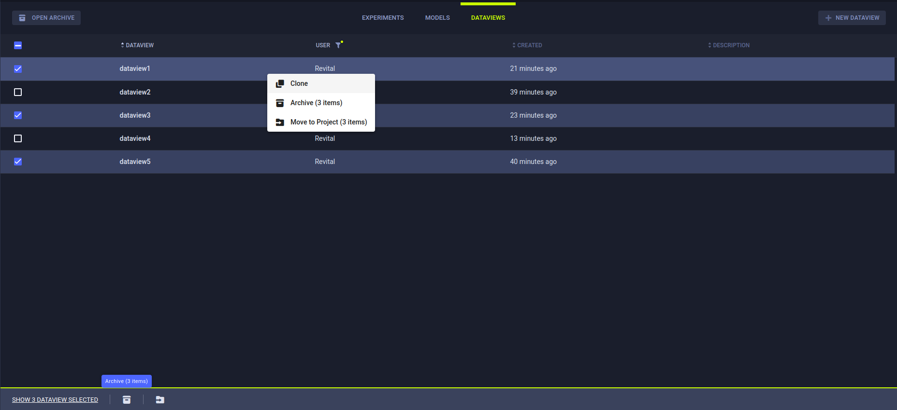

[Dataviews](../dataviews.md) appear in the same Project as the experiment that stored the Dataview in the ClearML Enterprise platform, 
as well as the **DATAVIEWS** tab in the **All Projects** page.

The **Dataviews table** is a [customizable](#customizing-the-dataviews-table) list of Dataviews associated with a project.
Use it to [view, create, and edit Dataviews](#viewing-adding-and-editing-dataviews) in the info panel. Dataview tables 
can be filtered by name or name fragments and / or ID, by using the search bar.

The Dataviews table columns in their default order are below. Dynamically order the columns by dragging a column heading 
to a new position.

* **DATAVIEW** - Dataview name.
* **USER** - User creating the Dataview.
* **CREATED** - Elapsed time since the Dataview was created.
* **DESCRIPTION**

## Customizing the Dataviews Table

The Dataviews table can be customized. Changes are persistent (cached in the browser), and represented in the URL. 
Save customized settings in a browser bookmark, and share the URL with teammates.

Customize any combination of the following:

* Dynamic column ordering - Drag a column title to a different position.
* Filter by user
* Sort columns - By experiment name and / or elapsed time since creation.
* Column autofit - In the column heading, double click a resizer (column separator).

:::note
The following Dataviews-table customizations are saved on a **per project** basis: 
* Column order
* Column width
* Active sort order
* Active filters

If a project has subprojects, the Dataviews can be viewed by their subproject groupings or together with 
all the Dataviews in the project. The customizations of these two views are saved separately. 
:::

## Dataview Actions

The following table describes the actions that can be performed from the Dataviews table. 

| ClearML Action | Description |
|---|---|--|
| View details | Dataview details, including input datasets, label mapping, augmentation operations, and iteration control. Click a Dataview and the info panel slides open. |
| Archive | To more easily work with active Dataviews, move a Dataview to the archive. See [Archiving Dataviews](#archiving-dataviews). | 
| Clone | Make an exact copy of a Dataview. |
| Move to project | To organize work and improve collaboration, move a Dataview to another project. | 

These actions can be accessed with the context menu (when right-clicking a Dataview or clicking the menu button 
in a Dataview's info panel).

Some of the actions mentioned in the chart above can be performed on multiple Dataviews at once.
Select multiple Dataviews, then use either the context menu, or the bar that appears at the bottom of the page, to perform
operations on the selected Dataviews. The context menu shows the number of Dataviews that can be affected by each action. 
The same information can be found in the bottom menu, in a tooltip that appears when hovering over an action icon. 

## Viewing, Adding, and Editing Dataviews

**To view, add, or edit a Dataview:**

1. Do one of the following:
    
    * Create a new Dataview - Click **+ NEW DATAVIEW**.
    * View or edit a Dataview - In the Dataview table, click the Dataview.
    
1. To edit sections of the Dataview, follow the steps on the "Modifying Dataviews" page for the following:

    1. [Selecting Dataset versions](webapp_exp_modifying.md#selecting-dataset-versions)
    1. [Filtering frames](webapp_exp_modifying.md#filtering-frames)
    1. [Mapping labels (label translation)](webapp_exp_modifying.md#mapping-labels-label-translation) (if appropriate for 
       the data and experiment)
    1. [Label enumeration](webapp_exp_modifying.md#label-enumeration)
    1. [Data augmentation](webapp_exp_modifying.md#data-augmentation)  (if appropriate for the data 
       and experiment)
    1. [Iteration controls](webapp_exp_modifying.md#iteration-controls)

## Cloning Dataviews

Create an exact editable copy of a Dataview. For example, when tuning an experiment, clone a Dataview to apply the same 
frame filters to different Dataset versions.

**To clone a Dataview:**

1. Do one of the following:

    * In the Dataview table, right click a Dataview and then click **Clone**.
    * If the info panel is opened, click  
      (menu) and then click **Clone**.
    
1. Select a project or accept the current project, enter a name, and optionally enter a description

1. Click **CLONE**.

## Archiving Dataviews

Archive Dataviews to more easily manage current work. Archived Dataviews do not appear on the active Dataviews table. 
They only appear in the archive. After archiving, the Dataview can be restored from the archive later.

**To archive a Dataview:**

* In the Dataview table:
    * Archive one Dataview - Right click the Dataview **>** **Archive**.
    * Archive multiple Dataviews - Select the Dataview checkboxes **>** In the footer menu that appears at the bottom of 
      the page, click **ARCHIVE**.
* In the Dataview info panel - Click  
  (menu) **>** **ARCHIVE**.

**To restore a Dataview:**

1. Go to the Dataview table of the archived Dataview or of the **All Projects** page
1. Click **OPEN ARCHIVE**
1. Do any of the following:
    * In the Dataview table:
        * Restore one Dataview - Right click the Dataview **>** **Restore**.
        * Restore multiple Dataviews - Select the Dataview checkboxes **>** **Restore**.
    * In the info panel, restore one Dataview - Click  
      (menu) **>** **Restore**.

