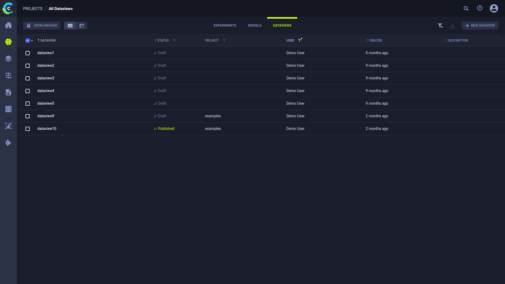

[Dataviews](../dataviews.md) appear in the same Project as the experiment that stored the Dataview in the ClearML Enterprise platform, 
as well as the **DATAVIEWS** tab in the **All Projects** page.

The **Dataviews table** is a [customizable](#customizing-the-dataviews-table) list of Dataviews associated with a project.
Use it to view, create, and edit Dataviews in the info panel. 

View the Dataviews table in table view  
or in details view ,
using the buttons on the top left of the page. Use the table view for a comparative view of your Dataviews according to 
columns of interest. Use the details view to access a selected Dataview’s details, while keeping the Dataview list in view.
Details view can also be accessed by double clicking a specific Dataview in the table view to open its details view. 

The Dataviews table includes the following columns: 

|Column|Description|Type|
|--|--|--|
|**DATAVIEW** | Dataview name | String|
|**USER** | User who created the Dataview | String|
|**STATUS** | The status of the Dataview, which can be *Draft* (editable) or *Published* (read-only)| String| 
|**PROJECT** | The project name with which the dataview is associated| String|
|**CREATED** | Elapsed time since the Dataview was created| Date-time|
|**DESCRIPTION**| A description of the Dataview | String| 

Dynamically order the columns by dragging a column heading 
to a new position.

## Customizing the Dataviews Table

The Dataviews table can be customized. Changes are persistent (cached in the browser), and represented in the URL. 
Save customized settings in a browser bookmark, and share the URL with teammates.

Customize the table using any of the following:

* Dynamic column order - Drag a column title to a different position.
* Resize columns - Drag the column separator to change the width of that column. Double click the column separator for automatic fit.
* Filter by user and / or status - When a filter is applied to a column, its filter icon will appear with a highlighted 
  dot on its top right ( ). To 
  clear all active filters, click 
  in the top right corner of the table.
* Sort columns - By experiment name and / or elapsed time since creation.

:::note
The following Dataviews-table customizations are saved on a **per project** basis: 
* Column order
* Column width
* Active sort order
* Active filters

If a project has subprojects, the Dataviews can be viewed by their subproject groupings or together with 
all the Dataviews in the project. The customizations of these two views are saved separately. 
:::

## Dataview Actions

The following table describes the actions that can be performed from the Dataviews table. 

Access these actions with the context menu in any of the following ways:
* In the Dataviews table, right click a Dataview, or hover over a Dataview and click 
* In a Dataview info panel, click the menu button 

| ClearML Action | Description |
|---|---|
| Details | View Dataview details, including input datasets, label mapping, augmentation operations, and iteration control. Can also be accessed by double clicking a Dataview in the Dataviews table. |
| Archive | To more easily work with active Dataviews, move a Dataview to the archive, removing it from the active Dataview table. | 
| Restore | Action available in the archive. Restore a Dataview to the active Dataviews table. |
| Clone | Make an exact copy of a Dataview that is editable. |
| Move to Project | To organize work and improve collaboration, move a Dataview to another project. |
| Publish |  Publish a Dataview to prevent changes to it. *Published* Dataviews are read-only.|
| Custom action | When available, provides a mechanism to define your own custom action which will appear in the context menu. See [Custom UI Context Menu Actions](../../deploying_clearml/clearml_server_config.md#custom-ui-context-menu-actions).|

Some of the actions mentioned in the chart above can be performed on multiple Dataviews at once.
Select multiple Dataviews, then use either the context menu, or the bar that appears at the bottom of the page, to perform
operations on the selected Dataviews. The context menu shows the number of Dataviews that can be affected by each action. 
The same information can be found in the bottom menu, in a tooltip that appears when hovering over an action icon. 

## Creating a Dataview 

Create a new Dataview by clicking the **+ NEW DATAVIEW** button at the top right of the table, which open a 
**NEW DATAVIEW** window. 

