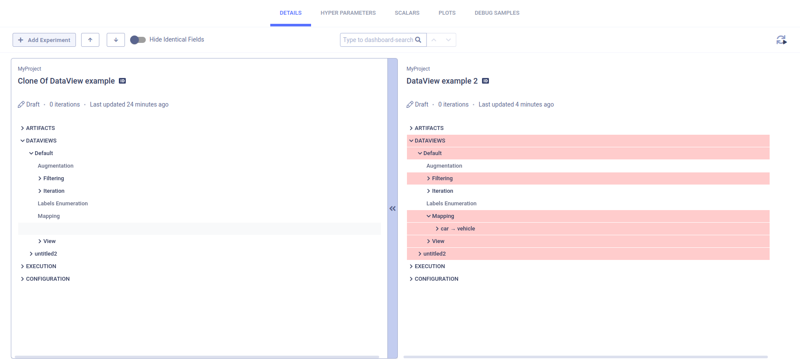

--- 
title: Comparing Dataviews
---

In addition to [**ClearML**'s comparison features](../../webapp/webapp_exp_comparing.md), the ClearML Enterprise WebApp 
provides a deep comparison of input data selection criteria of experiment Dataviews, enabling to easily locate, visualize, and analyze differences.

## Selecting Experiments 

**To select experiments to compare:**

1. In the experiment's table, select the checkbox of each experiment to compare, or select the top checkbox for all experiments. 
   After selecting the second checkbox, the bottom bar appears.
1. In the bottom bar, click **COMPARE**. The comparison page appears, showing a column for each experiment and differences with 
   a highlighted background color. The experiment on the left is the base experiment. Other experiments compare to the base experiment.

## Dataviews (Input Data)

**To locate the input data differences:**

1. Click the **DETAILS** tab **>** Expand the **DATAVIEWS** section, or, in the header, click  
   (Previous diff) or  (Next diff).
1. Expand any of the following sections:

* **Augmentation** - On-the-fly data augmentation.
* **Filtering** 
  * Frame inclusion and exclusion rules based on ROI labels
  * Frame metadata
  * Frame sources 
  * Number of instances of a rule matching ROIs in each frame
  * Confidence levels.
* **Iteration** - Iteration controls.
* **Labels Enumeration** - Class label enumeration.
* **Mapping** - ROI label translation.
* **View**

