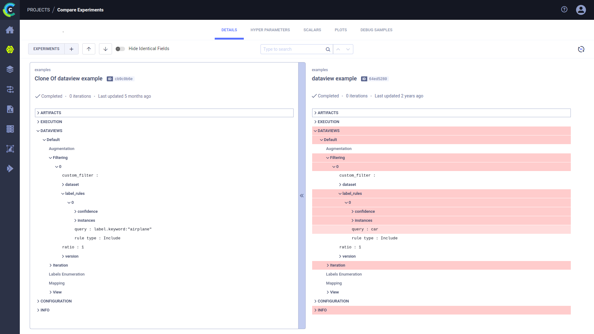

--- 
title: Comparing Dataviews
---

In addition to [ClearML's comparison features](../../webapp/webapp_exp_comparing.md), the ClearML Enterprise WebApp 
supports comparing input data selection criteria of experiment [Dataviews](../dataviews.md), enabling to easily locate, visualize, and analyze differences.

## Selecting Experiments 

To select experiments to compare:
1. Go to an experiments table that includes the experiments to be compared.
1. Select the experiments to compare. Once multiple experiments are selected, the batch action bar appears.
1. In the batch action bar, click **COMPARE**. 

The comparison page opens in the **DETAILS** tab, showing a column for each experiment. 

## Dataviews

In the **Details** tab, you can view differences in the experiments' nominal values. Each experiment's information is 
displayed in a column, so each field is lined up side-by-side. Expand the **DATAVIEWS** 
section to view all the Dataview fields side-by-side (filters, iterations, label enumeration, etc.). The differences between the 
experiments are highlighted. Obscure identical fields by switching on the `Hide Identical Fields` toggle. 

The experiment on the left is used as the base experiment, to which the other experiments are compared. You can set a 
new base experiment 
in one of the following ways:
* Click  
on the top right of the experiment that will be the new base.
* Click on the new base experiment and drag it all the way to the left

