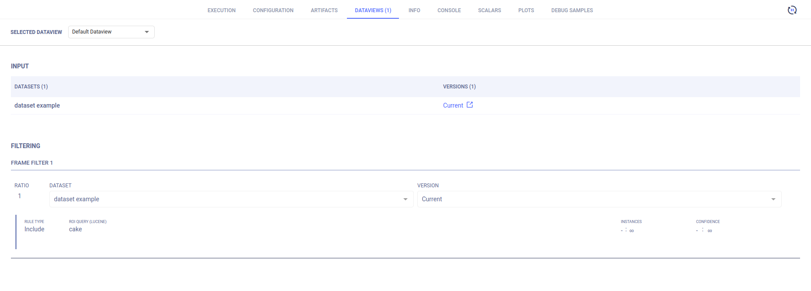

While an experiment is running, and any time after it finishes, results are tracked and can be visualized in the ClearML 
Enterprise WebApp (UI). 

In addition to all of ClearML's offerings, ClearML Enterprise keeps track of the Dataviews associated with an 
experiment, which can be viewed and [modified](webapp_exp_modifying.md) in the WebApp.

## Viewing an Experiment's Dataviews 

In an experiment's page, go to the **DATAVIEWS** tab to view all the experiment's Dataview details, including:
* Input data [selection](#input) and [filtering](#filtering)
* ROI [mapping](#mapping) (label translation)
* [Label enumeration](#label-enumeration)
* On-the-fly [data augmentation](#augmentation)
* [Iteration controls](#iteration-control)

### Input

SingleFrames are iterated from the Dataset versions specified in the **INPUT** area, in the **SELECTED DATAVIEW** drop-down 
menu.

### Filtering

The **FILTERING** section lists the SingleFrame filters iterated by a Dataview, applied to the experiment data. 

Each frame filter is composed of: 
* A Dataset version to input from 
* ROI Rules for SingleFrames to include and / or exclude certain criteria.
* Weights for debiasing input data. 
  
Combinations of frame filters can implement complex querying. 

For more detailed information, see [Filtering](../dataviews.md#filtering).

### Mapping

ROI label mapping (label translation) applies to the new model. For example, use ROI label mapping to accomplish the following: 

* Combine several labels under another more generic label.
* Consolidate disparate datasets containing different names for the ROI.
* Hide labeled objects from the training process.

For detailed information, see [Mapping ROI labels](../dataviews.md#mapping-roi-labels).

### Label Enumeration

Assign label enumeration in the **LABELS ENUMERATION** area.

### Augmentation

On-the-fly data augmentation applied to SingleFrames, which does not create new data. Apply data Augmentation in steps, 
where each step is composed of a method, an operation, and a strength.
 
For detailed information, see [Data augmentation](../dataviews.md#data-augmentation).

### Iteration Control

The input data iteration control settings determine the order, number, timing, and reproducibility of the Dataview iterating 
SingleFrames. Depending upon the combination of iteration control settings, all SingleFrames may not be iterated, and some may repeat. 

For detailed information, see [Iteration control](../dataviews.md#iteration-control).

