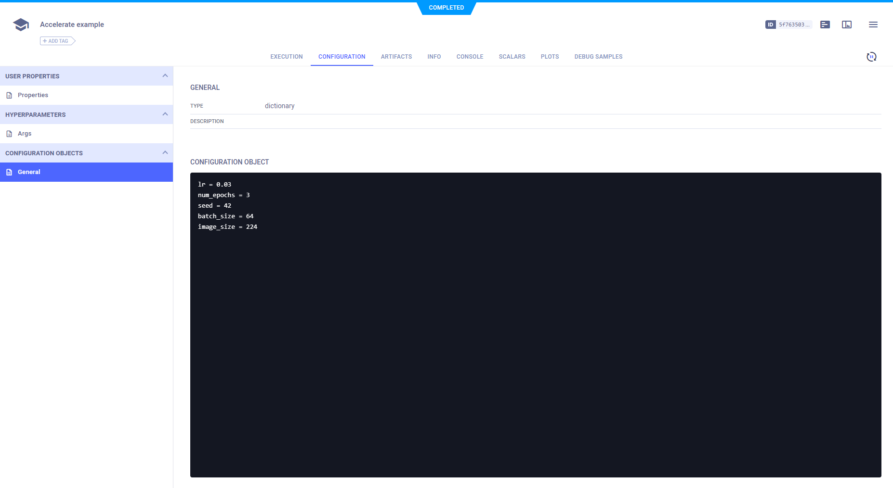

HuggingFace's [Accelerate](https://huggingface.co/docs/accelerate/main/en/index) library simplifies DL model training 
and inference. ClearML is a supported tracker in Accelerate: It automatically logs experiment environment information, 
such as required packages and uncommitted changes, and supports reporting scalars, parameters, debug samples, and plots.


## Setup

To use Accelerate's ClearML tracker, make sure that `clearml` is [installed and set up](../getting_started/ds/ds_first_steps.md#install-clearml) 
in your environment, and use the `log_with` parameter when instantiating an `Accelerator`:

```python
from accelerate import Accelerator

accelerator = Accelerator(log_with="all")  # For all available trackers in the environment
accelerator = Accelerator(log_with="clearml") # For the ClearML tracker only
```

Add `Accelerator.init_trackers()` in the beginning of your experiment. Specify the project where the ClearML task should
be saved in the `project_name` parameter, and add any experiment hyperparameters to be logged in the `config` parameter. 

The following code initializes the ClearML Task, which will capture all environment details, such as required packages 
and uncommitted code. The logged hyperparameters are displayed in the experiment's **Hyperparameters** tab:


```python
hps = {"lr": 0.03, "num_epochs": 3, "seed": 42, "batch_size": 64, "image_size": 224}
accelerator.init_trackers(project_name="my_project", config=hps)
```

:::tip
You can also pass parameters to [`Task.init()`](../references/sdk/task.md#taskinit) by adding a nested dictionary
to the `init_kwargs` argument of `Accelerator.init_trackers()`: use `"clearml"` as the key, and a dictionary of 
parameter-name/parameter-value pairs as the value. For example, the following code adds tags to your task:

```python
accelerator.init_trackers(
    project_name="my_project", 
    configs=hp, 
    init_kwargs={"clearml": {"tags": ["tag_a", "tag_b"]}}
)
```
:::



## Logging 

### Scalars 
To log scalars use `Accelerator.log()`. Specify a dictionary of name-value pairs under `values` and the step number 
under `step`.

Within the `values` dictionary, the name in each name-value pair is a string representing the title (metric) and series 
(variant) of the scalar. The `eval_`, `test_`, or `train_` name prefixes, will cause the scalar to be logged under the 
corresponding `eval`, `test`, or `train` title, and the remaining part of the name will be logged as the series. If none 
of these prefixes is used, the entire string is used as the series, and the title will default to `train`. 

If `step` is not specified, the scalar is reported as a single-value scalar. 

```python
accelerator.log(values={"accuracy": accuracy}, step=epoch)
```

The scalars are displayed in the experiment's **Scalars** tab. 

### Images and Table Plots
To add images or table plots to your experiment, you can use the `ClearMLTracker.log_images()` and `ClearMLTracker.log_table()`
respectively. 

First instantiate the `ClearMLTracker`. If you have run `Accelerator.init_trackers()` in your script, that means a ClearML 
task has already been initialized, so anything logged through the tracker will be logged to the existing task.  
Otherwise, just specify the experiment name under `run_name` and any kwargs to pass to 
[`Task.init()`](../references/sdk/task.md#taskinit):

```python
from accelerate.tracking import ClearMLTracker

clearml_tracker= ClearMLTracker(run_name="Example experiment")
```

#### Logging Images 
To log images, use `ClearMLTracker.log_images()`. Specify a dictionary of name-image pairs under `values` and the step
number under `step`. 

Within the `values` dictionary, the name in each name-image pair should be a string representing the title (metric) and 
series (variant) of the image. The `eval_`, `test_`, or `train_` name prefixes, will cause the image to be logged under 
the corresponding `eval`, `test`, or `train` title, and the remaining part of the name will be logged as the series. 
If none of these prefixes is used, the entire string is used as the series, and the title will default to `train`. The 
image in the name-image pair should be either a numpy array or a `PIL.Image` object.

```python
clearml_tracker.log_images(values={"test_cat_siamese":[image_obect]})
```

The images will be displayed in the experiment's **Debug Samples**

#### Logging Plots 

To log plots, use `ClearMLTracker.log_table()`. Specify the data under the `dataframe` or `data` parameters. List the 
name of the columns under `columns`, otherwise the first entry in `data` will be used as the column names. 

The plot will appear in the experiment's **Plots** tab. 

### Additional Logging Options

To augment its automatic logging, ClearML also provides an explicit logging interface.

See more information about explicitly logging information to a ClearML Task:
* [Models](../clearml_sdk/model_sdk.md#manually-logging-models)
* [Configuration](../clearml_sdk/task_sdk.md#configuration) (e.g. parameters, configuration files)
* [Artifacts](../clearml_sdk/task_sdk.md#artifacts) (e.g. output files or python objects created by a task)
* [Scalars](../clearml_sdk/task_sdk.md#scalars) 
* [Text/Plots/Debug Samples](../fundamentals/logger.md#manual-reporting)

See [Explicit Reporting Tutorial](../guides/reporting/explicit_reporting.md).

## Close Task 

Once you've finished training, make sure to run `Accelerator.end_training()` so that ClearML can mark the task as 
completed.

```python
accelerator.end_training()
```
