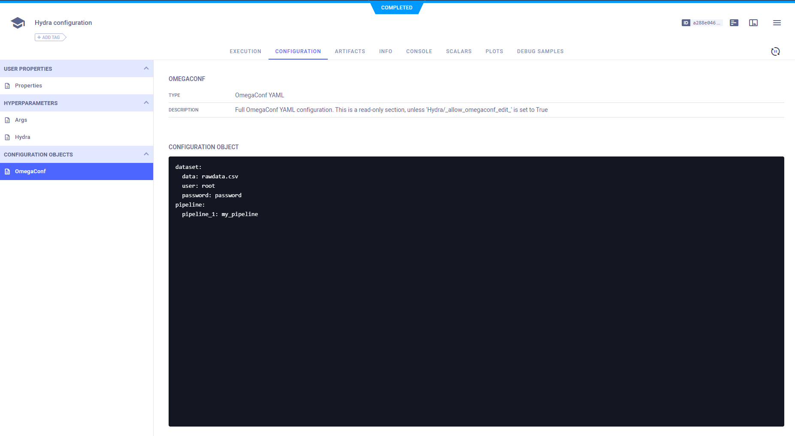

:::tip
If you are not already using ClearML, see [Getting Started](../getting_started/ds/ds_first_steps.md) for setup 
instructions.
:::


[Hydra](https://github.com/facebookresearch/hydra) is a Python framework for managing experiment parameters. ClearML integrates seamlessly
with Hydra and automatically logs the `OmegaConf` which holds all the configuration files, as well as 
values overridden during runtime. 

All you have to do is add two lines of code:

```python
from clearml import Task
task = Task.init(task_name="<task_name>", project_name="<project_name>")
```

ClearML logs the OmegaConf as a blob and can be viewed in the 
[WebApp](../webapp/webapp_overview.md), in the experiment's **CONFIGURATION > CONFIGURATION OBJECTS > OmegaConf** section. 



## Modifying Hydra Values

### Via Command Line
You can use Hydra's command line syntax to modify your OmegaConf: override, append, or remove config values:
* Override config value: `foo.bar=value`
* Append config value: `+foo.bar=value`
* Remove config value: `~foo.bar` or `~foo.bar=value`

See the [Hydra documentation](https://hydra.cc/docs/advanced/override_grammar/basic/#basic-override-syntax) for more information.

### Via UI

In the UI, you can clone a task multiple times and modify it for execution by the [ClearML Agent](../clearml_agent.md). 
The agent executes the code with the modifications you made in the UI, even overriding hardcoded values. 

Clone your experiment, then modify your Hydra parameters via the UI in one of the following ways:
* Modify the OmegaConf directly:
  1. In the experiment's **CONFIGURATION > HYPERPARAMETERS > HYDRA** section, set `_allow_omegaconf_edit_` to `True` 
  1. In the experiment's **CONFIGURATION > CONFIGURATION OBJECTS > OmegaConf** section, modify the OmegaConf values
* Add an experiment hyperparameter:
  1. In the experiment's **CONFIGURATION > HYPERPARAMETERS > HYDRA** section, make sure `_allow_omegaconf_edit_` is set 
  to `False` 
  1. In the same section, click `Edit`, which gives you the option to add parameters. Input parameters from the OmegaConf 
  that you want to modify using dot notation. For example, if your OmegaConf looks like this: 
  
  <br/>

  ```
  dataset:
      user: root
      main:
          number: 80
  ```
  Specify the `number` parameter with `dataset.main.number`, then set its new value


Enqueue the customized experiment for execution. The task will use the new values during execution. If you use the 
second option mentioned above, notice that the OmegaConf in **CONFIGURATION > CONFIGURATION OBJECTS > OmegaConf** changes 
according to your added parameters. 

## Code Example

See example which demonstrates integrating ClearML into script that uses Hydra [here](https://github.com/allegroai/clearml/blob/master/examples/frameworks/hydra/hydra_example.py).
