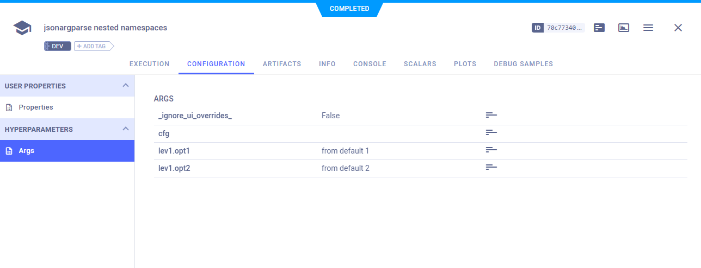

:::tip
If you are not already using ClearML, see [Getting Started](../getting_started/ds/ds_first_steps.md) for setup 
instructions.
:::


[jsonargparse](https://github.com/omni-us/jsonargparse) is a Python package for creating command-line interfaces. 
ClearML integrates seamlessly with `jsonargparse` and automatically logs its command-line parameters and connected 
configuration files.

All you have to do is add two lines of code:

```python
from clearml import Task

task = Task.init(task_name="<task_name>", project_name="<project_name>")
```

When the code runs, ClearML logs your command-line arguments, which you can view in the [WebApp](../webapp/webapp_overview.md), 
in the experiment's **Configuration > Hyperparameters > Args** section. 




### Automatic Logging Control
By default, when ClearML is integrated into your script, it captures all of your `jsonargparse` parameters. 
But, you may want to have more control over what your experiment logs. To control a task's logging of parameters from 
argument parsers, use the `auto_connect_arg_parser` parameter of [`Task.init()`](../references/sdk/task.md#taskinit). 
Completely disable all automatic logging by setting the parameter to `False`. 

```python
auto_connect_arg_parser=False
```

For finer grained control of logged parameters, input a dictionary with parameter-boolean pairs. The `False` value 
excludes the specified parameter. Unspecified parameters default to `True`.

For example, the following code will not log the `Example_1` parameter, but will log all other arguments.

```python
auto_connect_arg_parser={"Example_1": False}
```

To exclude all unspecified parameters, set the `*` key to `False`. For example, the following code will log **only** the 
`Example_2` parameter.

```python
auto_connect_arg_parser={"Example_2": True, "*": False}
```

## Remote Execution

In the UI, you can clone a task multiple times and modify it for execution by the [ClearML Agent](../clearml_agent.md). 
The agent executes the code with the modifications you made in the UI, even overriding hardcoded values. 

In the case that you connected a jsonargparse configuration file (e.g. with LightningCLI), make sure to set the 
`_ignore_ui_overrides` to `False` in the **CONFIGURATION > HYPERPARAMETERS > ARGS** section. That way, after the customized
experiment is enqueued, the task will use the new values during execution. 


## Code Examples

See [code examples](https://github.com/allegroai/clearml/blob/master/examples/frameworks/jsonargparse) demonstrating integrating
ClearML with code that uses `jsonargparse`.
