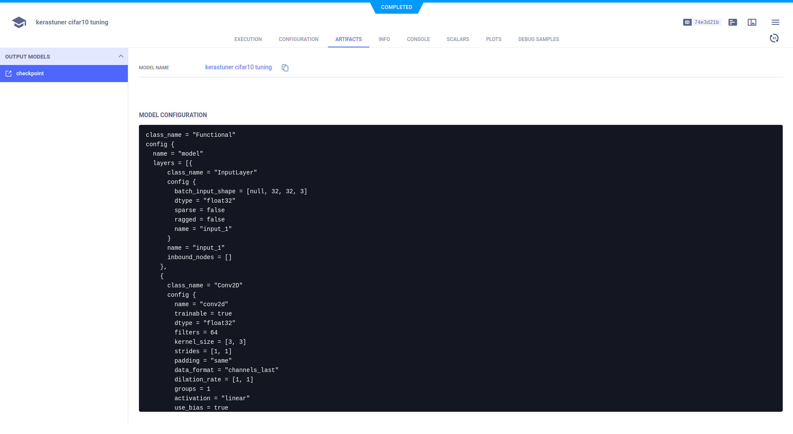

:::tip
If you are not already using ClearML, see [Getting Started](../getting_started/ds/ds_first_steps.md) for setup 
instructions.
:::

[Keras Tuner](https://www.tensorflow.org/tutorials/keras/keras_tuner) is a library that helps you pick the optimal set 
of hyperparameters for training your models. ClearML integrates seamlessly with `kerastuner` and automatically logs 
experiment scalars, the output model, and hyperparameter optimization summary. 

Integrate ClearML into your Keras Tuner optimization script by doing the following:
* Instantiate a ClearML Task: 
   
  ```python
  from clearml import Task
  task = Task.init(task_name="<task_name>", project_name="<project_name>")
  ```

* Specify `ClearMLTunerLogger` as the Keras Tuner logger:  

   ```python
   from clearml.external.kerastuner import ClearmlTunerLogger
   import keras_tuner as kt
      
   # Create tuner object
   tuner = kt.Hyperband(  
      build_model,
      project_name='kt examples',
      logger=ClearMLTunerLogger(),    # specify ClearMLTunerLogger
      objective='val_accuracy',
      max_epochs=10,
      hyperband_iterations=6
   )
   ```

And that's it! This creates a [ClearML Task](../fundamentals/task.md) which captures: 
* Output Keras model
* Optimization trial scalars - scalar plot showing metrics for all runs
* Hyperparameter optimization summary plot - Tabular summary of hyperparameters tested and their metrics by trial ID
* Source code and uncommitted changes
* Installed packages
* TensorFlow definitions
* Console output
* General details such as machine details, runtime, creation date etc.
* And more

You can view all the task details in the [WebApp](../webapp/webapp_exp_track_visual.md). 

## WebApp

ClearML logs the scalars from training each network. They appear in the experiment's **SCALARS** tab in the Web UI.


ClearML automatically logs the parameters of each experiment run in the hyperparameter search. They appear in tabular 
form in the experiment's **PLOTS**.


ClearML automatically stores the output model. It appears in the experiment's **ARTIFACTS** **>** **Output Model**.



## Example 

See Keras Tuner and ClearML in action in the [keras_tuner_cifar.py](../guides/frameworks/tensorflow/integration_keras_tuner.md)
example script.

