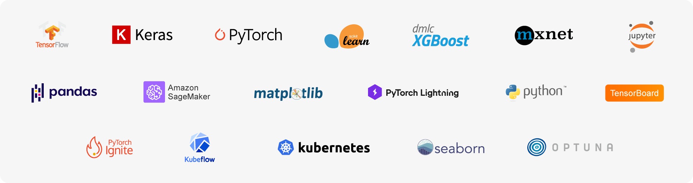

ClearML integrates with many frameworks and tools out of the box!  

Just follow the [getting started](/getting_started/ds/ds_first_steps.md) to automatically capture metrics, models and artifacts or check out examples for each library.

**Frameworks**
- [PyTorch](https://github.com/allegroai/clearml/tree/master/examples/frameworks/pytorch)
- [PyTorch Lightning](https://github.com/allegroai/clearml/tree/master/examples/frameworks/pytorch-lightning)
- [PyTorch Ignite](https://github.com/allegroai/clearml/tree/master/examples/frameworks/ignite)
- [TensorFlow](https://github.com/allegroai/clearml/tree/master/examples/frameworks/tensorflow)
- [Keras](https://github.com/allegroai/clearml/tree/master/examples/frameworks/keras)
- [scikit-learn](https://github.com/allegroai/clearml/tree/master/examples/frameworks/scikit-learn)
- [FastAI](https://github.com/allegroai/clearml/tree/master/examples/frameworks/fastai)
- [LightGBM](https://github.com/allegroai/clearml/tree/master/examples/frameworks/lightgbm)
- [XGBoost](https://github.com/allegroai/clearml/tree/master/examples/frameworks/xgboost)
- [MegEngine](https://github.com/allegroai/clearml/tree/master/examples/frameworks/megengine)
- [CatBoost](https://github.com/allegroai/clearml/tree/master/examples/frameworks/catboost)
- [OpenMMLab](https://github.com/allegroai/clearml/tree/master/examples/frameworks/openmmlab)  
- [Hydra](https://github.com/allegroai/clearml/tree/master/examples/frameworks/hydra)
- [Python Fire](https://github.com/allegroai/clearml/tree/master/examples/frameworks/fire)
- [click](https://github.com/allegroai/clearml/tree/master/examples/frameworks/click)

**HPO**
- [Optuna](https://github.com/allegroai/clearml/tree/master/examples/optimization/hyper-parameter-optimization)
- [Keras Tuner](https://github.com/allegroai/clearml/tree/master/examples/frameworks/kerastuner)
- [AutoKeras](https://github.com/allegroai/clearml/tree/master/examples/frameworks/autokeras) 

**Plotting**
- [Tensorboard](https://github.com/allegroai/clearml/blob/master/examples/frameworks/tensorflow/tensorboard_toy.py)
- [TensorboardX](https://github.com/allegroai/clearml/tree/master/examples/frameworks/tensorboardx)
- [matplotlib](https://github.com/allegroai/clearml/tree/master/examples/frameworks/matplotlib)

