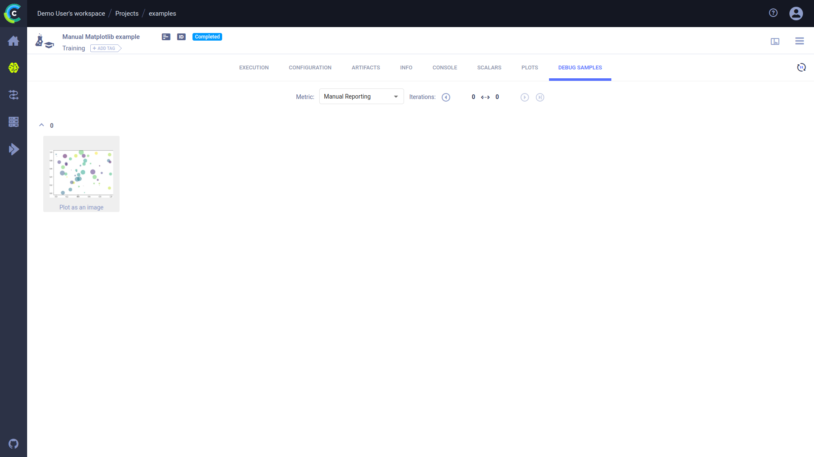

:::tip
If you are not already using ClearML, see [Getting Started](../getting_started/ds/ds_first_steps.md) for setup 
instructions.
:::

[Matplotlib](https://matplotlib.org/) is a Python library for data visualization. ClearML automatically captures plots 
and images created using `matplotlib`. 

All you have to do is add two lines of code to your script:

```python
from clearml import Task

task = Task.init(task_name="<task_name>", project_name="<project_name>")
```

This will create a ClearML Task that captures your script's information, including Git details, uncommitted code, python 
environment, your matplotlib visualizations, and more. View these matplotlib plots and images in the [WebApp](../webapp/webapp_exp_track_visual.md), 
in the experiment's **Plots** and **Debug Samples** tabs respectively.


## Automatic Logging Control 
By default, when ClearML is integrated into your matplotlib script, it captures all of your matplotlib visualizations. 
But, you may want to have more control over what your experiment logs.

To control a task's framework logging, use the `auto_connect_frameworks` parameter of [`Task.init()`](../references/sdk/task.md#taskinit). 
Completely disable all automatic logging by setting the parameter to `False`. For finer grained control of logged 
frameworks, input a dictionary, with framework-boolean pairs.

For example:

```python
auto_connect_frameworks={
   'matplotlib': False, 'tensorflow': False, 'tensorboard': False, 'pytorch': True,
   'xgboost': False, 'scikit': True, 'fastai': True, 'lightgbm': False,
   'hydra': True, 'detect_repository': True, 'tfdefines': True, 'joblib': True,
   'megengine': True, 'jsonargparse': True, 'catboost': True
}
```

## Manual Logging
To augment its automatic logging, ClearML also provides an explicit logging interface.

Use [`Logger.report_matplotlib_figure()`](../references/sdk/logger.md#report_matplotlib_figure) to explicitly log 
a matplotlib figure, and specify its title and series names, and iteration number:


```
logger = task.get_logger()

area = (40 * np.random.rand(N))**2
plt.scatter(x, y, s=area, c=colors, alpha=0.5)
logger.report_matplotlib_figure(title="My Plot Title", series="My Plot Series", iteration=10, figure=plt)
plt.show()
```

The logged figure is displayed in the experiment's **Plots** tab. 


Matplotlib figures can be logged as images by passing `report_image=True` to `Logger.report_matplotlib_figure()`. 
View the images in the experiment's **DEBUG SAMPLES** tab.



See [Manual Matplotlib Reporting](../guides/reporting/manual_matplotlib_reporting.md) example.

