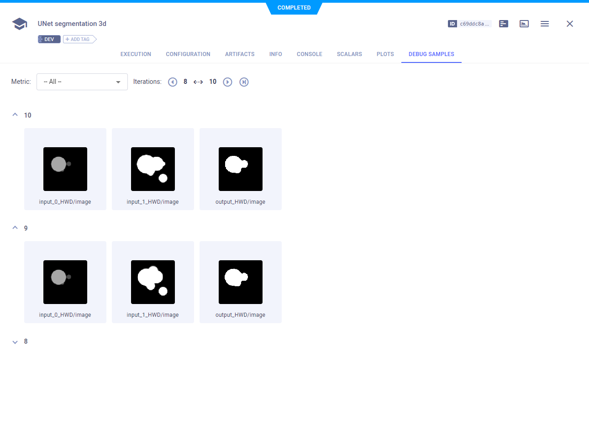
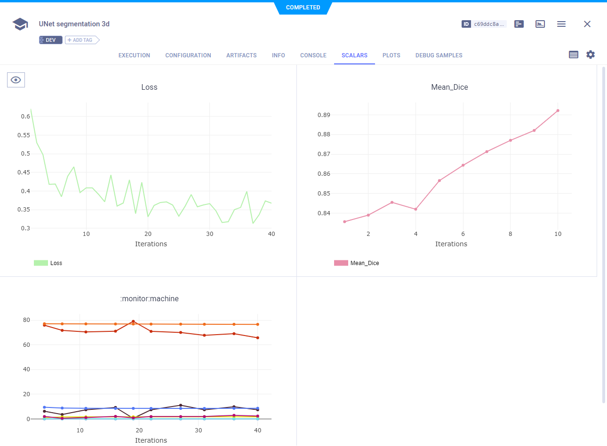
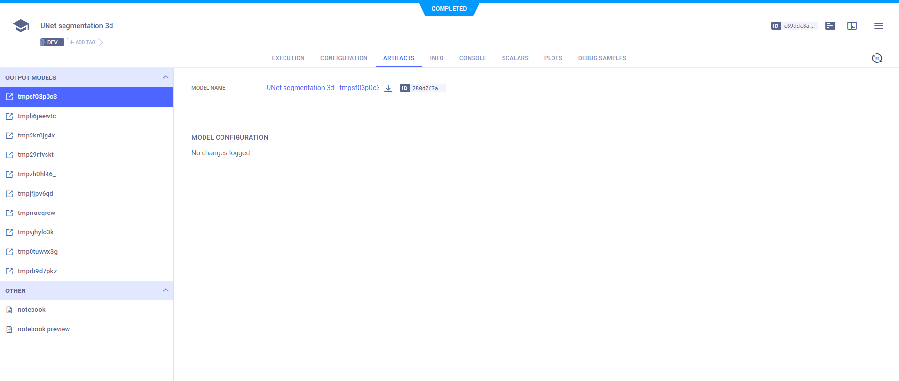

:::tip
If you are not already using ClearML, see [Getting Started](../getting_started/ds/ds_first_steps.md) for setup 
instructions.
:::

[MONAI](https://github.com/Project-MONAI/MONAI) is a PyTorch-based, open-source framework for deep learning in healthcare 
imaging. You can integrate ClearML into your code using MONAI's built-in handlers: [`ClearMLImageHandler`, `ClearMLStatsHandler`](#clearmlimagehandler-and-clearmlstatshandler), 
and [`ModelCheckpoint`](#modelcheckpoint). 

## ClearMLImageHandler and ClearMLStatsHandler

Use the `ClearMLImageHandler` and the `ClearMLStatsHandler` to log images and metrics respectively to ClearML. 
`ClearMLImageHandler` extends all functionality from [`TensorBoardImageHandler`](https://docs.monai.io/en/latest/handlers.html#monai.handlers.TensorBoardImageHandler), 
used for visualizing images, labels, and outputs. `ClearMLStatsHandler` extends all functionality from [`TensorBoardStatsHandler`](https://docs.monai.io/en/latest/handlers.html#monai.handlers.TensorBoardStatsHandler), 
which is used to define a set of Ignite Event handlers for TensorBoard logic. ClearML automatically captures all 
TensorBoard outputs.

For example, the code below attaches the ClearML image handler and stats handler to an Ignite evaluator engine:

```python
# ignite evaluator
evaluator = ignite.engine.create_supervised_evaluator(
    net,
    val_metrics,
    device,
    True,
    output_transform=lambda x, y, y_pred: (
        [post_pred(i) for i in decollate_batch(y_pred)],
        [post_label(i) for i in decollate_batch(y)],
    ),
)
# add handler to draw the first image and the corresponding
# label and model output in the last batch
# here we draw the 3D output as GIF format along Depth
# axis, at every validation epoch
val_clearml_image_handler = ClearMLImageHandler(
    task_name=task_name,
    project_name=project_name,
    log_dir=log_dir,
    batch_transform=lambda batch: (batch[0], batch[1]),
    output_transform=lambda output: output[0],
    global_iter_transform=lambda x: trainer.state.epoch,
)
evaluator.add_event_handler(
    event_name=ignite.engine.Events.EPOCH_COMPLETED,
    handler=val_clearml_image_handler,
)

# add handler to record metrics to clearml at every validation epoch
val_clearml_stats_handler = ClearMLStatsHandler(
    log_dir=log_dir,
    # no need to plot loss value, so disable per iteration output
    output_transform=lambda x: None,
    # fetch global epoch number from trainer
    global_epoch_transform=lambda x: trainer.state.epoch,
)
val_clearml_stats_handler.attach(evaluator)
```

When the code runs with either of these handlers, it creates a [ClearML Task](../fundamentals/task.md) called `monai_experiment` in the `MONAI` project. To 
change the task's name or project, use the `task_name` and `project_name` parameters when instantiating either handler. 
The task captures the images logged by the image handler, metrics logged with the stats handler, as well as source code, 
uncommitted changes, installed packages, console output, and more. 
 
You can see all the captured data in the task’s page of the ClearML [WebApp](../webapp/webapp_exp_track_visual.md).

View the logged images in the WebApp, in the experiment's **Debug Samples** tab.



View the logged metrics in the WebApp, in the experiment's **Scalars** tab.



## ModelCheckpoint

ClearML automatically logs models saved using the `ModelCheckpoint` handler. Make sure a ClearML Task is instantiated in
your script. If you're already using either `ClearMLStatsHandler` or `ClearMLImageHandler`, you don't have to add any code. 
Otherwise, all you have to is add two lines of code to create a task:

```python
from clearml import Task

task = Task.init(task_name="<task name>", project_name="<project_name>")
```

The code below creates a handler to save models. When the script runs with a ClearML task, the task automatically
captures the saved models.

```python
# adding checkpoint handler to save models (network
# params and optimizer stats) during training and log them to ClearML
log_dir = os.path.join(root_dir, "logs")
checkpoint_handler = ignite.handlers.ModelCheckpoint(log_dir, "net", n_saved=10, require_empty=False)
trainer.add_event_handler(
    event_name=ignite.engine.Evclearents.EPOCH_COMPLETED,
    handler=checkpoint_handler,
    to_save={"net": net, "opt": opt},
)
```

View the captured models in the WebApp, in the experiment's **Artifacts** tab. 


