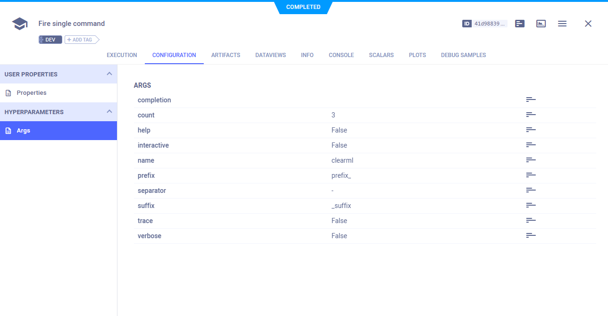

Python Fire is a Python package for creating command-line interfaces. 
ClearML integrates seamlessly with `fire` and automatically logs its command-line parameters.

All you have to do is add two lines of code:

```python
from clearml import Task
task = Task.init(task_name="<task_name>", project_name="<project_name>")
```

When the code runs, it creates a [ClearML Task](../fundamentals/task.md) that captures your script's information, 
including Git details, uncommitted code, python environment, your `fire`
parameters, and more. You can view the parameters in the [WebApp](../webapp/webapp_overview.md), in the experiment's 
**Configuration > Hyperparameters > Args** section. 



In the UI, you can clone the task multiple times and modify the logged `fire` parameters for re-execution by the [ClearML Agent](../clearml_agent.md).
When the task is re-executed, the executing agent will override the original values with the new ones.

See code examples [here](https://github.com/allegroai/clearml/blob/master/examples/frameworks/fire).