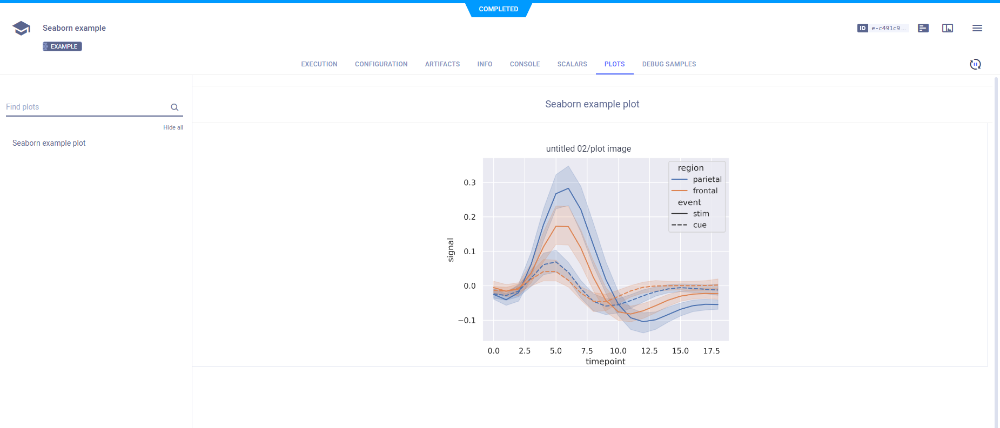

:::tip
If you are not already using ClearML, see [Getting Started](../getting_started/ds/ds_first_steps.md) for setup 
instructions.
:::

[seaborn](https://seaborn.pydata.org/) is a Python library for data visualization. 
ClearML automatically captures plots created using `seaborn`. All you have to do is add two
lines of code to your script:

```python
from clearml import Task
task = Task.init(task_name="<task_name>", project_name="<project_name>")
```

This will create a [ClearML Task](../fundamentals/task.md) that captures your script's information, including Git details,
uncommitted code, python environment, your `seaborn` plots, and more. View the seaborn plots in the [WebApp](../webapp/webapp_overview.md), 
in the experiment's **Plots** tab.



View code example [here](https://github.com/allegroai/clearml/blob/master/examples/frameworks/matplotlib/matplotlib_example.py). 
