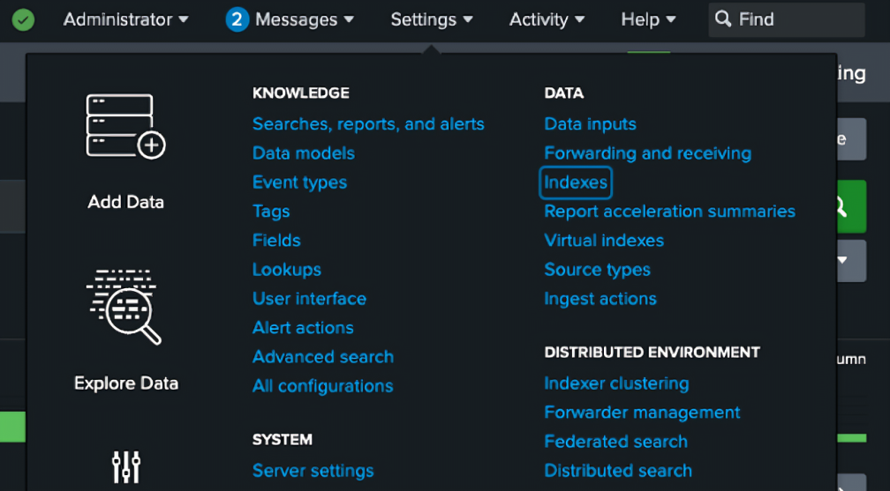
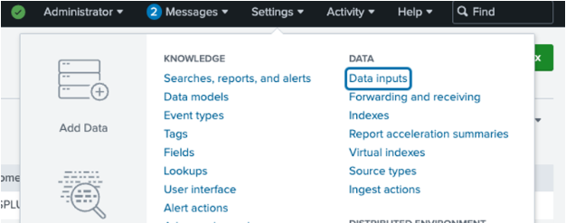
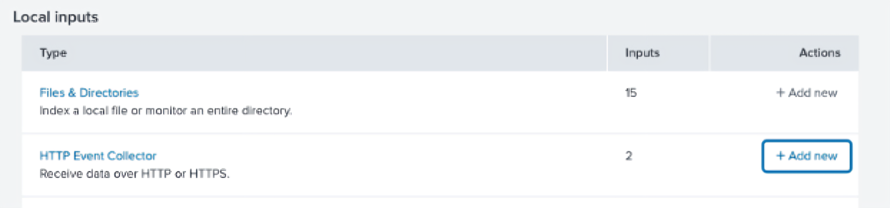

---
title: Splunk
--- 

:::important Enterprise Feature
Splunk integration is available under the ClearML Enterprise plan.
:::

Integrating ClearML with Splunk allows you to centralize and analyze API logs for improved monitoring.

## Create a Splunk Index

1. Log in to your Splunk web application
1. In the **Settings** menu, click **Indexes**

   

1. In the Indexes page, click **New Index**
1. In the index creation modal, enter Index name (`<SPLUNK_INDEX>`). If you don't need special 
settings, keep the default settings for the rest of the fields
1. Click **Save**

## Set Up a Splunk HTTP Event Collector
1. In the **Settings** menu, click **Data Inputs**
 
   

1. On the **HTTP Event Collector** row, click **+ Add new** 

   

1. On the next page, input a name for your collector and click **Next**
1. On the next page, select your newly created index from the list and add it to the selected items list 
on the right
1. Click **Review**
1. Click **Submit**
1. Copy the displayed collector token (`<SPLUNK_TOKEN>`). It will be used in the next steps

## Configure ClearML
Configure the ClearML server to send API logs to Splunk using [Docker Compose](#docker-compose) or [Kubernetes Helm](#kubernetes-helm):

### Docker Compose 

1. Add the following configuration to your `apiserver.conf` file. Make sure to replace `<SPLUNK_URL>`, `<SPLUNK_PORT>`, 
   `<SPLUNK_TOKEN>`, and `<SPLUNK_INDEX>`. 
   
   ```
   apilog: {
        adapter: ["logging"],
        adapters: {
          logging: {
            logger_prefix: "",
            formatter: {
              cls: "logstash_formatter.LogstashFormatterV1",
              -kwargs: {}
            },
            handler: {
              cls: "splunk_handler.SplunkHandler",
              -custom_kwargs: {},
              -kwargs: {
                host: "<SPLUNK_URL>",
                port: <SPLUNK_PORT>,
                token: "<SPLUNK_TOKEN>",
                index: "<SPLUNK_INDEX>",
                protocol: https,
                verify: false
              },
            }
          }
        }
      }
   ```
1. Set the following environment variables:
   
   ```
   CLEARML__apiserver__endpoints__debug__ping__log_call=false
   CLEARML__apiserver__endpoints___default__log_call=true
   CLEARML__apiserver__log_calls=true
   ```

1. Apply configuration with `docker-compose`:
   
   ```
   docker-compose -f docker-compose.yml down
   docker-compose -f /opt/clearml/docker-compose.yml --env-file constants.env up -d
   ```
 

### Kubernetes Helm 
1. Add the following `values.override.yaml` to your ClearML installation specification. Make sure to replace `<SPLUNK_TOKEN>` 
   and `<SPLUNK_INDEX>` with  the values from the previous steps.

   ```
   apiserver:
     logCalls: true # Sets CLEARML__APISERVER__LOG_CALLS to true
     extraEnvs:
       - name: CLEARML__apiserver__endpoints___default__log_call
         value: "true"
       - name: CLEARML__apiserver__endpoints__debug__ping__log_call
         value: "false"
     additionalConfigs:
       apiserver.conf: |
         apilog: {
           adapter: ["logging"],
           adapters: {
             logging: {
               logger_prefix: "",
               formatter: {
                 cls: "logstash_formatter.LogstashFormatterV1",
                 -kwargs: {}
               },
               handler: {
                 cls: "splunk_handler.SplunkHandler",
                 -custom_kwargs: {},
                 -kwargs: {
                   host: "splunk-splunk-standalone-service.splunk.svc.cluster.local",
                   port: 8088,
                   token: "<SPLUNK_TOKEN>",
                   index: "<SPLUNK_INDEX>",
                   protocol: https,
                   verify: false
                 },
               }
             }
           }
         }
   ```
   
1. Upgrade the Helm release:

   ```
   helm repo update
   helm upgrade -i clearml allegroai-enterprise/clearml-enterprise -f values-override.yaml
   ```

### Exclude API Calls from Logs 
To exclude specific API calls from the Splunk logs, add an environment variable with the following 
format: `CLEARML__apiserver__endpoints__<SERVICE>__<METHOD>__log_call` and set it to `false`.

For example, the configuration below for servers on K8s Helm exclude the [`POST /debug.ping`](../references/api/debug.md##post-debugping) 
call from the Splunk logs:

```
apiserver:
  extraEnvs:
    - name: CLEARML__apiserver__endpoints__debug__ping__log_call
      value: "false"
```