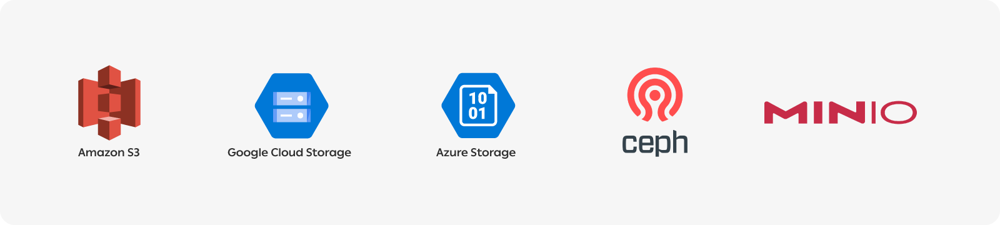

ClearML is able to interface with the most popular storage solutions in the market for storing model checkpoints, artifacts
and charts.

Supported storage mediums include:



To use cloud storage with ClearML, [install](#installation) the `clearml` package for your cloud storage type, and then 
[configure](#configuring-storage) your storage credentials.

:::note
Once uploading an object to a storage medium, each machine that uses the object must have access to it.
:::

## Installation 

For cloud storage, install the ClearML package for your cloud storage type:
* AWS S3 - `pip install clearml[s3]`
* Azure - `pip install clearml[azure]`
* Google Storage - `pip install clearml[gs]`

## Configuring Storage

Configuration for storage is done by editing the [clearml.conf](../configs/clearml_conf.md).

The ClearML configuration file uses [HOCON](https://github.com/lightbend/config/blob/main/HOCON.md) format, which supports runtime environment variable access.

### Configuring AWS S3

Modify the `sdk.aws.s3` section of the `clearml.conf` to add the key, secret, and region of the S3 bucket.

You can also give access to specific S3 buckets in the `sdk.aws.s3.credentials` section. The default configuration 
provided in the `sdk.aws.s3` section is applied to any bucket without a bucket-specific configuration. 

You can also enable using a credentials chain to let Boto3 
pick the right credentials. This includes picking credentials from environment variables, a credential file, and metadata service 
with an IAM role configured. For more details, see [Boto3 documentation](https://boto3.amazonaws.com/v1/documentation/api/latest/guide/credentials.html#configuring-credentials).

You can specify additional [ExtraArgs](https://boto3.amazonaws.com/v1/documentation/api/latest/guide/s3-uploading-files.html#the-extraargs-parameter) 
to pass to Boto3 when uploading files. You can set this on a per-bucket basis. 

```
sdk {
    aws {
        s3 {
            # S3 credentials, used for read/write access by various SDK elements
    
            # default, used for any bucket not specified below
            key: ""
            secret: ""
            region: ""
            use_credentials_chain: false
            extra_args: {}
            
            credentials: [
                # specifies key/secret credentials to use when handling s3 urls (read or write)
                {
                    bucket: "my-bucket-name"
                    key: ""
                    secret: ""
                    use_credentials_chain: false
                },
                    
            ]
        }
        boto3 {
            pool_connections: 512
            max_multipart_concurrency: 16
        }
    }
}
```

AWS S3 access parameters can be specified by referencing the standard environment variables if they are already defined.

For example: 
```
sdk {
    aws {
        s3 {
            # default, used for any bucket not specified below
            key: ${AWS_ACCESS_KEY_ID}
            secret: ${AWS_SECRET_ACCESS_KEY}
            region: ${AWS_DEFAULT_REGION}
        }
    }
}
``` 

#### Non-AWS Endpoints
ClearML supports any S3-compatible services, such as [MinIO](https://github.com/minio/minio) as well as other 
cloud-based or locally deployed storage services. For non-AWS endpoints, use a configuration like this:

```
sdk {
    aws {
        s3 {
            # default, used for any bucket not specified below
            key: ""
            secret: ""
            region: ""
    
            credentials: [
                {
                    # This will apply to all buckets in this host (unless key/value is specifically provided for a given bucket)
                    host: "my-minio-host:9000"
                    key: ""
                    secret: ""
                    multipart: false
                    secure: false
                    verify: true # OR "/path/to/ca/bundle.crt" OR "https://url/of/ca/bundle.crt" OR false to not verify                    
                }
            ]
        } 
    }
}
```

To force usage of a non-AWS endpoint, port declaration is *always* needed (e.g. `host: "my-minio-host:9000"`), 
even for standard ports like `433` for HTTPS (e.g. `host: "my-minio-host:433"`).

:::important
Port specification is mandatory whenever you specify non-AWS S3 endpoint access. Use the following URI 
format: `s3://<hostname>:<port>/<bucket-name>/path`.

This applies when:
* Setting output URIs for tasks (via SDK or UI)
* Registering Hyper-Dataset frames
* All fields where endpoint access is specified. 
:::


##### TLS
To enable TLS, pass `secure: true`. For example: 
```
sdk {
   aws {
      s3 {
         key: ""
         secret: ""
         region: ""
   
         credentials: [
            {
               host: "my-minio-host:9000"
               key: ""
               secret: ""
               multipart: false
               secure: true
               verify: true
            }
         ]
      } 
   }
}
```

Use the `sdk.aws.s3.credentials.verify` configuration option to control SSL certificate verification:
* By default, verify is set to `true`, meaning certificate verification is enabled
* You can provide a path or a URL to a CA bundle for custom certificate verification

### Configuring Azure
To configure Azure blob storage specify the account name and key.

```
sdk {
    azure.storage {
        containers: [
            {
                account_name: ""
                account_key: ""
                # container_name:
            }
        ]
    }
}
```

Azure's storage access parameters can be specified by referencing the standard environment variables if already defined.

For example:
```
sdk {
    azure.storage {
        containers: [
            {
                account_name: ${AZURE_STORAGE_ACCOUNT}
                account_key: ${AZURE_STORAGE_KEY}
                # container_name:
            }
        ]
    }
}
```

### Configuring Google Storage
To configure Google Storage, specify the project and the path to the credentials JSON file.

It's also possible to specify credentials for a specific bucket in the `google.storage.credentials` section. The default 
configuration provided in the `google.storage` section is applied to any bucket without a bucket-specific configuration.

```
sdk {
    google.storage {
        # Default project and credentials file
        # Will be used when no bucket configuration is found
        project: "clearml"
        credentials_json: "/path/to/credentials.json"
    
        # Specific credentials per bucket and sub directory
        credentials = [
             {
                 bucket: ""
                 subdir: "path/in/bucket" # Not required
                 project: ""
                 credentials_json: "/path/to/credentials.json"
             },
         ]
    }
}
```

GCP storage access parameters can be specified by referencing the standard environment variables if already defined.

```
sdk {
    google.storage {
        credentials = [
             {
                 bucket: ""
                 subdir: "path/in/bucket" # Not required
                 project: ""
                 credentials_json: ${GOOGLE_APPLICATION_CREDENTIALS}
             },
         ]
    }
}
```

:::tip Direct Decoding
From v1.13.2, `clearml` supports directly decoding JSON from the `credentials_json` argument. If ClearML
fails to load the credentials as a file, it will attempt to decode the JSON directly. 
:::

## Storage Manager

ClearML provides the [StorageManager](../references/sdk/storage.md) class to manage downloading, uploading, and caching of 
content directly from code.

See [StorageManager Examples](../guides/storage/examples_storagehelper.md).

### Path Substitution
The ClearML StorageManager supports local path substitution when fetching files.

This is especially useful when managing data using [`clearml-data`](../clearml_data/clearml_data_cli.md)! If different data consumers have the data physically stored in different locations, path 
substitution allows for registering the data into `clearml-data` once, and then storing and accessing it in multiple locations.

To enable path substitution, modify the clearml.conf file and configure:

```bash
sdk {
    storage {
        path_substitution = [
            # Replace registered links with local prefixes,
            # Solve mapping issues, and allow for external resource caching.
            # {
            #     registered_prefix = "s3://bucket/research"
            #     local_prefix = "file:///mnt/shared/bucket/research
            # },
            # {
            #     registered_prefix = "file:///mnt/shared/folder/"
            #     local_prefix = "file:///home/user/shared/folder"
            # }
        ]
    }
}
```

## Caching
ClearML also manages a cache of all downloaded content so nothing is duplicated, and code won't need to download the same
piece twice!

Configure cache location by modifying the [clearml.conf](../configs/clearml_conf.md) file:

```
sdk {
    storage {
        cache {
            # Defaults to <system_temp_folder>/clearml_cache
            default_base_dir: "~/.clearml/cache"
        }
    
        direct_access: [
            # Objects matching are considered to be available for direct access, i.e. they will not be downloaded
            # or cached, and any download request will return a direct reference.
            # Objects are specified in glob format, available for url and content_type.
            { url: "file://*" }  # file-urls are always directly referenced
        ]
    }
}
```

### Direct Access
By default, all artifacts (Models / Artifacts / Datasets) are automatically downloaded to the cache before they're used.

Some storage mediums (NFS / Local storage) allows for direct access,
which means that the code would work with the object where it's originally stored and not downloaded to cache first.

To enable direct access, specify the urls to access directly.