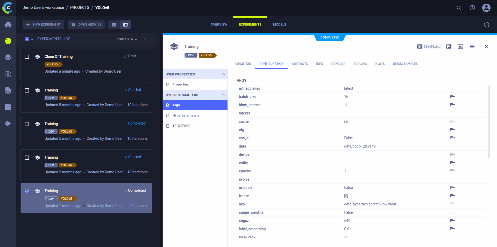

The [NVIDIA TAO Toolkit](https://docs.nvidia.com/tao/tao-toolkit/index.html) is a low-code version of the NVIDIA TAO 
framework that accelerates the model training process. ClearML integrates seamlessly with TAO Toolkit, automatically 
logging metrics, model files, plots, debug samples, and more, so you can gain more insight into the training process.

## Setup

1. Install the `clearml` python package:

   ```commandline
   pip install clearml
   ``` 
   
1. To keep track of your experiments and/or data, ClearML needs to communicate to a server. You have 2 server options:
    * Sign up for free to the [ClearML Hosted Service](https://app.clear.ml/) 
    * Set up your own server, see [here](../deploying_clearml/clearml_server.md)  
1. Connect the ClearML SDK to the server by creating credentials (go to the top right in the UI to **Settings > Workspace > Create new credentials**), 
   then execute the command below and follow the instructions:

   ```commandline
   clearml-init
   ```
   
   :::tip Jupyter Notebook 
   If you're using Jupyter Notebook, in the **New Credential** modal, click "Jupyter Notebook", and copy the credential and paste
   them in your notebook 
   :::

   :::tip Set Credentials in TAO Toolkit Launcher
   You can set environment variables with your ClearML credentials via the TAO Toolkit launcher. Add your credentials 
   to the `Envs` element of the `~/.tao_mounts.json` file as shown below:
   ```json
   {
       "Mounts": [
      
       ],
       "Envs": [
           {
               "variable": "CLEARML_WEB_HOST",
               "value": "https://app.clear.ml"
           },
           {
               "variable": "CLEARML_API_HOST",
               "value": "https://api.clear.ml"
            },
            {
                "variable": "CLEARML_FILES_HOST",
                "value": "https://files.clear.ml"
            },
            {
                "variable": "CLEARML_API_ACCESS_KEY",
                "value": "<API_ACCESS_KEY>"
            },
            {
                "variable": "CLEARML_API_SECRET_KEY",
                "value": "<API_SECRET_KEY>"
            }
        ],
        "DockerOptions": {
   
        }
   }
   ```
   :::

1. Customize the ClearML Task through TAO Toolkit. Under `visualizer.clearml_config` of your training configuration file,
   you can set the following:
   * `task` - Name of the ClearML Task. In order to maintain a unique name per run, TAO Toolkit appends to the name 
   string a timestamp of the experiment creation time. 
   * `project` - Project where the task will be stored
   * `tags` - Tags to label the task. 
   
   For example:
   ```
   clearml_config{
       project: "TAO Toolkit ClearML Demo"
	   task: "detectnet_v2_resnet18_clearml"
	   tags: "detectnet_v2"
	   tags: "training"
	   tags: "resnet18"
	   tags: "unpruned"
   }
   ```
   This configuration may vary depending on the schema the network follows. For more information, see the [NVIDIA documentation](https://docs.nvidia.com/tao/tao-toolkit/text/mlops/clearml.html#configuring-the-clearml-element-in-the-training-spec). 


And that's it! Whenever you train a model using TAO toolkit, a [ClearML Task](../fundamentals/task.md) will be created, 
which will capture your model files, training configuration, scalars, debug samples, plots, console output, and more. 
You can view all of this captured information in the [ClearML Web UI](../webapp/webapp_exp_track_visual.md). 


## Remote Execution
ClearML logs all the information required to reproduce an experiment on a different machine (installed packages, 
uncommitted changes etc.). The [ClearML Agent](../clearml_agent.md) listens to designated queues and when a task is 
enqueued, the agent pulls it, recreates its execution environment, and runs it, reporting its scalars, plots, etc. to the 
experiment manager.

Deploy a ClearML Agent onto any machine (e.g. a cloud VM, a local GPU machine, your own laptop) by simply running 
the following command on it:

```commandline
clearml-agent daemon --queue <queues_to_listen_to> [--docker]
```

Use the ClearML [Autoscalers](../cloud_autoscaling/autoscaling_overview.md) to help you manage cloud workloads in the 
cloud of your choice (AWS, GCP, Azure) and automatically deploy ClearML agents: the autoscaler automatically spins up 
and shuts down instances as needed, according to a resource budget that you set.


### Cloning, Editing, and Enqueuing



Use ClearML's web interface to edit task details, like configuration parameters or input models, then execute the task 
with the new configuration on a remote machine:
* Clone the experiment
* Edit the hyperparameters and/or other details 
* Enqueue the task

The ClearML Agent executing the task will use the new values to [override any hard coded values](../clearml_agent.md). 
