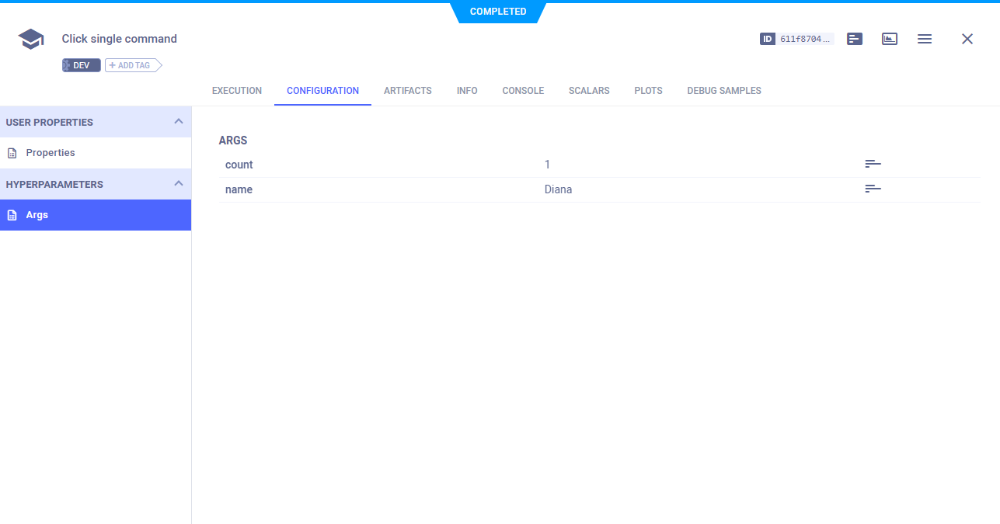

[TensorFlow]() is a python package for $$$$$$$$$$$$$$$$$$$. ClearML integrates 
seamlessly with Tensorflow and automatically logs its models, TensorFlow definitions, and scalars.
All you have to do is add two lines of code:

```python
from clearml import Task
task = Task.init(task_name="<task_name>", project_name="<project_name>")
```

When this code is executed, ClearML logs your command-line arguments, which you can view in the 
[WebApp](../webapp/webapp_overview.md), in the experiment's **Configuration > Hyperparameters > Args** section. 

ClearML automatically logs TensorFlow Definitions. They appear in **CONFIGURATION** **>** **HYPERPARAMETERS** **>** **TF_DEFINE**.



In the UI, you can clone the task multiple times and set the clones' parameter values for execution by the [ClearML Agent](../clearml_agent.md).
When the clone is executed, the executing agent will use the new parameter values as if set by the command-line.

## Examples


For a basic demonstration of how ClearML integrates with TensorFlow, see the tensorflow_mnist.py example script. The code trains a neural network on the MNIST dataset. ClearML automatically logs model checkpoints, TensorFlow definitions, and scalars logged using TensorFlow methods.

The following examples use TensorFlow and ClearML in different configurations with additional tools:
* absl_flags.py -  Demonstrates ClearML’s automatic logging of parameters defined using absl.flags 
* tensorboard_pr_curve.py - Demonstrates ClearML’s automatic logging of TensorBoard output and TensorFlow definitions.
* tensorboard_toy.py - Demonstrates ClearML’s automatic logging of TensorBoard scalars, histograms, images, and text, as well as all console output and TensorFlow Definitions.