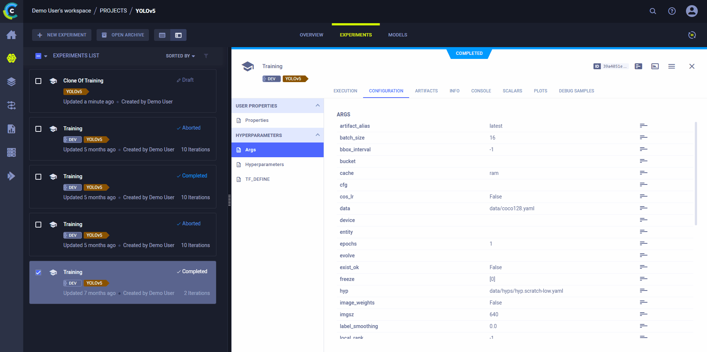

ClearML helps you get the most out of ultralytics' [YOLOv5](https://github.com/ultralytics/yolov5) through its native 
built in logger:
* Track every YOLOv5 training run in ClearML
* Version and easily access your custom training data with [ClearML Data](../clearml_data/clearml_data.md) 
* Remotely train and monitor your YOLOv5 training runs using [ClearML Agent](../clearml_agent.md)
* Get the very best mAP using ClearML [Hyperparameter Optimization](../fundamentals/hpo.md)
* Turn your newly trained YOLOv5 model into an API with just a few commands using [ClearML Serving](../clearml_serving/clearml_serving.md)

## Setup
1. Install the clearml python package:

   ```commandline
   pip install clearml
   ``` 
   
1. To keep track of your experiments and/or data, ClearML needs to communicate to a server. You have 2 server options:
    * Sign up for free to the [ClearML Hosted Service](https://app.clear.ml/) 
    * Set up your own server, see [here](../deploying_clearml/clearml_server.md).  
1. Connect the ClearML SDK to the server by creating credentials (go to the top right in the UI to **Settings > Workspace > Create new credentials**), 
   then execute the command below and follow the instructions:

   ```commandline
   clearml-init
   ```
    
That's it! Now, whenever you train a model using YOLOv5, the run will be captured and tracked by ClearML – no additional 
code necessary. 
 
## Training YOLOv5 with ClearML 

To enable ClearML experiment tracking, simply install the `clearml` pip package in your execution environment.

```commandline
pip install clearml>=1.2.0
```

This will enable integration with the YOLOv5 training script. In every training run from now on, the ClearML experiment 
manager will capture:
* Source code and uncommitted changes
* Installed packages
* [Hyperparameters](../fundamentals/hyperparameters.md)
* Model files (use `--save-period n` to save a checkpoint every n epochs)
* Console output
* Scalars (e.g. mAP_0.5, mAP_0.5:0.95, precision, recall, losses)
* General information such as machine details, runtime, creation date etc.
* All produced plots such as label correlogram and confusion matrix
* Images with bounding boxes per epoch
* Mosaic per epoch
* Validation images per epoch
* And more

All of this is captured into a [ClearML Task](../fundamentals/task.md). By default, a task called `Training` is created 
in the `YOLOv5` project. To change the task's name or project, use the `--project` and `--name` arguments when running 
the `train.py` script. 

```commandline
python train.py --project my_project --name my_training --img 640 --batch 16 --epochs 3 --data coco128.yaml --weights yolov5s.pt --cache
```

:::tip project names 
ClearML uses `/` as a delimiter for subprojects: using `example/sample` as a name will create the `sample` 
task within the `example` project. 
:::

You can see all the captured data in the task's page of the ClearML [WebApp](../webapp/webapp_exp_track_visual.md). 
Additionally, you can view all of your YOLOv5 runs tracked by ClearML in the [Experiments Table](../webapp/webapp_model_table.md). 
Add custom columns to the table, such as mAP values, so you can easily sort and see what is the best performing model. 
You can also select multiple experiments and directly [compare](../webapp/webapp_exp_comparing.md) them.   

## Dataset Version Management
Versioning your data separately from your code makes it easier to access the dataset version you need for your 
experiments. [ClearML Data](../clearml_data/clearml_data.md) makes data easily accessible from every machine, and links 
data and experiments for better traceability.

### Prepare Your Dataset
The [YOLOv5 repository](https://github.com/ultralytics/yolov5) supports a number of different datasets by using yaml 
files containing their information. By default, datasets are downloaded to the `../datasets` folder relative to the 
repository root folder. For example, if you download the [coco128](https://github.com/ultralytics/yolov5/blob/master/data/coco128.yaml) 
dataset using the link in the yaml file or the scripts provided by YOLOv5, you get this folder structure:

```
..
|_ yolov5
|_ datasets
    |_ coco128
        |_ images
        |_ labels
        |_ LICENSE
        |_ README.txt
```

You can use any dataset, as long as you maintain this folder structure.
Copy the dataset's corresponding yaml file to the root of the dataset folder. 

```
..
|_ yolov5
|_ datasets
    |_ coco128
        |_ images
        |_ labels
        |_ coco128.yaml  # <---- HERE!
        |_ LICENSE
        |_ README.txt
```

The yaml file needs to be stored along with your dataset so that ClearML can set up the dataset in a way that it's 
accessible to train on the data with YOLO.

### Upload Your Dataset
To create a ClearML dataset with this data, go to the dataset root folder and run the `sync` command:

```commandline
cd coco128
clearml-data sync --project YOLOv5 --name coco128 --folder .
```

This command syncs the folder's content with ClearML, packaging all of the folder's contents into a ClearML dataset.

Alternatively, you can run these commands one after the other to create a dataset:

```commandline
# Optionally add --parent <parent_dataset_id> if you want to base
# this version on another dataset version, so no duplicate files are uploaded!
clearml-data create --name coco128 --project YOLOv5
clearml-data add --files .
clearml-data close
```

Both of these methods print to console a dataset ID, which you can later use to access your dataset:

```console
clearml-data - Dataset Management & Versioning CLI
Creating a new dataset:
ClearML results page: https://app.clear.ml/projects/<project-id>/experiments/<dataset-id>/output/log
ClearML dataset page: https://app.clear.mli/datasets/simple/<project-id>/experiments/<dataset-id>
New dataset created id=<dataset-id>
```

### Run Training Using a ClearML Dataset
Now that you have a ClearML dataset, you can very simply use it to train custom YOLOv5 models:

```commandline
python train.py --img 640 --batch 16 --epochs 3 --data clearml://<your_dataset_id> --weights yolov5s.pt --cache
```


## Remote Execution
ClearML logs all the information required to reproduce an experiment on a different machine (installed packages, 
uncommitted changes etc.). The [ClearML Agent](../clearml_agent.md) listens to designated queues and when a task is 
enqueued, the agent pulls it, recreates its execution environment, and runs it, reporting its scalars, plots, etc. to the 
experiment manager.

Deploy a ClearML Agent onto any machine (e.g. a cloud VM, a local GPU machine, your own laptop) by simply running 
the following command on it:

```commandline
clearml-agent daemon --queue <queues_to_listen_to> [--docker]
```

Use the ClearML [Autoscalers](../cloud_autoscaling/autoscaling_overview.md) to help you manage cloud workloads in the 
cloud of your choice (AWS, GCP, Azure) and automatically deploy ClearML agents: the autoscaler automatically spins up 
and shuts down instances as needed, according to a resource budget that you set.


### Cloning, Editing, and Enqueuing



Use ClearML's web interface to edit task details, like configuration parameters or input models, then execute the task 
with the new configuration on a remote machine:
* Clone the experiment
* Edit the hyperparameters and/or other details 
* Enqueue the task

The ClearML Agent executing the task will use the new values to [override any hard coded values](../clearml_agent.md). 

### Executing a Task Remotely
You can set a task to be executed remotely programmatically by adding `Task.execute_remotely()` to your script. This 
method stops the current local execution of the task, and then enqueues it to a specified queue to re-run it on a remote machine.

To run the YOLOv5 training script remotely, all you have to do is add `loggers.clearml.task.execute_remotely(queue="<queue_name>")` 
to the `training.py script` after the ClearML logger has been instantiated:

```python
# ...
# Loggers
data_dict = None
if RANK in {-1, 0}:
    loggers = Loggers(save_dir, weights, opt, hyp, LOGGER)  # loggers instance
    if loggers.clearml:
        loggers.clearml.task.execute_remotely(queue="my_queue")  # <------ ADD THIS LINE
        # Data_dict is either None is user did not choose for ClearML dataset or is filled in by ClearML
        data_dict = loggers.clearml.data_dict
# …
```

## Hyperparameter Optimization
Use ClearML's [`HyperParameterOptimizer`](../references/sdk/hpo_optimization_hyperparameteroptimizer.md) class to find 
the hyperparameter values that yield the best performing models. 

To run hyperparameter optimization locally, you can use the [template script](https://github.com/ultralytics/yolov5/blob/master/utils/loggers/clearml/hpo.py) 
provided with YOLOv5. Notice you need to fill in a baseline task ID, meaning a training task needs to have been run at 
least once. This experiment will be cloned multiple times, and each clone's parameter will be overridden with a new value.
