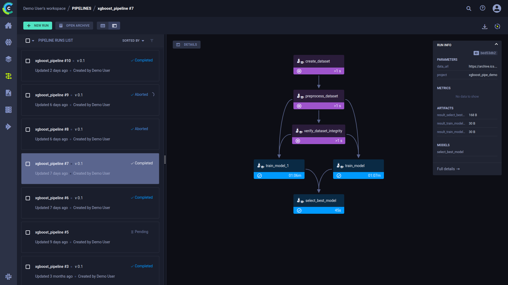

Pipelines are a way to streamline and connect multiple processes, plugging the output of one process as the input of another. 

ClearML Pipelines are implemented by a *Controller Task* that holds the logic of the pipeline steps' interactions. The execution logic 
controls which step to launch based on parent steps completing their execution. Depending on the specifications 
laid out in the controller task, a step's parameters can be overridden, enabling users to leverage other steps' execution 
products such as artifacts and parameters.

When run, the controller will sequentially launch the pipeline steps. The pipeline logic and steps 
can be executed locally, or on any machine using the [clearml-agent](../clearml_agent.md).

The [Pipeline Run](../webapp/pipelines/webapp_pipeline_viewing.md) page in the web UI displays the pipeline’s structure 
in terms of executed steps and their status, as well as the run’s configuration parameters and output. See [pipeline UI](../webapp/pipelines/webapp_pipeline_page.md) 
for more details.

ClearML pipelines are created from code using one of the following:
* [PipelineController](pipelines_sdk_tasks.md) class - A pythonic interface for defining and configuring the pipeline 
  controller and its steps. The controller and steps can be functions in your python code, or existing [ClearML tasks](../fundamentals/task.md).
* [PipelineDecorator](pipelines_sdk_function_decorators.md) class - A set of Python decorators which transform your 
  functions into the pipeline controller and steps

When the pipeline runs, corresponding ClearML tasks are created for the controller and steps. 

Since a pipeline controller is itself a [ClearML task](../fundamentals/task.md), it can be used as a pipeline step. 
This allows to create more complicated workflows, such as pipelines running other pipelines, or pipelines running multiple 
tasks concurrently. See the [Tabular training pipeline](../guides/frameworks/pytorch/notebooks/table/tabular_training_pipeline.md) 
example of a pipeline with concurrent steps.

## Running Your Pipelines
ClearML supports multiple modes for pipeline execution:
* **Remote Mode** (default) - In this mode, the pipeline controller logic is executed through a designated queue, and all 
  the pipeline steps are launched remotely through their respective queues. Since each task is executed independently, 
  it can have control over its git repository (if needed), required python packages and specific container to be used.
* **Local Mode** - In this mode, the pipeline is executed locally, and the steps are executed as sub-processes. Each 
  subprocess uses the exact same Python environment as the main pipeline logic.
* **Debugging Mode** (for PipelineDecorator) - In this mode, the entire pipeline is executed locally, with the pipeline 
  controller and steps called synchronously as regular Python functions providing full ability to debug each function call.

## Pipeline Features  
### Artifacts and Metrics
Each pipeline step can log additional artifacts and metrics on the step task with the usual flows (TB, Matplotlib, or with 
[ClearML Logger](../fundamentals/logger.md)). To get the instance of the step’s Task during runtime, use the class method 
[Task.current_task](../references/sdk/task.md#taskcurrent_task).

Additionally, pipeline steps can directly report metrics or upload artifacts / models to the pipeline using these 
PipelineController and PipelineDecorator class methods: `get_logger`, `upload_model`, `upload_artifact`.

The pipeline controller also offers automation for logging step metrics / artifacts / models on the pipeline task itself. 
Each pipeline step can specify metrics / artifacts / models to also automatically log to the pipeline Task. The idea is 
that pipeline steps report metrics internally while the pipeline automatically collects them into a unified view on the 
pipeline Task. To enable the automatic logging, use the `monitor_metrics`, `monitor_artifacts`, `monitor_models` arguments 
when creating a pipeline step.

### Pipeline Step Caching
The Pipeline controller also offers step caching, meaning, reusing outputs of previously executed pipeline steps, in the 
case of  exact same step code, and the same step input values. By default, pipeline steps are not cached. Enable caching
when creating a pipeline step.

When a step is cached, the step code is hashed, alongside the step’s parameters (as passed in runtime), into a single 
representing hash string. The pipeline first checks if a cached step exists in the system (archived Tasks will not be used 
as a cached instance). If the pipeline finds an existing fully executed instance of the step, it will plug its output directly, 
allowing the pipeline logic to reuse the step outputs.

### Callbacks

Callbacks can be utilized to control pipeline execution flow. A callback can be defined to be called before and / or after 
the execution of every task in a pipeline. Additionally, you can create customized, step-specific callbacks.

### Pipeline Reusing 
Like any other task in ClearML, the controller task can be cloned, modified, and relaunched. The main pipeline logic 
function’s arguments are stored in the controller task’s **Configuration > Args** section. You can clone the pipeline 
Task using the UI or programmatically, modify the pipeline arguments, and send the pipeline for execution by enqueuing 
the pipeline on the `services` queue.

### Pipeline Versions
Each pipeline must be assigned a version number to help track the evolution of your pipeline structure and parameters.

If you pass `auto_version_bump=True` when instantiating a PipelineController, the pipeline’s version automatically bumps up
if there is a change in the pipeline code. If there is no change, the pipeline retains its version number.  

### Tracking Pipeline Progress
ClearML automatically tracks a pipeline’s progress percentage: the number of pipeline steps completed out of the total
number of steps. For example, if a pipeline consists of 4 steps, after the first step completes, ClearML automatically 
sets its progress value to 25. Once a pipeline has started to run but is yet to successfully finish, , the WebApp will 
show the pipeline’s progress indication in the pipeline runs table, next to the run’s status.

## Examples

See examples of building ClearML pipelines:
* [PipelineDecorator](../guides/pipeline/pipeline_decorator.md)
* PipelineController
  * [Pipeline from tasks](../guides/pipeline/pipeline_controller.md)
  * [Pipeline from functions](../guides/pipeline/pipeline_functions.md)
 