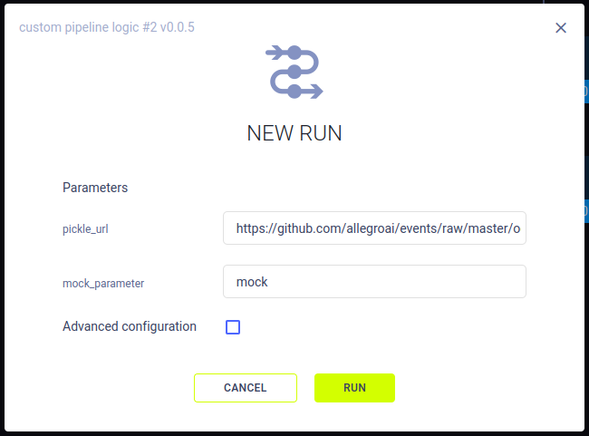

## Creating Pipelines Using Function Decorators

Use the [PipelineDecorator](../references/sdk/automation_controller_pipelinecontroller.md#class-automationcontrollerpipelinedecorator) 
class to create pipelines from your existing functions. Use [`@PipelineDecorator.component`](../references/sdk/automation_controller_pipelinecontroller.md#pipelinedecoratorcomponent) 
to denote functions that comprise the steps of your pipeline, and [`@PipelineDecorator.pipeline`](../references/sdk/automation_controller_pipelinecontroller.md#pipelinedecoratorpipeline) 
for your main pipeline execution logic function.

## @PipelineDecorator.pipeline

Using the [`@PipelineDecorator.pipeline`](../references/sdk/automation_controller_pipelinecontroller.md#pipelinedecoratorpipeline)
decorator transforms the function which implements your pipeline's execution logic to a ClearML pipeline controller

```python
@PipelineDecorator.pipeline(
  name='pipeline', project='examples', version='0.1', 
  args_map={'General':['pickle_url'], 'Mock':['mock_parameter']}
)
def main(pickle_url, mock_parameter='mock'):
    data_frame = step_one(pickle_url)
    X_train, X_test, y_train, y_test = step_two(data_frame)
    model = step_three(X_train, y_train)
    accuracy = 100 * step_four(model, X_data=X_test, Y_data=y_test)
    print(f"Accuracy={accuracy}%")
```

### Arguments

* `name` - The name for the pipeline controller task
* `project` - The ClearML project where the pipeline controller task is stored
* `version` -  Numbered version string (e.g. 1.2.3). If `auto_version_bump` is set to `True`, the version number is 
  automatically bumped if the same version already exists and the pipeline code has changed
* `default_queue` - The default [ClearML Queue](../fundamentals/agents_and_queues.md#what-is-a-queue) in which to enqueue all pipeline steps (unless otherwise specified in the pipeline step).
* `args_map` - Map arguments to their [configuration section](../fundamentals/hyperparameters.md#webapp-interface) in 
  the following format: `{'section_name':['param_name']]}`. For example, the pipeline in the code above will store the 
  `pickle_url` parameter in the `General` section and `mock_parameter` in the `Mock` section. By default, arguments will 
  be stored in the `Args` section.  
* `pool_frequency` - The polling frequency (in minutes) for monitoring experiments / states.
* `add_pipeline_tags` - If `True`, add `pipe: <pipeline_task_id>` tag to all steps (Tasks) created by this pipeline 
  (this is useful to create better visibility in projects with multiple pipelines, and for easy selection) (default: 
  `False`).
* `target_project` - If provided, all pipeline steps are cloned into the target project. If not provided, pipeline steps 
  are stored on the same project as the pipeline itself. Target sub-folder allows for easier organization of pipeline 
  execution logic (Pipeline Task) and step execution Tasks. Example: "pipeline/component_execution".
* `abort_on_failure` - If `False` (default), failed pipeline steps will not cause the pipeline to stop immediately. 
  Instead, any step that is not connected (or indirectly connected) to the failed step, will still be executed. 
  Nonetheless, the pipeline itself will be marked failed (unless the failed step was specifically defined with 
  `continue_on_fail=True`). If `True`, any failed step will cause the pipeline to immediately abort, stopping all running 
  steps, and marking the pipeline as failed.
* `pipeline_execution_queue` - The queue in which to enqueue the pipeline controller task. The default value is the 
  `services` queue. To run the pipeline logic locally while the components are executed remotely, pass 
  `pipeline_execution_queue=None`

When the function is called, a corresponding ClearML Controller Task is created: its arguments are logged as the task’s 
parameters. When launching a new pipeline run from the [UI](../webapp/pipelines/webapp_pipeline_page.md), you can modify their values for the new run.  



## @PipelineDecorator.component
Using the [`@PipelineDecorator.component`](../references/sdk/automation_controller_pipelinecontroller.md#pipelinedecoratorcomponent) 
decorator transforms a function into a ClearML pipeline step when called from a pipeline controller.

When the pipeline controller calls a pipeline step, a corresponding ClearML task is created. For this reason, each 
function which makes up a pipeline step needs to be self-contained. All package imports inside the function are automatically 
logged as required packages for the pipeline execution step. 

```python
from clearml.automation.controller import PipelineDecorator

@PipelineDecorator.component(return_values=['data_frame'], cache=True)
def step_one(pickle_data_url: str, extra: int = 43):
    import sklearn  # noqa
    import pickle
    import pandas as pd
    from clearml import StorageManager
    local_iris_pkl = StorageManager.get_local_copy(remote_url=pickle_data_url)
    with open(local_iris_pkl, 'rb') as f:
        iris = pickle.load(f)
    data_frame = pd.DataFrame(iris['data'], columns=iris['feature_names'])
    data_frame.columns += ['target']
    data_frame['target'] = iris['target']
    return data_frame
```
### Arguments
* `return_values` - The artifact names for the step’s corresponding ClearML task to store the step’s returned objects. 
  In the example above, a single object is returned and stored as an artifact named `data_frame`
* `name` (Optional) - The name for the pipeline step. If not provided, the function name is used 
* `cache` - If `True`, the pipeline controller checks if an identical step with the same parameters was already executed.
  If found, its outputs are used instead of rerunning the step.
* `packages` - A list of required packages or a local requirements.txt file. Example: `["tqdm>=2.1", "scikit-learn"]` or 
  `"./requirements.txt"`. If not provided, packages are automatically added based on the imports used inside the function.
* `execution_queue` (Optional) - Queue in which to enqueue the specific step. This overrides the queue set with the 
  [`PipelineDecorator.set_default_execution_queue method`](../references/sdk/automation_controller_pipelinecontroller.md#pipelinedecoratorset_default_execution_queue)
  method.
* `continue_on_fail` - If `True`, a failed step does not cause the pipeline to stop (or marked as failed). Notice, that 
  steps that are connected (or indirectly connected) to the failed step are skipped (default `False`)
* `docker` - Specify the Docker image to be used when executing the pipeline step remotely
* `docker_args` - Add Docker execution arguments for the remote execution (use single string for all docker arguments).
* `docker_bash_setup_script` - Add a bash script to be executed inside the docker before setting up the Task's environment
* `task_type` (Optional) - The [task type](../fundamentals/task.md#task-types) to be created
* `repo` (Optional) - Specify a repository to attach to the function when remotely executing. Allow users to execute the function inside the specified repository, enabling them to load modules / script from the repository. Notice the execution work directory will be the repository root folder. Supports both git repo url link, and local repository path (automatically converted into the remote git / commit as is currently checkout).
  * Examples:
    * remote url: `"https://github.com/user/repo.git"`
    * local repo copy: `"./repo"` -> will automatically store the remote repo url and commit ID based on the locally cloned copy
* `repo_branch` (Optional) - Specify the remote repository branch (Ignored, if local repo path is used)
* `repo_commit` (Optional) - Specify the repository commit ID (Ignored, if local repo path is used)
* `helper_functions` (Optional) - A list of helper functions to make available for the standalone pipeline step. By default, the pipeline step function has no access to any of the other functions, by specifying additional functions here, the remote pipeline step could call the additional functions.
  Example, assuming we have two functions, `parse_data()` and `load_data()`: `[parse_data, load_data]`
* `parents` – Optional list of parent steps in the pipeline. The current step in the pipeline will be sent for execution only after all the parent steps have been executed successfully.

Additionally, you can enable automatic logging of a step’s metrics / artifacts / models to the pipeline task using the 
following arguments:
* `monitor_metrics` (Optional) - Automatically log the step's reported metrics also on the pipeline Task. The expected 
  format is one of the following:
  * List of pairs metric (title, series) to log: [(step_metric_title, step_metric_series), ]. Example: `[('test', 'accuracy'), ]`
  * List of tuple pairs, to specify a different target metric to use on the pipeline Task: [((step_metric_title, step_metric_series), (target_metric_title, target_metric_series)), ].
  Example: `[[('test', 'accuracy'), ('model', 'accuracy')], ]`
* `monitor_artifacts` (Optional) - Automatically log the step's artifacts on the pipeline Task. 
  * Provided a list of 
  artifact names created by the step function, these artifacts will be logged automatically also on the Pipeline Task 
  itself. Example: `['processed_data', ]` (target artifact name on the Pipeline Task will have the same name as the original 
  artifact). 
  * Alternatively, provide a list of pairs (source_artifact_name, target_artifact_name), where the first string is the 
    artifact name as it appears on the component Task, and the second is the target artifact name to put on the Pipeline 
    Task. Example: `[('processed_data', 'final_processed_data'), ]`
* `monitor_models` (Optional) - Automatically log the step's output models on the pipeline Task.
  * Provided a list of model names created by the step's Task, they will also appear on the Pipeline itself. Example: `['model_weights', ]`
  * To select the latest (lexicographic) model use `model_*`, or the last created model with just `*`. Example: `['model_weights_*', ]`
  * Alternatively, provide a list of pairs (source_model_name, target_model_name), where the first string is the model 
    name as it appears on the component Task, and the second is the target model name to put on the Pipeline Task. 
    Example: `[('model_weights', 'final_model_weights'), ]`

You can also directly upload a model or an artifact from the step to the pipeline controller, using the 
[`PipelineDecorator.upload_model`](../references/sdk/automation_controller_pipelinecontroller.md#pipelinedecoratorupload_model) 
and [`PipelineDecorator.upload_artifact`](../references/sdk/automation_controller_pipelinecontroller.md#pipelinedecoratorupload_artifact) 
methods respectively. 


## Controlling Pipeline Execution
### Default Execution Queue 
The [`PipelineDecorator.set_default_execution_queue`](../references/sdk/automation_controller_pipelinecontroller.md#pipelinedecoratorset_default_execution_queue) 
method lets you set a default queue through which all pipeline steps 
will be executed. Once set, step-specific overrides can be specified through the `@PipelineDecorator.component` decorator. 

### Running the Pipeline
To run the pipeline, call the pipeline controller function. 

ClearML pipelines can be run in one of the following modes:

#### Remote Mode
The remote mode is the pipeline controller's default mode. In this mode, the pipeline controller logic is executed on the 
services queue, and all the pipeline steps are launched remotely on their respective queues.

Example:
```python
if __name__ == '__main__':
   executing_pipeline(pickle_url='https://example.com/iris_dataset.pkl')
   print('pipeline completed')
```

:::tip RUN PIPELINE CONTROLLER LOCALLY
It is possible to run the pipeline logic itself locally, while keeping the pipeline components execution remote
(enqueued and executed by the clearml-agent). Pass `pipeline_execution_queue=None` to the `@PipelineDecorator.pipeline` decorator.
```python
@PipelineDecorator.pipeline(
   name='custom pipeline logic', project='examples', version='0.0.5', pipeline_execution_queue=None
)
```
:::

#### Debugging Mode
In debugging mode, the pipeline controller and all components are treated as regular python functions, with components 
called synchronously. This mode is great to debug the components and design the pipeline as the entire pipeline is 
executed on the developer machine with full ability to debug each function call. Call [`PipelineDecorator.debug_pipeline`](../references/sdk/automation_controller_pipelinecontroller.md#pipelinedecoratordebug_pipeline) 
before the main pipeline logic function call.

Example:
```python
if __name__ == '__main__':
   PipelineDecorator.debug_pipeline()
   executing_pipeline(pickle_url='https://example.com/iris_dataset.pkl')
   print('pipeline completed')
```

#### Local Mode
In local mode, the pipeline controller creates Tasks for each component, and component functions calls are translated 
into sub-processes running on the same machine. Notice that the data is passed between the components and the logic with 
the exact same mechanism as in the remote mode (i.e. hyperparameters / artifacts), with the exception that the execution 
itself is local. Notice that each subprocess is using the exact same python environment as the main pipeline logic. Call 
[`PipelineDecorator.run_locally`](../references/sdk/automation_controller_pipelinecontroller.md#pipelinedecoratorrun_locally)
before the main pipeline logic function.

Example:
```python
if __name__ == '__main__':
   PipelineDecorator.run_locally()
   executing_pipeline(pickle_url='https://example.com/iris_dataset.pkl')
   print('pipeline completed')
```
