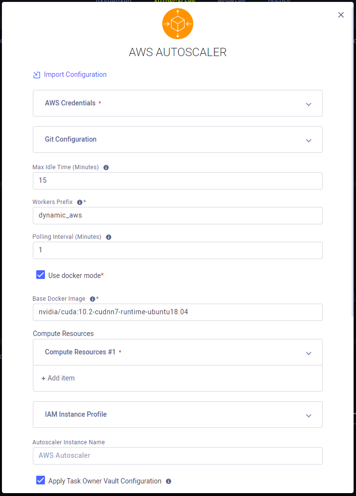
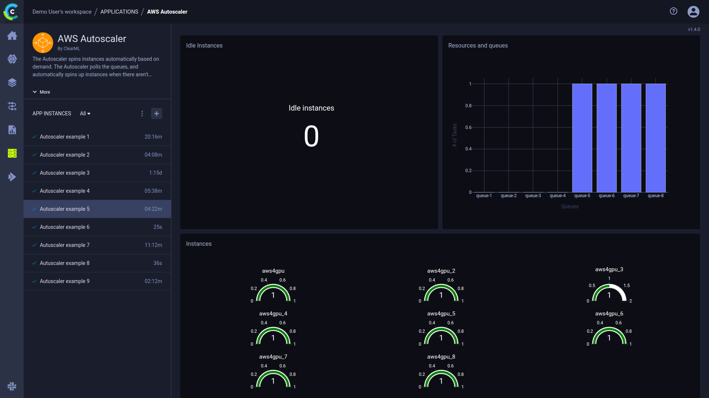
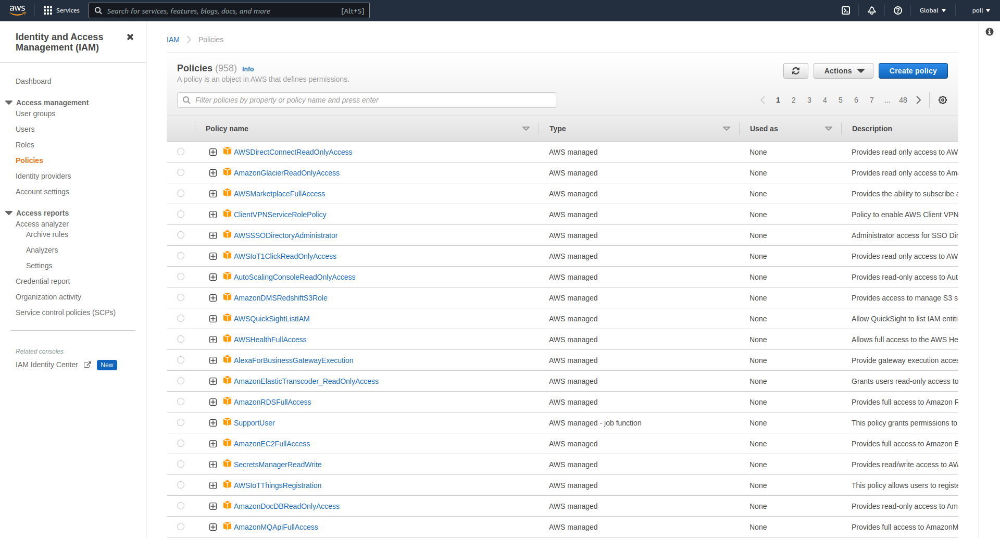
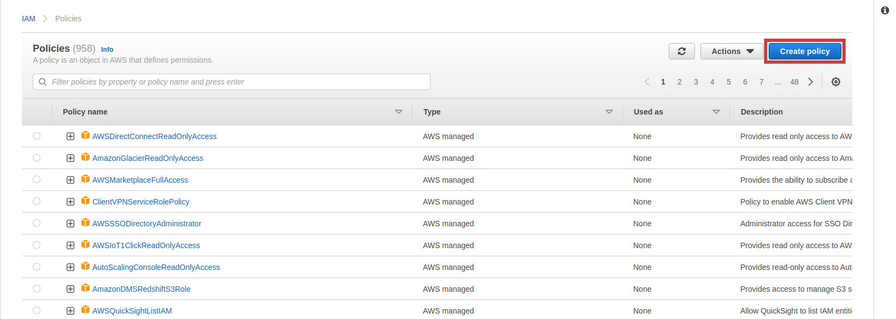
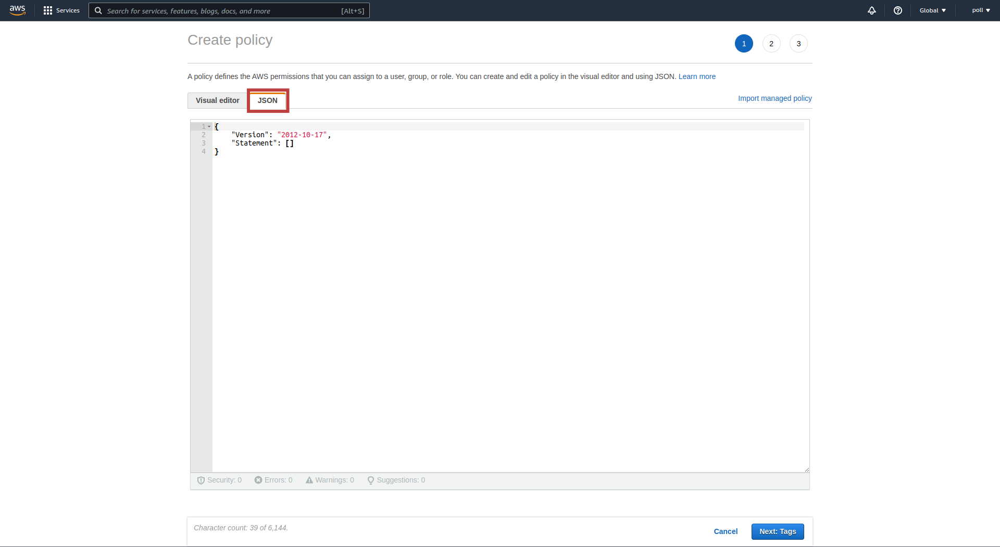

:::info Pro Plan Offering
The ClearML AWS Autoscaler App is available under the ClearML Pro plan.
:::

The AWS Autoscaler Application optimizes AWS EC2 instance usage according to a user defined resource budget: define your 
budget by specifying the type and amount of available compute resources.

Each resource type is associated with a ClearML [queue](../../fundamentals/agents_and_queues.md#what-is-a-queue) whose status determines the need for instances of that resource 
type (i.e. spin up new instances if there are pending jobs on the queue).

When running, the autoscaler periodically polls your AWS cluster. The autoscaler automatically terminates idle instances 
based on a specified maximum idle time, or spins up new instances when there aren't enough to execute pending tasks in a 
queue (until reaching the defined maximum number of instances). You can add an init script, which will be executed when 
each instance is spun up. 

For more information about how autoscalers work, see [Autoscalers Overview](../../cloud_autoscaling/autoscaling_overview.md#autoscaler-applications).

## Autoscaler Instance Configuration

When configuring a new AWS Autoscaler instance, you can fill in the required parameters or reuse the configuration of 
a previously launched instance.  

Launch an app instance with the configuration of a previously launched instance using one of the following options:
* Cloning a previously launched app instance will open the instance launch form with the original instance's 
configuration prefilled.
* Importing an app configuration file. You can export the configuration of a previously launched instance as a JSON file 
when viewing its configuration.

The prefilled instance launch form can be edited before starting the new app instance. 

To configure a new app instance, click `Launch New`  
to open the app's instance launch form.

### Configuration Options
* **Import Configuration** - Import an app instance configuration file. This will fill the instance launch form with the 
  values from the file, which can be modified before launching the app instance
* **AWS Credentials** - Credentials with which the autoscaler can access your AWS account. See [Generating AWS IAM Credentials](#generating-aws-iam-credentials)
    * Use IAM role - Select if you are running your autoscalers on your own EC2 instances which are attached to an [IAM 
      role](https://docs.aws.amazon.com/IAM/latest/UserGuide/id_roles.html). In such a case, no AWS IAM credentials are required
    * AWS Region - [AWS Region](https://docs.aws.amazon.com/AmazonRDS/latest/UserGuide/Concepts.RegionsAndAvailabilityZones.html#Concepts.RegionsAndAvailabilityZones.Regions) 
      where the EC2 instances will be spun up
    * AWS Access Key ID and AWS Secret Access Key - The credentials with which the autoscaler will access your AWS 
      account for spinning EC2 instances up/down
* **Git Configuration** - Git credentials with which the ClearML Agents running on your EC2 instances will access your 
  repositories to retrieve the code for their jobs
    * Git User 
    * Git Password / Personal Access Token
* **Max Idle Time** (optional) - Maximum time in minutes that an EC2 instance can be idle before the autoscaler spins it 
  down 
* **Workers Prefix** (optional) - A Prefix added to workers' names, associating them with this autoscaler
* **Polling Interval** (optional) - Time period in minutes at which the designated queue is polled for new tasks
* **Use docker mode** - If selected, tasks enqueued to the autoscaler will be executed by ClearML Agents running in 
[Docker mode](../../clearml_agent/clearml_agent_execution_env.md#docker-mode) 
  * **Base Docker Image** (optional) - Available when `Use docker mode` is selected: Default Docker image in which the 
  ClearML Agent will run. Provide an image stored in a Docker artifactory so instances can automatically fetch it
* **Compute Resources**
    * Resource Name - Assign a name to the resource type. This name will appear in the autoscaler dashboard
    * EC2 Instance Type - See [Instance Types](https://aws.amazon.com/ec2/instance-types) for full list of types
    * Run in CPU mode - Check box to run with CPU only
    * Use Spot Instance - Select to use a spot instance. Otherwise, a reserved instance is used.
        * Regular Instance Rollback - When selected, if a spot instance is unavailable for the time specified in the `Regular Instance Rollback Timeout`, a reserved instance will be spun up instead        
        * Regular Instance Rollback Timeout - Controls how long the autoscaler will wait for a spot instance to become available. It will first attempt to start a spot instance, then periodically retry. Once the specified time is exceeded, the autoscaler will try to start a reserved instance instead. The timeout applies for a specific attempt, where starting a spot fails and an alternative instance needs to be started. 
        * Spot Instance Blackout Period - Specifies a blackout period after failing to start a spot instance. This is related to future attempts: after failing to start a spot instance, all requests to start additional spot instances will be converted to attempts to start regular instances, as a way of "easing" the spot requests load on the cloud provider and not creating a "DOS" situation in the cloud account which might cause the provider to refuse creating spots for a longer period.
    * Place tags on resources - In addition to placing tags on the instance, choose which cloud resources tags will be placed on
    * Availability Zone - The [EC2 availability zone](https://docs.aws.amazon.com/AmazonRDS/latest/UserGuide/Concepts.RegionsAndAvailabilityZones.html#Concepts.RegionsAndAvailabilityZones.AvailabilityZones) 
      to launch this resource in
    * AMI ID - The AWS AMI to launch
    :::note AMI prerequisites
    The AMI used for the autoscaler must include docker runtime and virtualenv.
    
    Recent NVIDIA AMIs only install the required drivers on initial user login. To make use of such AMIs, the autoscaler 
    needs to mimic an initial user login. This can be accomplished by, adding the following script to the `Init script`
    field:
    
    ```
    apt-get update
    DEBIAN_FRONTEND=noninteractive apt-get -y -o Dpkg::Options::="--force-confdef" -o Dpkg::Options::="--force-confold" upgrade
    su -l ubuntu -c '/usr/bin/bash /home/ubuntu/.profile'
    ```
    :::
    * Max Number of Instances - Maximum number of concurrent running instances of this type allowed
    * Monitored Queue - Queue associated with this instance type. The tasks enqueued to this queue will be executed on 
      instances of this type
    * EC2 Tags (optional) - AWS instance tags to attach to launched EC2 instances. Insert key=value pairs, separated by 
      commas 
    * EBS Device (optional) - Disk mount point
    * EBS Volume Size (optional) - Disk size (GB)
    * EBS Volume Type (optional) - See [Amazon EBS volume types](https://docs.aws.amazon.com/AWSEC2/latest/UserGuide/ebs-volume-types.html) 
      for full list of types
    * Instance Key Pair (optional) - AWS key pair that is provided to the spun EC2 instances for connecting to them via 
      SSH. Provide the Key Pair's name, as was created in AWS. See [Amazon EC2 key pairs](https://docs.aws.amazon.com/AWSEC2/latest/UserGuide/ec2-key-pairs.html) 
      for more details
    * Security Group ID (optional) - Comma separated list of AWS VPC Security Group IDs to attach to the launched 
      instance. Read more [here](https://docs.aws.amazon.com/vpc/latest/userguide/VPC_SecurityGroups.html) 
    * VPC Subnet ID - The subnet ID For the created instance. If more than one ID is provided, the instance will be started in the first available subnet. For more information, see [What is Amazon VPC?](https://docs.aws.amazon.com/vpc/latest/userguide/what-is-amazon-vpc.html)
    * \+ Add Item - Define another resource type
* **IAM Instance Profile** (optional) - Set an IAM instance profile for all instances spun by the autoscaler 
    * Arn - Amazon Resource Name specifying the instance profile
    * Name - Name identifying the instance profile
* **Autoscaler Instance Name** (optional) - Name for the Autoscaler instance. This will appear in the instance list
* **Apply Task Owner Vault Configuration** - Select to apply values from the task owner's [configuration vault](../settings/webapp_settings_profile.md#configuration-vault) when executing the task (available under ClearML Enterprise Plan)
* **Warn if more than one instance is executing the same task** - Select to print warning to console when multiple 
  instances are running the same task. In most cases, this indicates an issue.
* **Exclude .bashrc script** - Select in order to skip `.bashrc` script execution 
* **Ignore vault parsing errors** - If not selected, the autoscaler will abort if encountering errors when loading vaults 
  on startup. This only applies to vaults loaded by the autoscaler itself, not to vaults loaded on cloud instances or by 
  tasks run by the autoscaler. For more information, see [Configuration Vault](#configuration-vault) (available under ClearML Enterprise Plan).
* **Init script** (optional) - A bash script to execute after launching the EC2 instance 
* **Additional ClearML Configuration** (optional) - A ClearML configuration file to use by the ClearML Agent when 
  executing your experiments
* **Custom Launch Spec** - Custom AWS EC2 launch specification in JSON format. This will be used as the basis for 
creating the instances launch spec. See [boto3 EC2.client.run_instances Request Syntax](https://boto3.amazonaws.com/v1/documentation/api/latest/reference/services/ec2/client/run_instances.html) 
and [AWS API Reference: RunInstances](https://docs.aws.amazon.com/AWSEC2/latest/APIReference/API_RunInstances.html) (available under ClearML Enterprise Plan)
* **Run with Service Account** -  Select to allow running the application under a [Service Account](../settings/webapp_settings_users.md#service-accounts) identity instead of under your own identity (available under ClearML Enterprise Plan)
* **Export Configuration** - Export the app instance configuration as a JSON file, which you can later import to create 
  a new instance with the same configuration 



### Configuration Vault 

:::important Enterprise Feature
The Configuration Vault is available under the ClearML Enterprise plan.
:::

You can utilize the [configuration vault](../settings/webapp_settings_profile.md#configuration-vault) to set the following: 
* `aws_region`
* `aws_credentials_key_id` and `aws_secret_access_key` - AWS credentials for the autoscaler
* `extra_vm_bash_script` - A bash script to execute after launching the EC2 instance. This script will be appended to
the one set in the `Init script` field of the instance launch form
* `extra_clearml_conf` - ClearML configuration to use by the ClearML Agent when executing your experiments. This 
configuration will be appended to that set in the `Additional ClearML Configuration` field of the instance launch form
* `files` - Files to create at designated paths with predefined content inside the container running the autoscaler. 
For more information, see [Files Section](../../configs/clearml_conf.md#files-section)
* `environment` - Dictionary of environment variables and values to set in the OS environment of the container running 
the autoscaler. For more information, see [Environment Section](../../configs/clearml_conf.md#environment-section)

For example, the following configuration would be applied to all autoscaler instances:

```
auto_scaler.v1.aws {
   aws_region: "us-east-1"
   aws_access_key_id: "<key>"
   aws_secret_access_key: "<secret>"
   extra_vm_bash_script: """
     echo "Hello world!"
   """
   extra_clearml_conf: """
     agent.docker_force_pull: true
   """
   files {
     boto3_file {
       contents: """
          boto3 {
            pool_connections: 512
            max_multipart_concurrency: 16
          }
       """      	
       path: "/boto3_config.yaml"
       target_format: yaml
       mode: "0o644"
       }
     }
   }
   environment {
      DB_PASSWORD: "secretpassword"
      LOG_LEVEL: "info"
   }

}
```

#### Configure Specific Autoscaler Instances
Use the configuration vault to configure specific instances: Add a regular expression to match the autoscaler's `Workers Prefix` under 
`auto_scaler.v1.aws.match`. Within this section, input the specific configuration which will be merged to any 
matched autoscaler's configuration.

For example:

```
auto_scaler.v1.aws {
    # this will be applied to all AWS autoscalers
    aws_region: "us-east-2"

    match {
        "^aws_test$": {
            # this will be applied only to AWS autoscalers who's workers prefix exactly matches aws_test
            extra_vm_bash_script: """ echo "Hello world!" """
        }
        "^aws_.*$": {
            # this will be applied to all AWS autoscalers who's workers prefix starts with aws_
            extra_vm_bash_script: """ echo "Goodbye!" """
        }
    }
}
```

#### Configure Instances Spawned by the Autoscaler
To configure instances spawned by the autoscaler, do any of the following:
* Add the configuration in the `auto_scaler.v1.aws.extra_clearml_conf` field of the configuration vault
* Run the autoscaler using a [ClearML Service Account](../settings/webapp_settings_users.md#service-accounts). Add the 
configuration to the service account's configuration vault, and set the autoscaler to run under that account
in the `Run with Service Account` field
* Admins can add the configuration to a [ClearML Administrator Vault](../settings/webapp_settings_admin_vaults.md)
and link the vault with a [user group](../settings/webapp_settings_users.md#user-groups) that includes the user running the 
autoscaler

## Dashboard
Once an autoscaler is launched, the autoscaler's dashboard provides information about available EC2 instances and their 
status.



The autoscaler dashboard shows:
* Number of idle instances
* Queues and the resource type associated with them
* Number of current running instances 
* Console: the application log containing everything printed to stdout and stderr appears in the console log. The log 
  shows polling results of the autoscaler's associated queues, including the number of tasks enqueued, and updates EC2 
  instances being spun up/down.

:::tip Console Debugging   
To make the autoscaler console log show additional debug information, change an active app instance's log level to DEBUG:
1. Go to the app instance task's page > **CONFIGURATION** tab > **USER PROPERTIES** section 
1. Hover over the section > Click `Edit` > Click `+ADD PARAMETER`
1. Input `log_level` as the key and `DEBUG` as the value of the new parameter.


The console's log level will update in the autoscaler's next iteration.  
:::

* Instance log files - Click to access the app instance's logs. This takes you to the app instance task's ARTIFACTS tab, 
  which lists the app instance's logs. In a log's `File Path` field, click  
  to download the complete log. 


:::tip EMBEDDING CLEARML VISUALIZATION
You can embed plots from the app instance dashboard into [ClearML Reports](../webapp_reports.md). These visualizations 
are updated live as the app instance(s) updates. The Enterprise Plan and Hosted Service support embedding resources in 
external tools (e.g. Notion). Hover over the plot and click  
to copy the embed code, and navigate to a report to paste the embed code.
:::

## Generating AWS IAM Credentials

The autoscaler app accesses your AWS account with the credentials you provide. 

You will need to create an AWS policy which grants the autoscaler app the required access privileges, attach the policy 
to an IAM user, and create credentials keys for that user to configure in the autoscaler app: 

1. In your AWS account, go to Services **Menu > IAM > Policies** 
    
   

1. Under policies, click **Create Policy** 

   

1. In the **Create Policy** modal, click on the JSON option

   

1. Insert the following policy into the text box (make sure to replace `<AWS_ACCOUNT_ID>` with your account ID): 

   ```json
   {
       "Version": "2012-10-17",
       "Statement": [
           {
               "Sid": "CreateTags",
               "Effect": "Allow",
               "Action": "ec2:CreateTags",
               "Resource": [
                   "arn:aws:ec2:*:<AWS_ACCOUNT_ID>:instance/*",
                   "arn:aws:ec2:*:<AWS_ACCOUNT_ID>:dedicated-host/*",
                   "arn:aws:ec2:*:<AWS_ACCOUNT_ID>:elastic-ip/*",
                   "arn:aws:ec2:*:<AWS_ACCOUNT_ID>:reserved-instances/*",
                   "arn:aws:ec2:*:<AWS_ACCOUNT_ID>>:capacity-reservation-fleet/*",
                   "arn:aws:ec2:*:<AWS_ACCOUNT_ID>>:volume/*",
                   "arn:aws:ec2:*:<AWS_ACCOUNT_ID>:capacity-reservation/*",
                   "arn:aws:ec2:*:<AWS_ACCOUNT_ID>:fleet/*",
                   "arn:aws:ec2:*:<AWS_ACCOUNT_ID>:spot-instances-request/*",
                   "arn:aws:ec2:*:<AWS_ACCOUNT_ID>:host-reservation/*",
                   "arn:aws:ec2:*:<AWS_ACCOUNT_ID>:launch-template/*",
                   "arn:aws:ec2:*:<AWS_ACCOUNT_ID>:network-interface/*"
               ]
           },
           {
               "Sid": "EC2Actions",
               "Effect": "Allow",
               "Action": [
                   "ec2:DescribeInstances",
                   "ec2:RequestSpotInstances",
                   "ec2:CancelSpotFleetRequests",
                   "ec2:DescribeInstanceAttribute",
                   "ec2:SendSpotInstanceInterruptions",
                   "ec2:RunInstances",
                   "ec2:RequestSpotFleet",
                   "ec2:DescribeSpotInstanceRequests",
                   "ec2:DescribeInstanceEventNotificationAttributes",
                   "ec2:GetConsoleOutput",
                   "ec2:CancelSpotInstanceRequests",
                   "ec2:DescribeInstanceTypes",
                   "ec2:DescribeInstanceStatus",
                   "ec2:TerminateInstances"
               ],
               "Resource": "*"
           },
           {
               "Sid": "AllowUsingMarketplaceAMIAliases",
               "Effect": "Allow",
               "Action": [
                   "ssm:GetParametersByPath",
                   "ssm:GetParameters",
                   "ssm:GetParameter"
               ],
               "Resource": "arn:aws:ssm:*::parameter/aws/service/marketplace/*"
           },
           {
               "Sid": "AllowUsingDeeplearningAMIAliases",
               "Effect": "Allow",
               "Action": [
                   "ssm:GetParametersByPath",
                   "ssm:GetParameters",
                   "ssm:GetParameter"
               ],
               "Resource": "arn:aws:ssm:*::parameter/aws/service/deeplearning/*"
           }
       ]
   }
   ```

1. Complete creating the policy
1. Attach the created policy to an IAM user/group whose credentials will be used in the autoscaler app (you can create a 
   new IAM user/group for this purpose)
1. Obtain a set of AWS IAM credentials for the user/group to which you have attached the created policy in the previous step  
