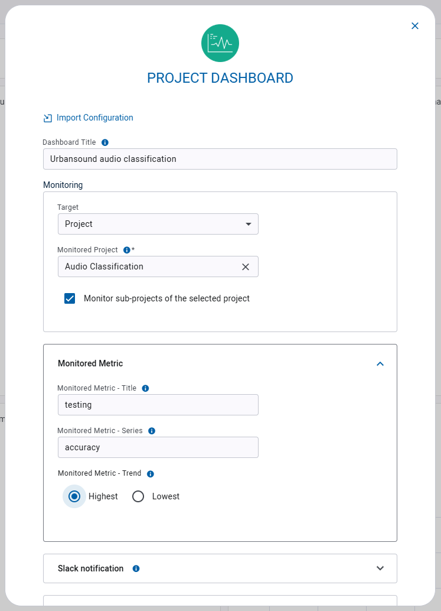
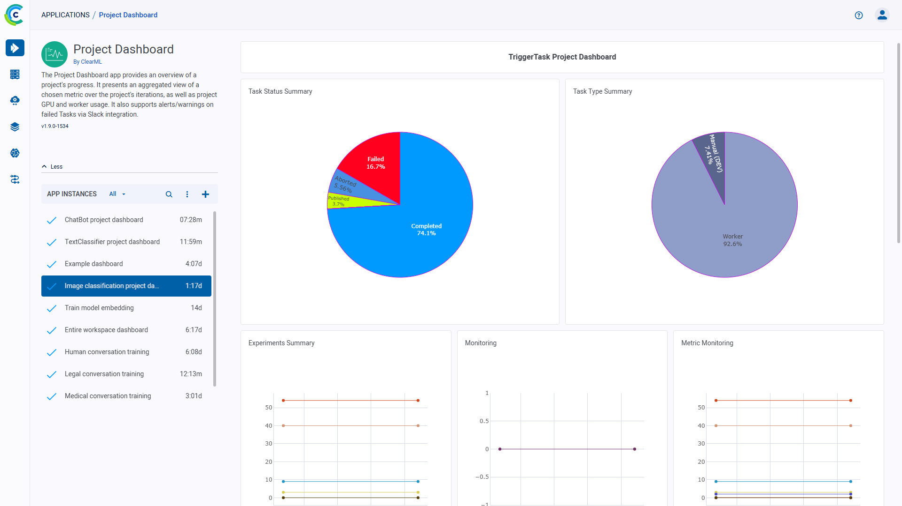

:::info Pro Plan Offering
The ClearML Project Dashboard App is available under the ClearML Pro plan
:::

The Project Dashboard Application provides an overview of a project's progress. It presents an aggregated view of a 
chosen metric over the project's iterations, as well as project GPU and worker usage. It also supports alerts/warnings 
on failed Tasks via Slack integration.

## Project Dashboard Instance Configuration
* **Import Configuration** - Import an app instance configuration file. This will fill the configuration wizard with the 
  values from the file, which can be modified before launching the app instance
* **Monitored Project** - Name of the ClearML project to monitor
* **Monitored Metric**
    * Monitored Metric - Title - Metric title to track
    * Monitored Metric - Series - Metric series (variant) to track
    * Monitored Metric - Trend - Choose whether to track the monitored metric's highest or lowest values
* **Dashboard Title** - Name of the project dashboard instance, which will appear in the instance list
* **Failed Task Slack Monitor** (Optional)
    * API Token - Slack workspace access token 
    * Channel Name - Slack channel to which task failure alerts will be posted
    * Fail Iteration Threshold - Minimum number of iterations to trigger Slack alerts about task failure (failed tasks that do not meet the threshold will be ignored)
* **Export Configuration** - Export the app instance configuration as a JSON file, which you can later import to create 
  a new instance with the same configuration.
  

## Dashboard

Once a project dashboard instance is launched, its dashboard displays the following information about a project:  
* Task Status Summary - Percentages of Tasks by status
* Task Type Summary - Percentages of local experiments vs. agent experiments
* Experiments Summary - Number of tasks by status over time
* Monitoring - GPU utilization and GPU memory usage
* Metric Monitoring - An aggregated view of the values of a metric over time
* Project’s Active Workers - Number of workers currently executing experiments in the monitored project
* Workers Table - List of active workers
* Failed Experiments - Failed experiments and their time of failure summary

