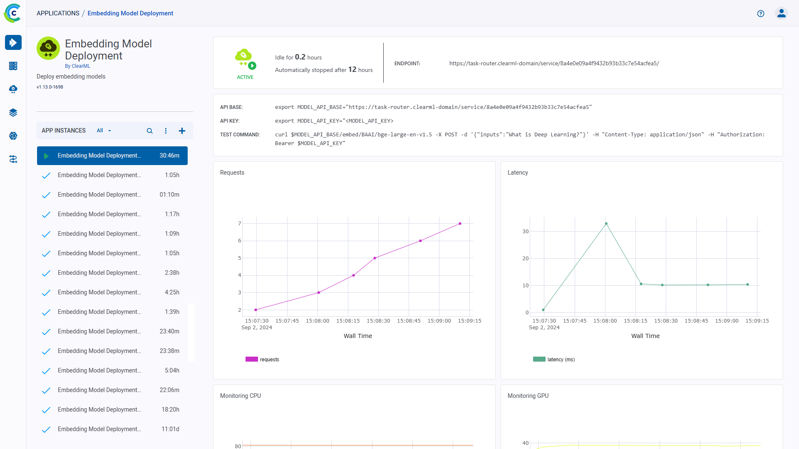
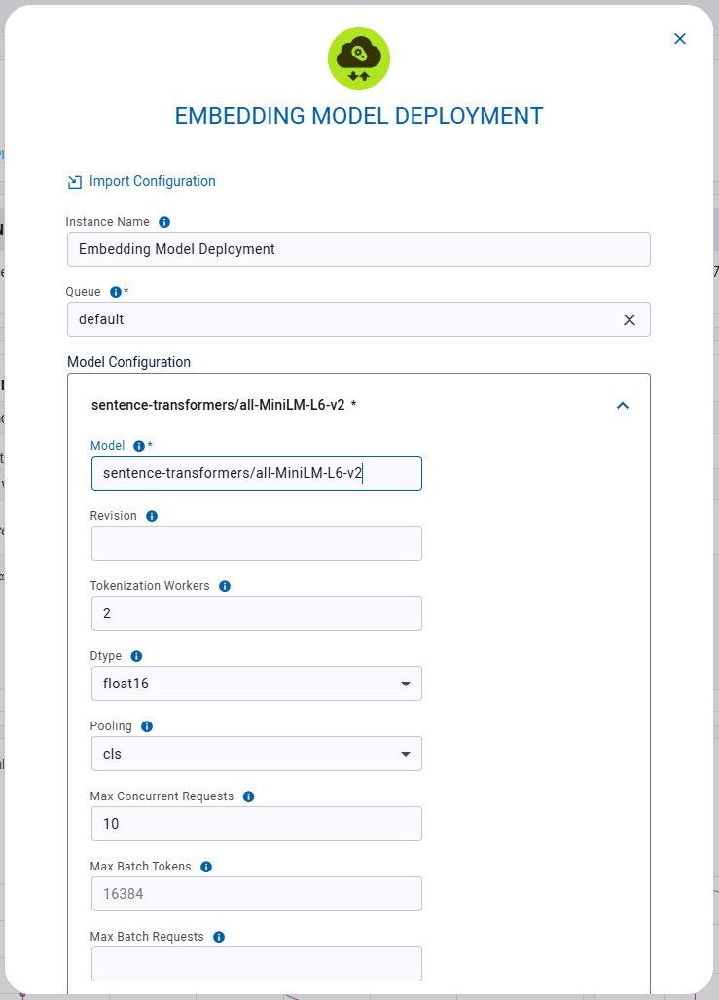

:::important Enterprise Feature
The Embedding Model Deployment App is available under the ClearML Enterprise plan.
:::

The Embedding Model Deployment app enables users to quickly deploy embedding models as networking services over a secure
endpoint. This application supports various model configurations and customizations, addressing a range of embedding use
cases. The Embedding Model Deployment application serves your model on a machine of your choice. Once an app instance is
running, it serves your embedding model through a secure, publicly accessible network endpoint. The app monitors 
endpoint activity and shuts down if the model remains inactive for a specified maximum idle time.

:::info Task Traffic Router
The Embedding Model Deployment app relies on the ClearML Traffic Router which implements a secure, authenticated network 
channel to the model
:::

After starting an Embedding Model Deployment instance, you can view the following information in its dashboard:
* Status indicator
    * <icon> - App instance is running and is actively in use
    * <icon> - App instance is setting up
    * <icon> - App instance is idle
    * <icon> App instance is stopped
* Idle time - Time elapsed since last activity 
* Endpoint - The publicly accessible URL of the model endpoint
* API base - The base URL for the model endpoint
* API key - The authentication key for the model endpoint
* Test Command - An example command line to test the deployed model
* Requests - Number of requests over time
* Latency - Request response time (ms) over time
* Endpoint resource monitoring metrics over time
  * CPU usage 
  * Network throughput 
  * Disk performance 
  * Memory performance 
  * GPU utilization 
  * GPU memory usage 
  * GPU temperature
* Console log - The console log shows the app instance's console output: setup progress, status changes, error messages, etc.

## Embedding Model Deployment Instance Configuration

When configuring a new Embedding Model Deployment instance, you can fill in the required parameters or reuse the 
configuration of a previously launched instance. 

Launch an app instance with the configuration of a previously launched instance using one of the following options:
* Cloning a previously launched app instance will open the instance launch form with the original instance's 
configuration prefilled.
* Importing an app configuration file. You can export the configuration of a previously launched instance as a JSON file 
when viewing its configuration.

The prefilled configuration form can be edited before launching the new app instance.

To  configure a new app instance, click `Launch New`  
to open the app's configuration form.

### Configuration Options
* Import Configuration - Import an app instance configuration file. This will fill the configuration form with the 
values from the file, which can be modified before launching the app instance
* Project name - ClearML Project where your Embedding Model Deployment app instance will be stored
* Task name - Name of ClearML Task for your Embedding Model Deployment app instance
* Queue - The [ClearML Queue](../../fundamentals/agents_and_queues.md#what-is-a-queue) to which the Embedding Model 
Deployment app instance task will be enqueued (make sure an agent is assigned to it)
* Model Configuration
  * Model - A ClearML Model ID or a Hugging Face model name (e.g. `openai-community/gpt2`)
  * Revision - The specific Hugging Face version of the model you want to use. You can use a specific commit ID or a 
  branch like `refs/pr/2`
  * Tokenization Workers - Number of tokenizer workers used for payload tokenization, validation, and truncation. 
  Defaults to the number of CPU cores on the machine
  * Dtype - The data type enforced on the model
  * Pooling - Model pooling method. If `pooling` is not set, the pooling configuration will be parsed from the model 
  `1_Pooling/config.json` configuration. If `pooling` is set, it will override the model pooling configuration. Possible 
  values: 
    * `cls`: Use CLS token
    * `mean`: Apply Mean pooling 
    * `splade`: Apply SPLADE (Sparse Lexical and Expansion) pooling. This option is only available for `ForMaskedLM` 
    Transformer models
  * \+ Add item - Add another model endpoint. Each model will be accessible through the same base URL, with the model 
  name appended to the URL.  
* Hugging Face Token - Token for accessing Hugging Face models that require authentication
* Idle Time Limit (Hours) - Maximum idle time after which the app instance will shut down
* Export Configuration - Export the app instance configuration as a JSON file, which you can later import to create a 
new instance with the same configuration

