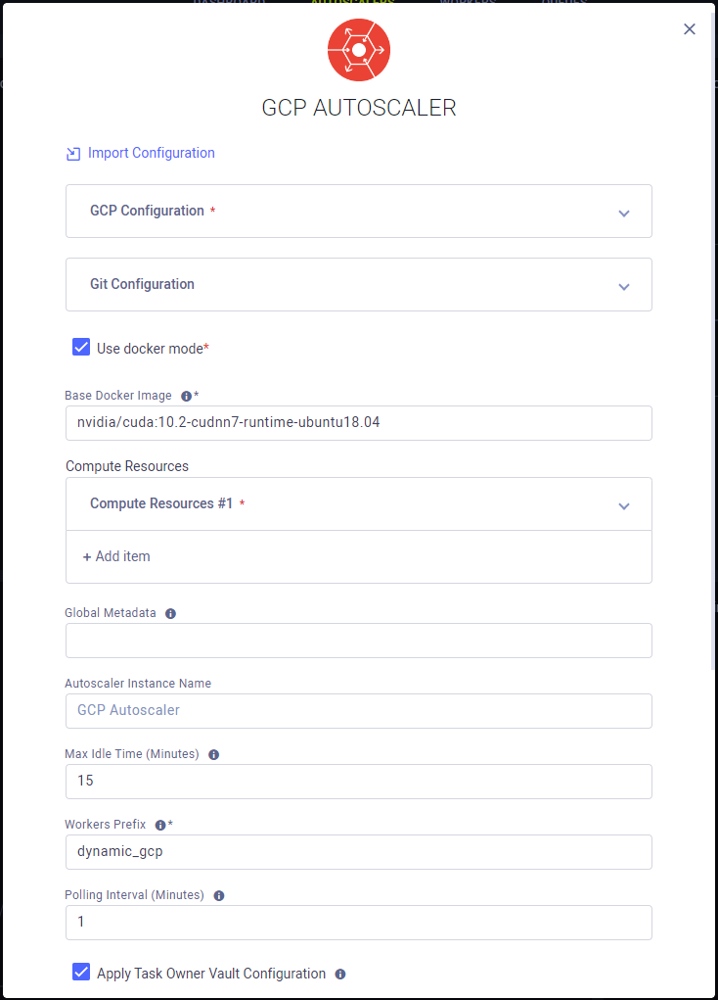
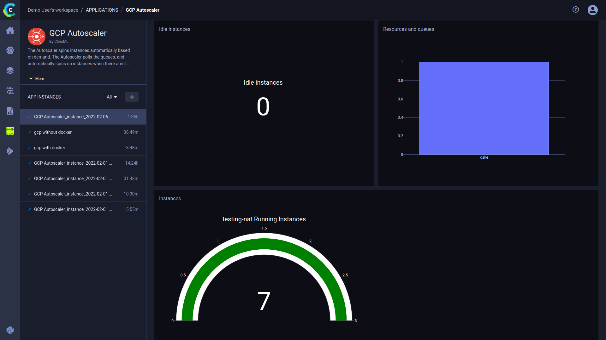

:::info Pro Plan Offering
The ClearML GCP Autoscaler App is available under the ClearML Pro plan
:::

The GCP Autoscaler Application optimizes GCP VM instance usage according to a user defined instance  budget: Define your 
budget by specifying the type and amount of available compute resources.

Each resource type is associated with a ClearML [queue](../../fundamentals/agents_and_queues.md#what-is-a-queue) whose 
status determines the need for instances of that resource type (i.e. spin up new instances if there are pending jobs on 
the queue).

When running, the autoscaler periodically polls your GCP cluster. The autoscaler automatically deletes idle VM instances 
based on a specified maximum idle time, or spins up new VM instances when there aren't enough to execute pending tasks 
in a queue (until reaching the defined maximum number of instances). You can add an init script, which will be executed 
when each VM instance is spun up. 

## Autoscaler Instance Configuration
* **GCP Configuration**
    * GCP Project ID - Project used for spinning up VM instances
    * GCP Zone - The GCP zone where the VM instances will be spun up. See [Regions and zones](https://cloud.google.com/compute/docs/regions-zones)
    * GCP Credentials - Project credentials, see [here](https://cloud.google.com/docs/authentication/production) for 
      more details.
* **Git Configuration** - Git credentials with which the ClearML Agents running on your VM instances will access your 
  repositories to retrieve the code for their jobs
    * Git User 
    * Git Password / Personal Access Token
* **Base Docker Image** (Optional) - Default Docker image in which the ClearML Agent will run. Provide a Docker stored in a 
  Docker artifactory so VM instances can automatically fetch it
* **Compute Resources**
    * Resource Name - Assign a name to the resource type. This name will appear in the Autoscaler dashboard.
    * GCP Machine Type - See list of [machine types](https://cloud.google.com/compute/docs/machine-types)
    * Run in CPU mode - Select to have the autoscaler utilize only CPU VM instances
    * GPU Type - See list of [supported GPUs by instance](https://cloud.google.com/compute/docs/gpus)
    * Use Preemptible Instance - Choose whether VM instances of this type will be [preemptible](https://cloud.google.com/compute/docs/instances/preemptible).
    * Max Number of Instances - Maximum number of concurrent running VM instances of this type allowed
    * Monitored Queue - Queue associated with this VM instance type. The tasks enqueued to this queue will be executed on VM instances of this type
    * Machine Image (Optional)  - The GCP machine image to launch 
    * Disc Size (in GB) (Optional) 
    * \+ Add Item - Define another resource type
* **Autoscaler Instance Name** (Optional) - Name for the Autoscaler instance. This will appear in the instance list. 
* **Max Idle Time** (Optional) - Maximum time in minutes that a VM instance can be idle before the autoscaler spins it down
* **Workers Prefix** (Optional) - A Prefix added to workers’ names, associating them with this autoscaler
* **Polling Interval** (Optional) - Time period in minutes at which the designated queue is polled for new tasks
* **Init Script** (Optional) - A bash script to execute after launching the VM instance
* **Additional ClearML Configuration** (Optional) - A ClearML configuration file to use by the ClearML Agent when executing your experiments



:::note Enterprise Feature
You can utilize the [configuration vault](../../webapp/webapp_profile.md#configuration-vault) to globally add your GCP 
credentials in the following format: 

```
auto_scaler.v1 {
    gcp {
        gcp_credentials: """
        {
          "type": "service_account",
          ...
        }
        """
    }
}
```
:::

## Dashboard

Once an autoscaler is launched, The autoscaler's dashboard provides information about available VM instances and their 
status.



The autoscaler dashboard shows:
* Number of Idle Instances
* Queues and the resource type associated with them
* Number of current running instances
* Console: the application log containing everything printed to stdout and stderr appears in the console log. The log 
  shows polling results of the autoscaler’s associated queues, including the number of tasks enqueued, and updates VM 
  instances being spun up/down.   
