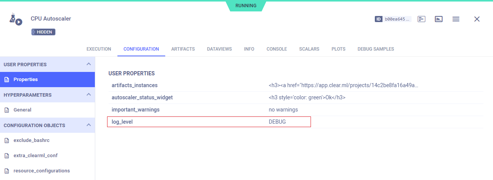
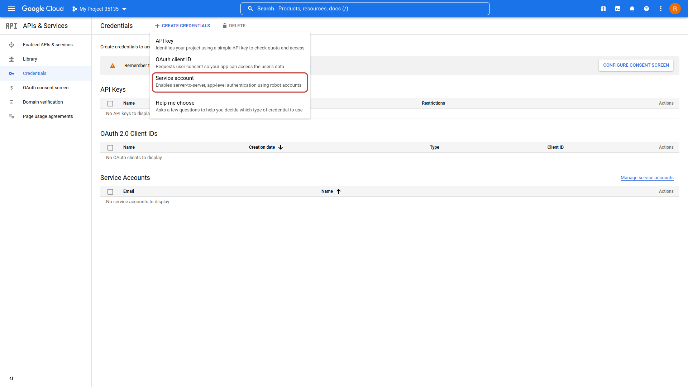
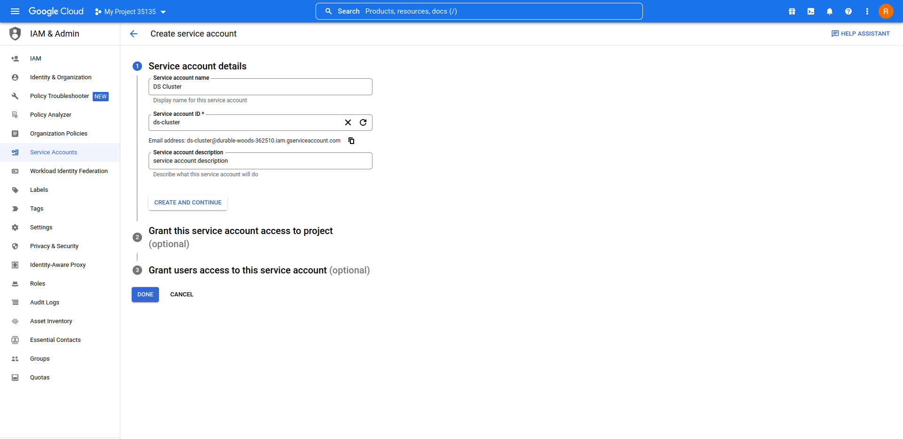
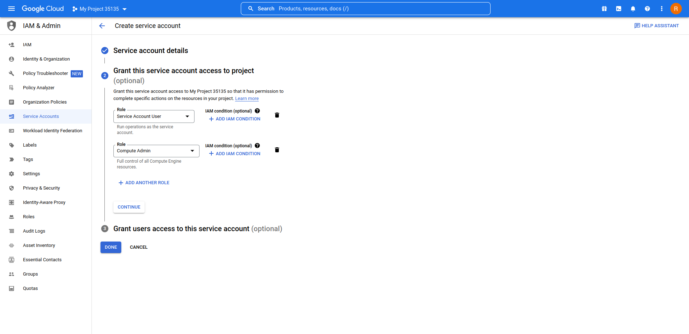
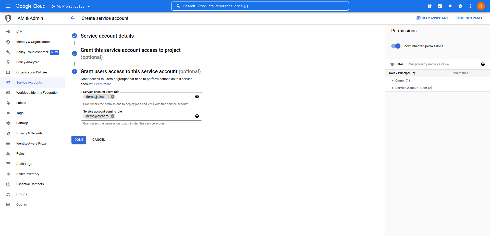
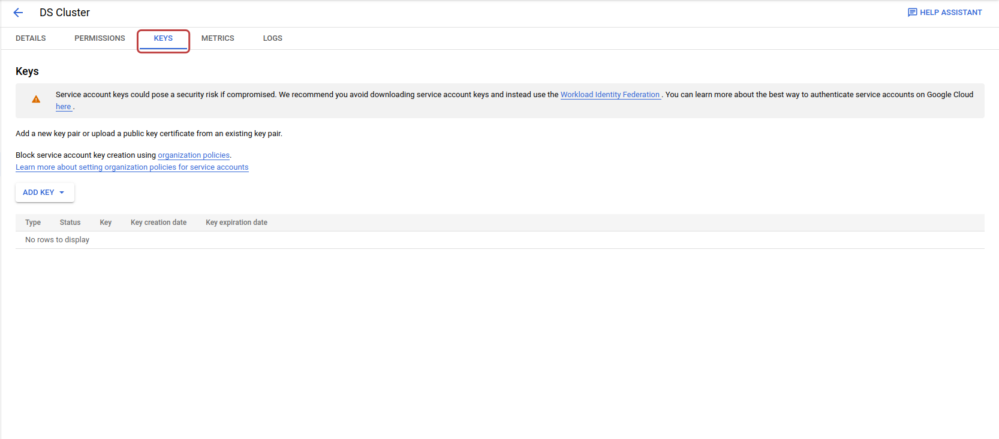
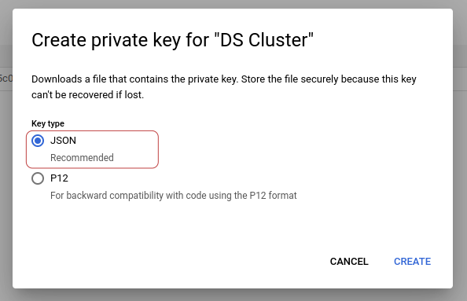
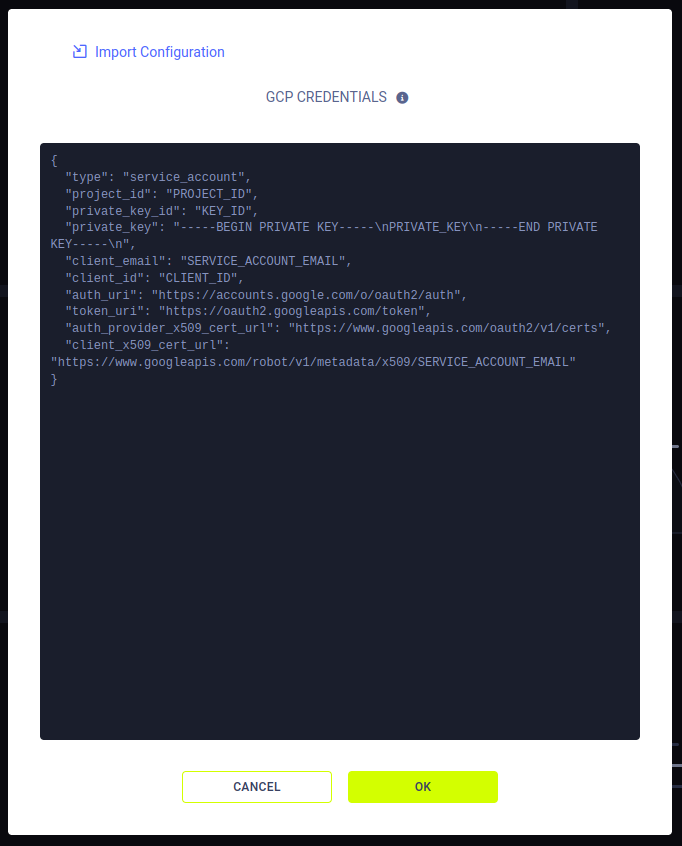

:::info Pro Plan Offering
The ClearML GCP Autoscaler App is available under the ClearML Pro plan
:::

The GCP Autoscaler Application optimizes GCP VM instance usage according to a user defined instance budget: Define your 
budget by specifying the type and amount of available compute resources.

Each resource type is associated with a ClearML [queue](../../fundamentals/agents_and_queues.md#what-is-a-queue) whose 
status determines the need for instances of that resource type (i.e. spin up new instances if there are pending jobs on 
the queue).

When running, the autoscaler periodically polls your GCP cluster. The autoscaler automatically deletes idle VM instances 
based on a specified maximum idle time, or spins up new VM instances when there aren't enough to execute pending tasks 
in a queue (until reaching the defined maximum number of instances). You can add an init script, which will be executed 
when each VM instance is spun up. 

For more information about how autoscalers work, see [Autoscalers Overview](../../cloud_autoscaling/autoscaling_overview.md#autoscaler-applications).

## Autoscaler Instance Configuration
* **Import Configuration** - Import an app instance configuration file. This will fill the configuration wizard with the 
  values from the file, which can be modified before launching the app instance
* **GCP Configuration**
    * GCP Project ID - Project used for spinning up VM instances
    * GCP Zone - The GCP zone where the VM instances will be spun up. See [Regions and zones](https://cloud.google.com/compute/docs/regions-zones)
    * Use full subnet path - Select to specify a full subnet path (i.e. referencing a subnet from a different project)
      * GCP Subnet Full Path - Available if `Use full subnet path` was selected. The GCP subnetwork where the instances 
      will be spun up. This allows setting a custom subnet resource path, and allows setting subnets shared from other 
      projects as well. See [GCP Documentation](https://cloud.google.com/dataflow/docs/guides/specifying-networks).
    * GCP Subnet Name - Available  if `Use full subnet path` was not selected. The GCP subnetwork where the instances 
    will be spun up. GCP setting will be `projects/{project-id}/regions/{region}/subnetworks/{subnetwork}`
    * GCP Credentials - Credentials with which the autoscaler can access your GCP account for spinning VM instances 
      up/down. See [Generating GCP Credentials](#generating-gcp-credentials).
* **Git Configuration** - Git credentials with which the ClearML Agents running on your VM instances will access your 
  repositories to retrieve the code for their jobs
    * Git User 
    * Git Password / Personal Access Token
* **Use docker mode** - If selected, tasks enqueued to the autoscaler will be executed by ClearML Agents running in 
[Docker mode](../../clearml_agent.md#docker-mode) 
* **Base Docker Image** (optional) - Available when `Use docker mode` is selected. Default Docker image in which the ClearML Agent will run. Provide an image stored in a 
  Docker artifactory so VM instances can automatically fetch it
* **Compute Resources**
    * Resource Name - Assign a name to the resource type. This name will appear in the Autoscaler dashboard
    * GCP Machine Type - See list of [machine types](https://cloud.google.com/compute/docs/machine-types)
    * Run in CPU mode - Select to have the autoscaler utilize only CPU VM instances
    * GPU Type - See list of [supported GPUs by instance](https://cloud.google.com/compute/docs/gpus)
    * Use Preemptible Instance - Choose whether VM instances of this type will be [preemptible](https://cloud.google.com/compute/docs/instances/preemptible)
      * Preemptible Provision Model - Select the provision model. For more information, see [Spot VMs](https://cloud.google.com/compute/docs/instances/spot) 
      and [Preemptible VMs](https://cloud.google.com/compute/docs/instances/preemptible)
      * Regular Instance Rollback - When selected, if a preemptible instance is unavailable for the time specified in the 
      `Regular Instance Rollback Timeout` field, a regular instance will be spun up instead
      * Preemptible Instance Blackout Period - Time (in minutes) to attempt using regular instances instead in case 
      acquiring a preemptible instance fails
    * Max Number of Instances - Maximum number of concurrent running VM instances of this type allowed
    * Monitored Queue - Queue associated with this VM instance type. The tasks enqueued to this queue will be executed on VM instances of this type
    * Machine Image (optional) - The GCP machine image to launch 
    :::note
    The machine image used for the autoscaler must include docker runtime and virtualenv 
    :::
    * Disc Size (in GB) (optional) 
    * Use the default GCP Service Account - If selected, the default service account will be used. To use a 
    different service account, clear this option and fill in the `Service Account Email` field
    * Service Account Scopes - Comma-separated scope aliases. For more information, see [GCP documentation](https://cloud.google.com/sdk/gcloud/reference/compute/instances/create#--scopes). 
    Fully-qualified scope URIs are supported. If left empty, the autoscaler will use the default scopes.
    * Metadata - GCP Metadata to be applied on this resource's instances. Input comma separated key=value pairs (e.g. `"Owner=Admin,Foo=Bar"`).
    * \+ Add Item - Define another resource type
* **Global Metadata** (optional) - GCP Metadata to be applied on all instances. Input comma separated key=value pairs (e.g. `"Owner=Admin,Foo=Bar"`).
* **Autoscaler Instance Name** (optional) - Name for the Autoscaler instance. This will appear in the instance list
* **Max Idle Time** (optional) - Maximum time in minutes that a VM instance can be idle before the autoscaler spins it down
* **Workers Prefix** (optional) - A Prefix added to workers' names, associating them with this autoscaler
* **Polling Interval** (optional) - Time period in minutes at which the designated queue is polled for new tasks
* **Apply Task Owner Vault Configuration** - Select to apply values from the task owner's [configuration vault](../webapp_profile.md#configuration-vault) when executing the task (available under ClearML Enterprise Plan)
* **Warn if more than one instance is executing the same task** - Select to print warning to console when multiple 
  instances are running the same task. In most cases, this indicates an issue.
* **Exclude .bashrc script** - Select in order to skip `.bashrc` script execution 
* **Ignore vault parsing errors** - If not selected, the autoscaler will abort if encountering errors when loading vaults 
  on startup. This only applies to vaults loaded by the autoscaler itself, not to vaults loaded on cloud instances or by 
  tasks run by the autoscaler. For more information, see [Configuration Vault note](#configuration_vault) (available under ClearML Enterprise Plan).
* **Init Script** (optional) - A bash script to execute after launching the VM instance
* **Additional ClearML Configuration** (optional) - A ClearML configuration file to use by the ClearML Agent when executing your experiments
* **Run with Service Account** -  Select to allow running the application under a [Service Account](../webapp_profile.md#service-accounts) identity instead of under your own identity (available under ClearML Enterprise Plan)
* **Export Configuration** - Export the app instance configuration as a JSON file, which you can later import to create 
  a new instance with the same configuration 


<a id="configuration_vault"/>

:::important Enterprise Feature
You can utilize the [configuration vault](../../webapp/webapp_profile.md#configuration-vault) to configure GCP 
credentials for the Autoscaler in the following format: 

```
auto_scaler.v1 {
    gcp {
        gcp_credentials: """
        {
          "type": "service_account",
          ...
        }
        """
    }
}
```
:::

## Dashboard

Once an autoscaler is launched, the autoscaler's dashboard provides information about available VM instances and their 
status.


The autoscaler dashboard shows:
* Number of Idle Instances
* Queues and the resource type associated with them
* Number of current running instances
* Console: the application log containing everything printed to stdout and stderr appears in the console log. The log 
  shows polling results of the autoscaler's associated queues, including the number of tasks enqueued, and updates VM 
  instances being spun up/down

:::tip Console Debugging   
To make the autoscaler console log show additional debug information, change an active app instance's log level to DEBUG:
1. Go to the app instance task's page > **CONFIGURATION** tab > **USER PROPERTIES** section 
1. Hover over the section > Click `Edit` > Click `+ADD PARAMETER`
1. Input `log_level` as the key and `DEBUG` as the value of the new parameter.



The console's log level will update in the autoscaler's next iteration.  
:::

* Instance log files - Click to access the app instance's logs. This takes you to the app instance task's ARTIFACTS tab, 
  which lists the app instance's logs. In a log's `File Path` field, click  
  to download the complete log. 

:::tip EMBEDDING CLEARML VISUALIZATION
You can embed plots from the app instance dashboard into [ClearML Reports](../webapp_reports.md). These visualizations 
are updated live as the app instance(s) updates. The Enterprise Plan and Hosted Service support embedding resources in 
external tools (e.g. Notion). Hover over the plot and click  
to copy the embed code, and navigate to a report to paste the embed code.
:::


## Generating GCP Credentials

The autoscaler app accesses your GCP account with the credentials you provide. 

You will need to create a service account with the required access privileges. Then generate credential keys for that 
account to configure the autoscaler app: 

1. In your GCP account, in the project of your choice, go to **APIs & Services** > **Credentials** 
    
1. Click **+ CREATE CREDENTIALS** and choose the **Service account** option

   

1. In the **Create service account** window that is opened, fill out the service account details 
   
   

1. Assign the `Service Account User` and `Compute Admin` roles to your service account

   

1. Complete creating the account 
   
   
   
1. In the **API & Services** > **Credentials** page, under **Service Accounts**, click on the service account you just 
   created and go to its **KEYS** tab 
   
   

1. Click **ADD KEY** and create a key in JSON format. Copy the contents of the JSON file. 
   
   
   
1. Go to the GCP Autoscaler wizard **>** open the **GCP Configuration** panel **>** click *Edit* in the 
   **GCP Credentials** field.

      
   
   Paste the contents of the JSON file from the previous step into the **GCP Credentials** popup. 

   
