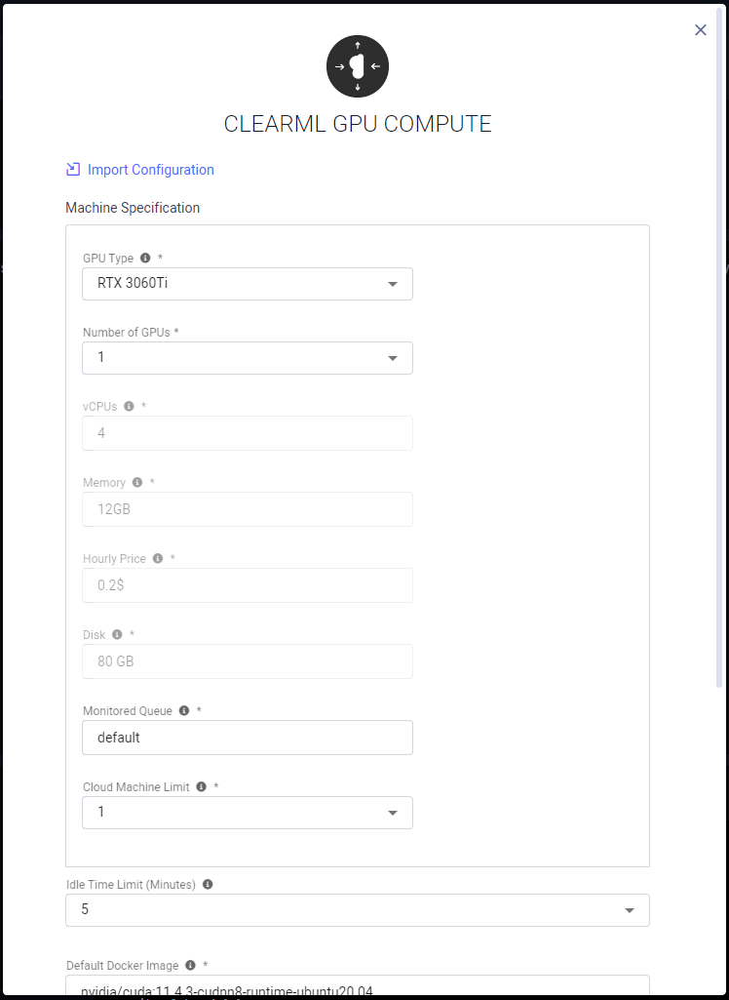
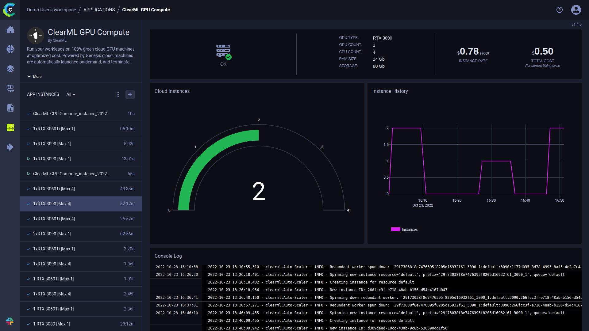

:::info Pro Plan Offering
The ClearML GPU Compute App is available under the ClearML Pro plan
::: 

Set up to run your workloads on 100% green cloud machines at optimized costs – no setup required! The ClearML GPU Compute 
Application automatically spins cloud machines up or down based on demand. The app optimizes machine usage according to 
a user defined resource budget: define your budget by specifying the GPU type and number of GPUs you want to use.

Each application instance monitors a ClearML queue: new cloud machines are spun up if there are pending jobs on the 
queue. The app instance automatically terminates idle machines based on a specified maximum idle time.

## GPU Compute Instance Configuration
* **Import Configuration** - Import an app instance configuration file. This will fill the configuration wizard with the 
  values from the file, which can be modified before launching the app instance
* **Machine Specification** 
    * GPU Type - NVIDIA GPU on the machine
    * Number of GPUs - Number of GPUs in the cloud machine
    * The rest of the machine’s available resources are dependent on the number and type of GPUs specified above:  
      * vCPUs - Number of vCPUs in the cloud machine
      * Memory - RAM available to the cloud machine
      * Hourly Price - Machine's hourly rate   
      * Disk - Amount of Disk space available to the cloud machine
    * Monitored Queue - Queue associated with application instance. The tasks enqueued to this queue will be executed on 
      machines of this specification
    * Cloud Machine Limit - Maximum number of concurrent machines to launch
* **Idle Time Limit** (Optional) - Maximum time in minutes that a cloud machine can be idle before it is spun down
* **Default Docker Image** (Optional) - Default Docker image in which the ClearML Agent will run. Provide a Docker stored 
  in a Docker artifactory so instances can automatically fetch it
* **Git Configuration** - Git credentials with which the ClearML Agents running on your cloud instances will access your repositories to retrieve the code for their jobs
    * Git User
    * Git Password / Personal Access Token
* **Cloud Storage Access** (Optional) - Access credentials to cloud storage service. Provides ClearML Tasks running on cloud 
  machines access to your storage

## Dashboard

Once a GPU Compute instance is launched, the dashboard displays a summary of your cloud usage and costs.

The GPU Compute dashboard shows:
* Service status indicator
  *  - Cloud service is available
  *  - Cloud service is currently unavailable
* Cloud instance details 
  * GPU type
  * Number of GPUs
  * Number of vCPUs
  * RAM 
  * Storage
* Cost details 
  * Instance rate 
  * Total cost for current billing cycle
* Number of current running cloud instances 
* Instance History - Number of running cloud instances over time  
* Console - The log shows updates of cloud instances being spun up/down. 
