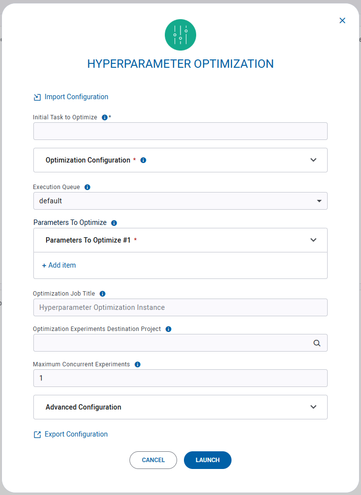
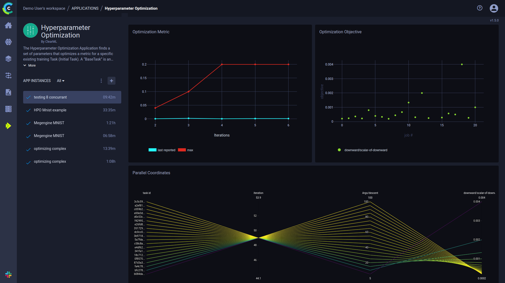

:::info Pro Plan Offering
The ClearML HPO App is available under the ClearML Pro plan
:::

The Hyperparameter Optimization Application finds the set of parameter values that optimize a specific metric for your 
model.

It takes in an existing ClearML experiment and its parameters to optimize. The parameter search space can be specified
by specific (discrete) values and/or value ranges (uniform parameters). 

The optimization app launches multiple copies of the original experiment, each time sampling different parameter sets, 
applying a user-selected optimization strategy (random search, Bayesian, etc.). 

Control the optimization process with the advanced configuration options, which include time, iteration, and experiment 
limits.

## HPO Instance Configuration
* **Import Configuration** - Import an app instance configuration file. This will fill the configuration wizard with the 
  values from the file, which can be modified before launching the app instance
* **Initial Task to Optimize** - ID of an existing ClearML task to optimize. This task will be cloned, and each clone will 
  sample a different set of hyperparameters values
* **Optimization Configuration**
    * Optimization Method - The optimization strategy to employ (e.g. random, grid, hyperband)
    * Optimization Objective Metric’s Title - Title of metric to optimize
    * Optimization Objective Metric’s Series - Metric series (variant) to optimize
    * Optimization Objective Trend - Choose the optimization target, whether to maximize or minimize the value of the 
      metric specified above
* **Execution Queue** - The [ClearML Queue](../../fundamentals/agents_and_queues.md#what-is-a-queue) to which 
  optimization tasks will be enqueued (make sure an agent is assigned to that queue)
* **Parameters to Optimize** - Parameters comprising the optimization space
    * Type 
        * Uniform Parameters - A value range to sample
            * Minimum Value
            * Maximum Value
            * Step Size - Step size between samples
        * Discrete Parameters - A set of values to sample
            * Values - Comma separated list of values to sample
    * Name - The original task’s configuration parameter name (including section name e.g. `Args/lr`)  <br/>
    :::tip Hydra Parameters
    For experiments using Hydra, input parameters from the OmegaConf in the following format:
    `Hydra/<param>`. Specify `<param>` using dot notation. For example, if your OmegaConf looks like this: 
    ```
    dataset:
      user: root
      main:
        number: 80
    ```
    Specify the `number` parameter with `Hydra/dataset.main.number`.

    Additionally, make sure that the initial experiment's `_allow_omegaconf_edit_` parameter is set to `False` (in experiment's 
    **CONFIGURATION > HYPERPARAMETERS > Hydra**).
    :::
* **Optimization Job Title** (Optional) - Name for the HPO instance. This will appear in the instance list 
* **Optimization Experiments Destination Project** (Optional) - The project where optimization tasks will be saved. 
  Leave empty to use the same project as the Initial task. 
* **Maximum Concurrent Tasks** - The maximum number of simultaneously running optimization experiments
* **Advanced Configuration** (Optional)
    * Limit Total HPO Experiments - Maximum total number of optimization experiments
    * Number of Top Experiments to Save - Number of best performing experiments to save (the rest are archived)
    * Limit Single Experiment Running Time (Minutes) - Time limit per optimization experiment. Experiments will be 
      stopped after the specified time elapsed
    * Minimal Number of Iterations Per Single Experiment - Some search methods, such as Optuna, prune underperforming 
      experiments. This is the minimum number of iterations per experiment before it can be stopped. Iterations are 
      based on the experiments' own reporting (for example, if experiments report every epoch, then iterations=epochs)
    * Maximum Number of Iterations Per Single Experiment - Maximum iterations per experiment after which it will be 
      stopped. Iterations are based on the experiments' own reporting (for example, if experiments report every epoch, 
      then iterations=epochs)
    * Limit Total Optimization Instance Time (Minutes) - Time limit for the whole optimization process (in minutes)
* **Export Configuration** - Export the app instance configuration as a JSON file, which you can later import to create 
  a new instance with the same configuration. 
  

 
## Dashboard
Once an HPO instance is launched, the dashboard displays a summary of the optimization process.



The HPO dashboard shows:
* Optimization Metric - Last reported and maximum / minimum values of objective metric over time
* Optimization Objective - Objective metric values per experiment
* Parallel coordinates - A visualization of parameter value impact on optimization objective
* Summary - Experiment summary table: experiment execution information, objective metric and parameter values.
* Budget - Available iterations and tasks budget (percentage, out of the values defined in the HPO instance's advanced configuration)
* Resources - Number of workers servicing the HPO execution queue, and the number of currently running optimization tasks
