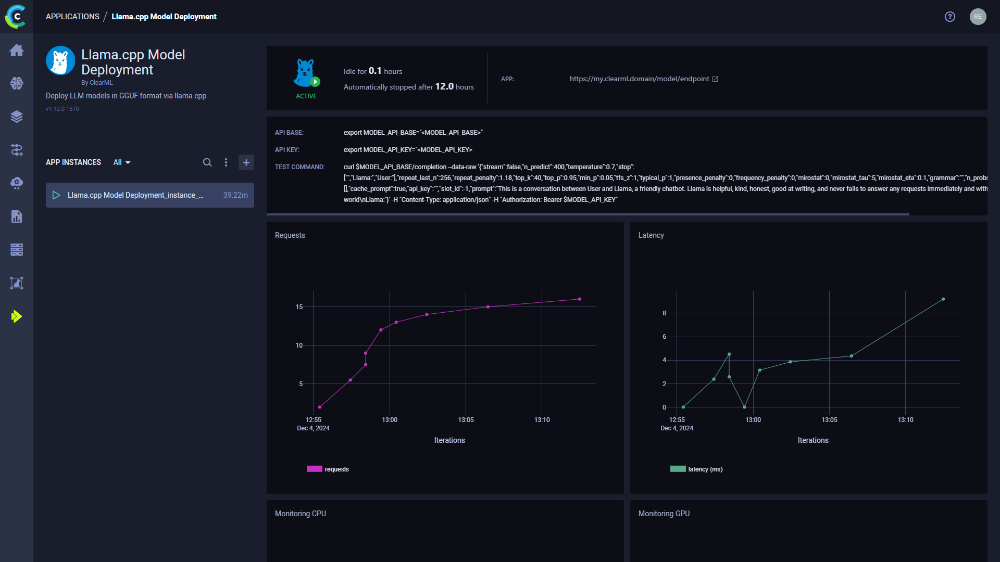
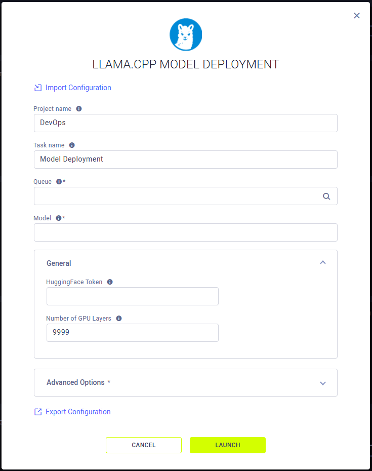

:::important Enterprise Feature
The llama.cpp Model Deployment App is available under the ClearML Enterprise plan.
:::

The llama.cpp Model Deployment app enables users to quickly deploy LLM models in GGUF format using [`llama.cpp`](https://github.com/ggerganov/llama.cpp). 
The llama.cpp Model Deployment application serves your model on a machine of your choice. Once an app instance is 
running, it serves your model through a secure, publicly accessible network endpoint. The app monitors endpoint activity 
and shuts down if the model remains inactive for a specified maximum idle time.

:::important AI Application Gateway
The llama.cpp Model Deployment app makes use of the ClearML Traffic Router which implements a secure, authenticated 
network endpoint for the model. 

If the ClearML AI application Gateway is not available, the model endpoint might not be accessible.
:::

After starting a llama.cpp Model Deployment instance, you can view the following information in its dashboard:
* Status indicator
  *  - App instance is running and is actively in use
  *  - App instance is setting up
  *  - App instance is idle
  *  - App instance is stopped
* Idle time - Time elapsed since last activity
* App - The publicly accessible URL of the model endpoint. Active model endpoints are also available in the 
  [Model Endpoints](../webapp_model_endpoints.md) table, which allows you to view and compare endpoint details and 
  monitor status over time
* API base - The base URL for the model endpoint
* API key - The authentication key for the model endpoint
* Test Command - An example command line to test the deployed model
* Requests - Number of requests over time
* Latency - Request response time (ms) over time
* Endpoint resource monitoring metrics over time
  * CPU usage
  * Network throughput
  * Disk performance
  * Memory performance
  * GPU utilization
  * GPU memory usage
  * GPU temperature
* Console log - The console log shows the app instance's console output: setup progress, status changes, error messages, etc.

### Llama.cpp Model Deployment Instance Configuration

When configuring a new llama.cpp Model Deployment instance, you can fill in the required parameters or reuse the 
configuration of a previously launched instance.

Launch an app instance with the configuration of a previously launched instance using one of the following options:
* Cloning a previously launched app instance will open the instance launch form with the original instance's configuration prefilled.
* Importing an app configuration file. You can export the configuration of a previously launched instance as a JSON file when viewing its configuration.

The prefilled configuration form can be edited before launching the new app instance.

To configure a new app instance, click `Launch New`  
to open the app's configuration form.

## Configuration Options
* **Import Configuration** - Import an app instance configuration file. This will fill the configuration form with the 
values from the file, which can be modified before launching the app instance
* **Project name** - ClearML Project where your llama.cpp Model Deployment app instance will be stored
* **Task name** - Name of [ClearML Task](../../fundamentals/task.md) for your llama.cpp Model Deployment app instance
* **Queue** - The [ClearML Queue](../../fundamentals/agents_and_queues.md#agent-and-queue-workflow) to which the 
  llama.cpp Model Deployment app instance task will be enqueued (make sure an agent is assigned to it)  
* **Model** - A ClearML Model ID or a Hugging Face model. The model must be in GGUF format. If you are using a 
  HuggingFace model, make sure to pass the path to the GGUF file. For example: `provider/repo/path/to/model.gguf`
* **General**
  * Hugging Face Token - Token for accessing Hugging Face models that require authentication
  * Number of GPU Layers - Number of layers to store in VRAM. `9999` indicates that all layers should be loaded in 
  VRAM. Used to offload the model on the CPU RAM
* **Advanced Options**
  * Idle Time Limit (Hours) - Maximum idle time after which the app instance will shut down
  * Last Action Report Interval (Seconds) - The frequency at which the last activity made by the application is reported. 
  Used to stop the application from entering an idle state when the machine metrics are low but the application is 
  actually still running

