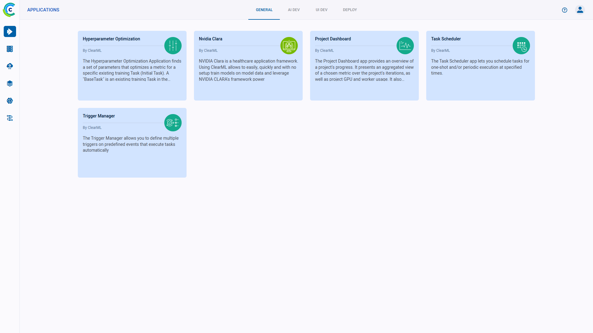
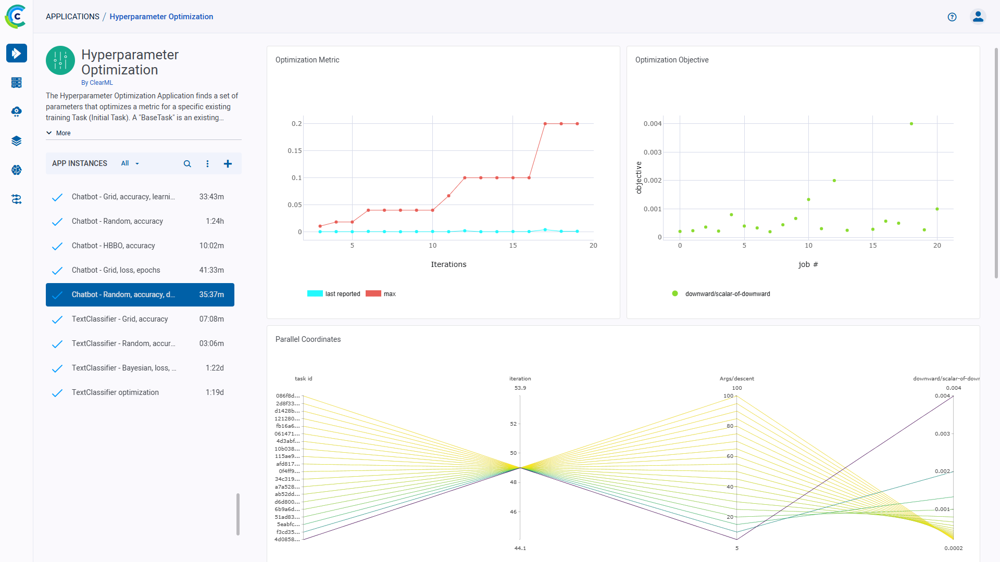

:::info Pro Plan Offering
ClearML Applications are available under the ClearML Pro plan
:::

Use ClearML’s GUI Applications to manage ML workloads and automatically run your recurring workflows without any coding. 

Configure and launch app instances, then track their execution from the app dashboard.

ClearML provides the following applications:
* [**AWS Autoscaler**](apps_aws_autoscaler.md) - Optimize AWS EC2 instance usage according to a defined instance budget
* [**GCP Autoscaler**](apps_gcp_autoscaler.md) - Optimize  GCP instance usage according to a defined instance budget
* [**Hyperparameter Optimization**](apps_hpo.md) - Find the parameter values that yield the best performing models
* **Nvidia Clara** - Train models using Nvidia’s Clara framework
* [**Project Dashboard**](apps_dashboard.md) - High-level project monitoring with Slack alerts

## App Pages Layout
Each application’s page is split into two sections:
* App Instance List - Launch new app instances and view previously launched instances. Click on an instance to view its 
  dashboard. Hover over it to access the [app instance actions](#app-instance-actions).
* App Instance Dashboard - The main section of the app page: displays the selected app instance’s status and results.

## Launching an App Instance

1. Choose the desired app
1. Click the `Launch New` button   to open the app’s configuration wizard
1. Fill in the configuration details
1. **Launch**

## App Instance Actions
Access app instance actions, by right clicking an instance, or through the menu button  (available on hover).

* **Rename** - Rename the instance 
* **Configuration** - View an instance’s configuration 
* **Stop** - Shutdown the instance
* **Clone** - Launch a new instance with same configuration prefilled
* **Delete** - Delete the instance
