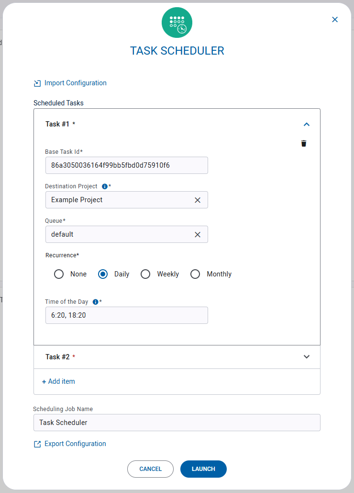
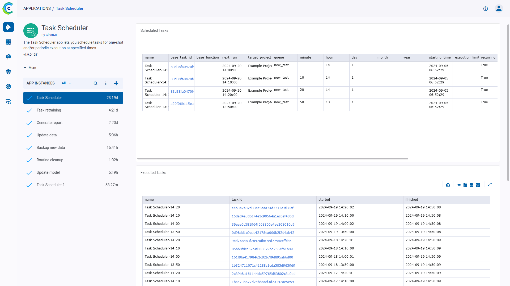
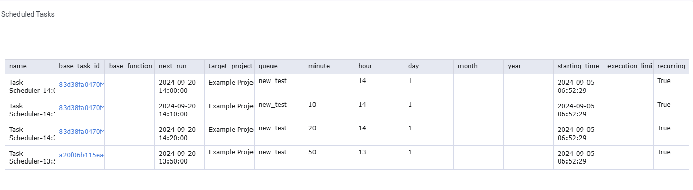
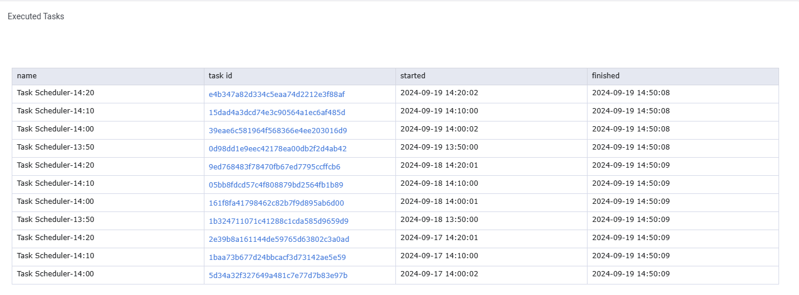

:::important Enterprise Feature
The Task Scheduler application is available under the ClearML Enterprise plan
:::

ClearML's Task Scheduler Application lets you schedule tasks for one-shot and/or periodic execution at specified times. 
The Scheduler is useful for scheduling routine operations, such as backups, generating reports, as well 
as periodically running pipelines for updating data and models. 

Each scheduling job is configured with existing ClearML tasks and a scheduling specification for each task: the time 
for execution and recurrence type. The Scheduler app will then launch copies of the specified tasks at their specified 
times. 

## Scheduler Instance Configuration

* **Scheduled Tasks** 
  * **Base Task ID** - ID of an existing ClearML task to schedule. This task will be cloned and enqueued for execution at the specified time. 
  * **Destination Project** - The project where scheduled tasks will be saved.
  * **Queue** - The [ClearML Queue](../../fundamentals/agents_and_queues.md#what-is-a-queue) to which scheduled tasks are enqueued (make sure an agent is assigned to that queue)
  * **Recurrence** - Recurrence type, select one of the following options:
    * **None** - The task will run once at the specified time.
    * **Daily** - Task will run every day at the times specified in the `Time of the Day` field
    * **Weekly** - Task will run every week on the specified day, at the times specified in the `Time of the Day` field
    * **Monthly** - Task will run every month on the specified days, and at the times specified in the `Time of the Day` field
    * **Time of the Day** - The time(s) (UTC) at which the task should run
    * **Add item** - Add another task to schedule 
* **Scheduling Job Name** - Name for the Scheduler instance. This will appear in the instance list

 
## Dashboard

Once a Task Scheduler instance is launched, the dashboard displays a summary of the scheduled tasks.

The Task Scheduler dashboard shows:
* Scheduled Tasks - Table of tasks scheduled for execution. The table displays the ID of the task scheduled for execution,
  the queue where it will be enqueued, and when it is scheduled to be executed. Each row presents a specific time that 
  the task is scheduled to be executed (both recurring and not). In the image below, the task in the first row is 
  scheduled to be launched daily (`day=1`) at 06:20 UTC (`minute=20, hour=6`).
  The task in the third row is scheduled to be launched every month (`month=1`) on the 15th at 12:00 UTC (`day=15, hour=12`).
  
  
* Executed Tasks - Table of tasks that have been executed. The table displays the `started` time, which is the time
  the task was enqueued, and its `finished` time, which is the time the task's execution was completed. If it says `None`,
  under the `finished` column, the task has not yet completed its execution. 
  
  

* Scheduler Log - Application console log containing everything printed to stdout and stderr. The log 
  includes when the scheduler syncs, and when it launches tasks for execution.   
 