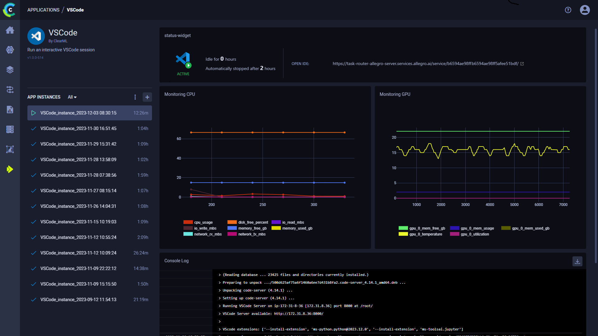

:::important Enterprise Feature
The VS Code application is available under the ClearML Enterprise plan
:::

The VS Code UI application allows you to launch a remote VS Code session on a machine that better meets resource needs. 
This feature provides a local link to access VS Code on a remote machine over a secure and encrypted SSH connection,
letting you use the IDE as if you're running on the target machine itself.

The VS Code session is set up using a [ClearML Agent](../../clearml_agent.md). When configuring an app instance, 
select a queue, and the agent servicing that queue will download and launch the IDE on its machine. When the server 
setup is complete, the dashboard displays a link to access the VS Code session.  

Once you have launched an app instance, you can view the following information in its dashboard: 
* App status indicator
    *  - Remote IDE is setting up 
    *  - Remote IDE is active
    *  - Remote IDE is idle  
    *  Remote IDE is stopped
* Open IDE - link to the IDE session
* Idle time
* Server’s resources monitoring (CPU / GPU / vMem utilization)
* Console - The console log shows the instance's activity, including server setup progress, server status changes

## VS Code App Instance Configuration

* **Git** - To access a git repository remotely, add git information. 
  * Repository
  * Branch
  * Commit
* **Docker**
  * Image - Docker image used to run the IDE in
  * Docker arguments - `docker run` arguments, as a single string
* **Queue** - The queue serviced by the ClearML Agent that will execute the VS Code session
* **Maximum idle time** (hours) - Maximum time of inactivity, after which the session will shut down. Configure idleness 
  definitions under `Advanced Options`.  
* **Advanced Options**
  * VSCode Version - VSCode code-server version to download
  * VSCode additional extensions - Comma separated list of additional VSCode extensions to install (for example `ms-toolsai.jupyter,ms-python.python`)
  * Idle Network Threshold (MB/s) - Throughput under which the session will be considered idle
  * Idle CPU Threshold (%) - CPU utilization under which the session will be considered idle
  * Idle GPU Threshold (%) - GPU utilization under which the session will be considered idle

