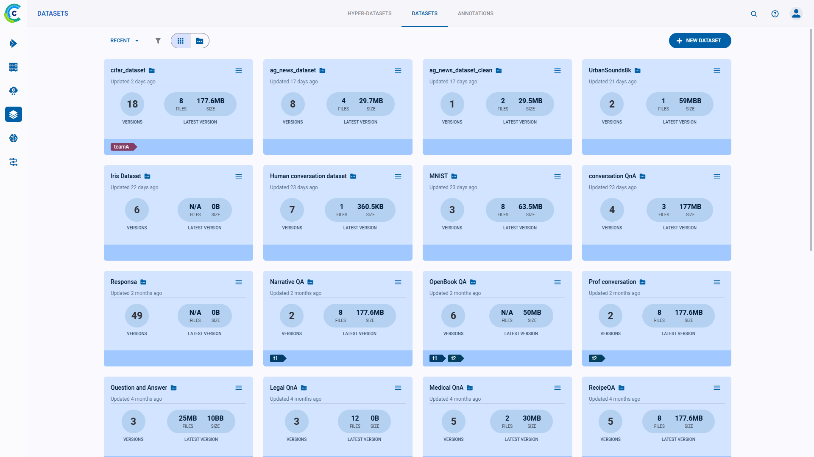
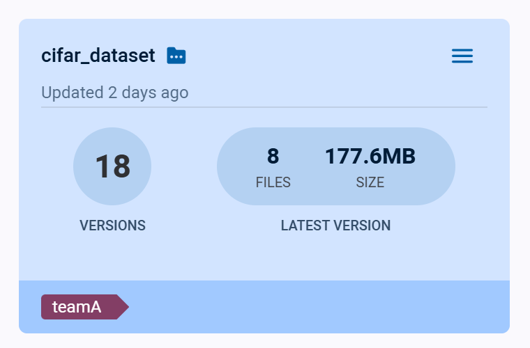
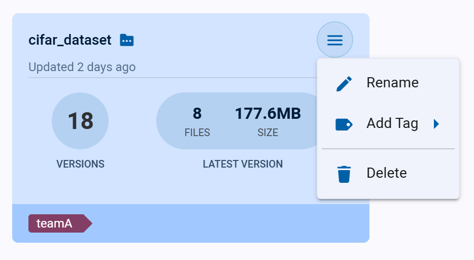

:::tip SDK version compatibility
The datasets page shows datasets created with `clearml` v1.6 or newer.  
Datasets created with earlier versions of `clearml` are available in their original project.  
:::

Use the **Datasets** Page to navigate between and manage datasets. The page shows summaries 
for all datasets created using [ClearML Data](../../clearml_data/clearml_data.md).

Click on a dataset card to navigate to its [Version List](webapp_dataset_viewing.md), where you can view the 
dataset versions' lineage and contents. 

## Dataset Cards

The dataset cards display summarized dataset information:

* Dataset name
* Time since last update
* Number of versions
* Details about latest version
  * Number of files
  * Size
* Tags 

### Dataset Actions

Click  on the top right
of a dataset card to open its context menu and access dataset actions.  

* **Rename** - Change the dataset’s name
* **Add Tag** - Add label to the dataset to help easily classify groups of dataset.
* **Delete** - Delete the dataset and all of its versions. To delete a dataset, all its versions must first be 
  [archived](../webapp_archiving.md). 