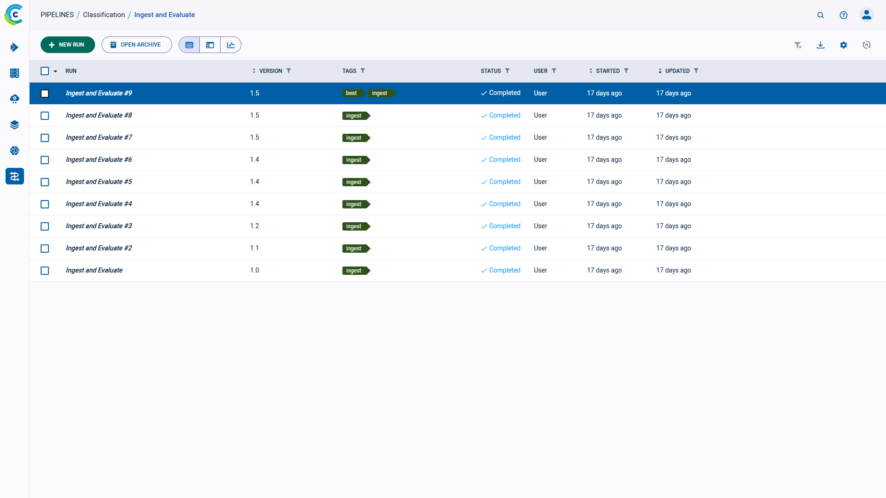
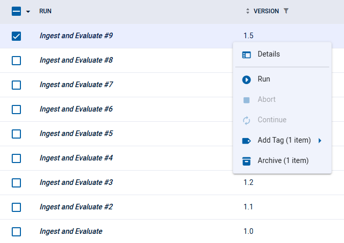

The dataset versions table is a [customizable](#customizing-the-versions-table) list of the dataset’s versions. Use it to
view a version’s details and genealogy. The versions table's auto-refresh allows users 
to continually monitor version changes.

View the versions in table view  
or in details view , 
using the buttons on the top left of the page. Use the table view for a comparative view of your versions according to 
columns of interest. Use the details view to access a selected version’s details, while keeping the version list in view. 

$$$ NEW IMAGE

## Version Table Columns

The models table contains the following columns:

| Column | Description | Type |
|---|---|---|
| **ID**| UUID String |
| **RUN** | Dataset identifier $$$ | String | 
| **VERSION** | The dataset version number.  | Version string |
| **TAGS** | Descriptive, user-defined, color-coded tags assigned to a version. | Tag |
| **STATUS** | Dataset version's status. See a list of the [dataset version states](../../clearml_data/clearml_data.md#dataset-version-states). |  String |
| **USER** | User who created the version.  |  String |
| **STARTED** | Elapsed time since the version was created. To view the date and time of start, hover over the elapsed time.  |  Date-time |
| **RUN TIME** | The current / total running time of the version. $$$$ | Time |
| **UPDATED** | Elapsed time since the last update to the version. To view the date and time of update, hover over the elapsed time. |  Date-time |

## Customizing the Versions Table

Customize the table using any of the following:
* Dynamic column ordering - Drag a column title to a different position.
* Show / hide columns - Click  
  to view and select columns to show.
* [Filter columns](#filtering-columns)
* Sort columns
* Resize columns - Drag the column separator to change the width of that column. Double click the column separator for 
  automatic fit.

Changes are persistent (cached in the browser) and represented in the URL, so customized settings can be saved in a 
browser bookmark and shared with other ClearML users.

### Filtering Columns

Filters can be applied by clicking  
on a column, and the relevant filter appears.

There are a few types of filters:
* Value set - Choose which values to include from a list of all values in the column
* Numerical ranges - Insert minimum and / or maximum value
* Date ranges - Insert starting and / or ending date and time
* Tags - Choose which tags to filter by from a list of all tags used in the column. 
  * Filter by multiple tag values using the **ANY** or **ALL** options, which correspond to the logical "AND" and "OR" respectively. These 
    options appear on the top of the tag list.
  * Filter by the absence of a tag (logical "NOT") by clicking its checkbox twice. An `X` will appear in the tag's checkbox.
  
Once a filter is applied to a column, its filter icon will appear with a highlighted dot on its top right ( ).  

To clear all active filters, click  
in the top right corner of the table.

:::note
The following table customizations are saved on a per dataset basis:
* Columns order
* Column width
* Active sort order
* Active filters
* Custom columns
:::

## Dataset Actions

The following table describes the actions that can be done from the dataset version table.  

Access these actions with the context menu in any of the following ways:
* In the dataset versions table, right click a version, or hover over a dataset version and click 
* In a dataset info panel, click the menu button 

| Action | Description |
|---|---|
| Details | View version details. |
| Archive | To more easily work with active dataset versions, archive a version. See [Archiving](../webapp_archiving.md).| 
| Restore | Action available in the archive. Restore a version to the active dataset versions table. | 
| Tags | User-defined labels added to versions for grouping and organization. |

$$$$

 

The actions mentioned in the chart above can be performed on multiple versions at once.
[Select multiple versions](#selecting-multiple-versions), then use either the context menu, or the bar that appears at 
the bottom of the page, to perform operations on the selected versions.

## Selecting Multiple Versions

Select multiple versions by clicking the checkbox on the left of each relevant run. Clear any existing selection 
by clicking the checkbox in the top left corner of the table.

Click the checkbox in the top left corner of the table to select all items currently visible.

An extended bulk selection tool is available through the down arrow next to the checkbox in the top left corner, enabling 
selecting items beyond the items currently on-screen:
* **All** - Select all versions in the dataset
* **None** - Clear selection
* **Filtered** - Select all versions in the dataset that match the current active table filters 

