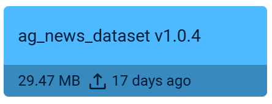
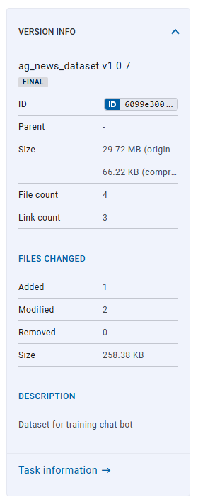
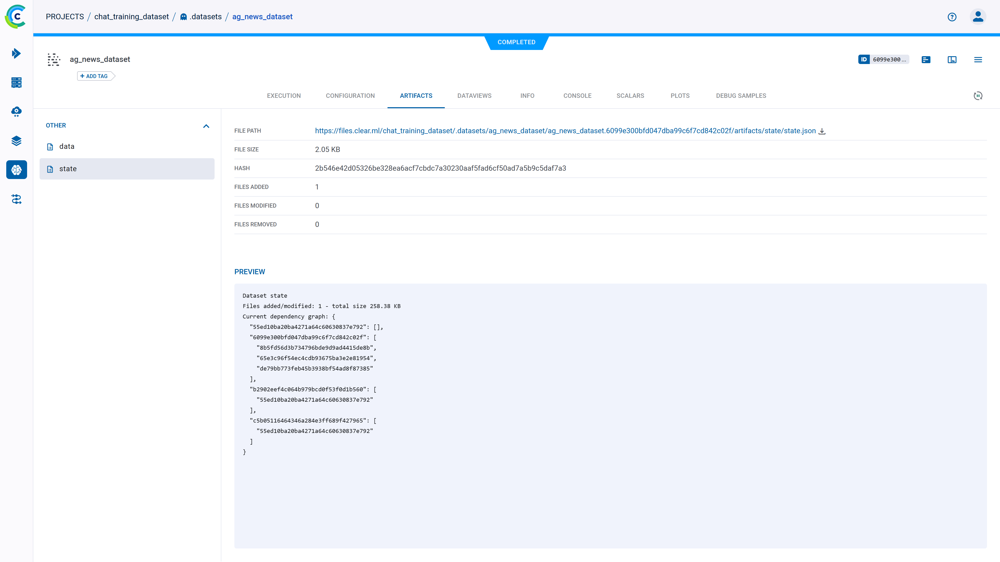
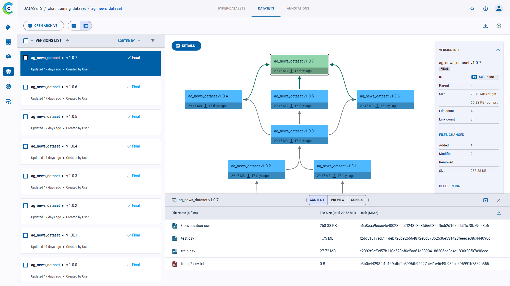
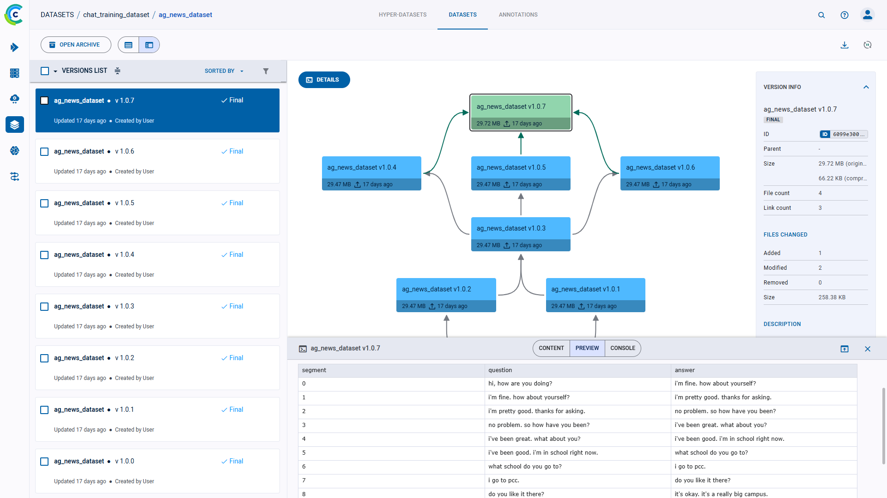

:::tip SDK version compatibility
The datasets page shows datasets created with `clearml` v1.6 or newer.  
Datasets created with earlier versions of `clearml` are available in their original project.  
:::

The dataset page lists the dataset's versions. For a selected version, the **Dataset Version Panel** shows its lineage 
in graph form. 

Each node in the graph represents a dataset version, and shows the following details:

* Version name and number
* Version size 
* Version update time
* Version details button - Hover over the version and click  
  to view the version’s [details panel](#version-details-panel) 
  
## Version Details
### Version Info

On the right side of the dataset version panel, view the **VERSION INFO** which shows: 
* Version name
* Dataset ID 
* Version file size 
* Number of files
* Number of links
* Changes from previous version 
  * Number of files added 
  * Number of files modified 
  * Number of files removed 
  * Change in size
* Version description - to modify, hover over description and click  ,
  which opens the edit window
  

To view a version’s detailed information, click **Full details**, which will open the dataset version’s [task page](../webapp_exp_track_visual.md).

To view the information for any version in the lineage graph, click its node, and the **VERSION INFO** panel displays
that version's details. 

### Version Details Panel

Click on **DETAILS** on the top left of the info panel or hover over a version node and click  
to view:
* **CONTENT** - Table summarizing version contents, including file names, file sizes, and hashes 

Version Content

 

* **PREVIEW** - A preview of the dataset version's contents 
  access [plot tools](../webapp_exp_track_visual.md#scalar-plot-tools). Click on a debug sample to expand it. 

Version Preview

 

* **CONSOLE** - The dataset version’s console output

Version Console

 

Click  on the content panel header to view the panel in full screen. 

## Dataset Actions
The following table describes the actions that can be done from the dataset versions list.

Access these actions with the context menu by right-clicking a version on the dataset versions list.

| Action | Description | 
|-----|----|
|Add Tag |User-defined labels added to versions for grouping and organization. |
|Archive| To more easily work with active dataset versions, archive a version. [See Archiving](../webapp_archiving.md).| 
|Restore|Action available in the archive. Restore a version to the active dataset versions table.|
|Delete| Delete an archived version and its artifacts. This action is available only from the dataset’s archive |

The actions mentioned in the chart above can be performed on multiple versions at once. [Select multiple versions](#selecting-multiple-versions), 
then use either the context menu, or the bar that appears at the bottom of the page, to perform operations on the 
selected versions.

## Selecting Multiple Versions
Select multiple versions by clicking the checkbox on the left of each relevant version. Clear any existing selection by 
clicking the checkbox in the top left corner of the list.

Click the checkbox in the top left corner of the list to select all items currently visible.

An extended bulk selection tool is available through the down arrow next to the checkbox in the top left corner, enabling selecting items beyond the items currently on-screen:
* All - Select all versions in the dataset
* None - Clear selection
* Filtered - Select all versions in the dataset that match the current active filters

